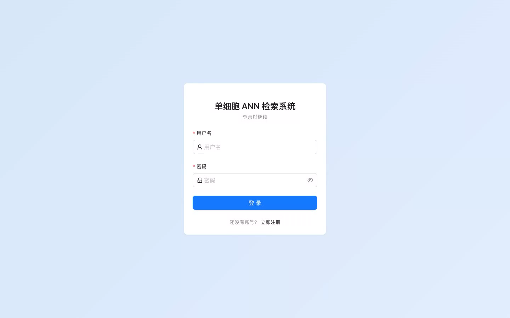
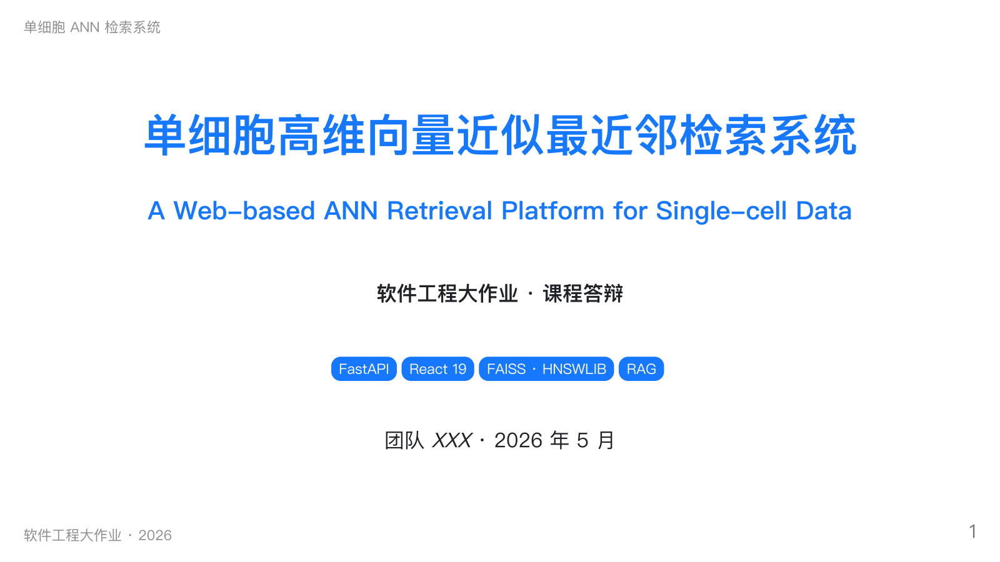
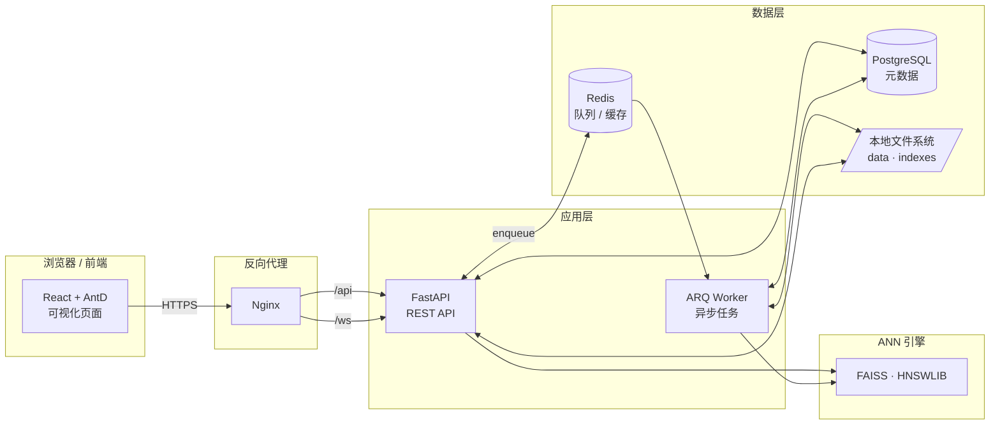

# 单细胞高维向量近似最近邻 (ANN) 检索系统

> 软件工程课程大作业 · 面向单细胞测序数据的可视化 ANN 检索平台。

<p align="center">
  <a href="docs/video/demo_final.mp4"></a>
  &nbsp;
  <a href="docs/slides/answer_defense.pdf"></a>
</p>

<p align="center">
  <a href="docs/video/demo_final.mp4">▶ 观看演示视频 (2分42秒)</a>
  &nbsp;·&nbsp;
  <a href="docs/slides/answer_defense.pdf">查看答辩 PPT</a>
  &nbsp;·&nbsp;
  <a href="docs/benchmark_report.md">性能基准报告</a>
  &nbsp;·&nbsp;
  <a href="submission/MANIFEST.md">提交物清单</a>
</p>

## 项目简介

随着单细胞测序技术的发展，一次实验可产生数十万级别的细胞样本，每个样本经数值化后即为一个高维向量。传统精确最近邻搜索在高维大规模数据上效率低下，本系统基于 **近似最近邻 (ANN)** 算法（HNSW、IVF、PQ 等）实现端到端的细胞相似性检索流水线：

- 支持 `.h5ad` 单细胞数据的上传、读取与预处理；
- 支持多种 ANN 索引的构建、保存、加载与切换；
- 提供 Top-K 相似细胞检索、条件检索（按细胞类型 / 疾病等过滤）、跨数据集联合检索；
- 内置可视化展示（UMAP / t-SNE 投影、检索结果高亮、性能指标）；
- 评测多种距离度量与索引算法的召回率与查询延迟；
- 加分功能：RAG + LLM 自然语言查询、自定义改进的 ANN 算法。

## 技术栈

| 层 | 选型 | 说明 |
| --- | --- | --- |
| 前端 | React 19 · TypeScript · Vite · Ant Design · Zustand · Plotly.js | SPA、状态管理、交互式可视化 |
| 后端 | Python 3.12 · FastAPI · SQLAlchemy 2 (async) · Pydantic v2 · Alembic | 异步 REST API + ORM + 迁移 |
| 任务队列 | ARQ + Redis | 索引构建 / 数据预处理后台异步任务 |
| 数据库 | PostgreSQL 17 | 元数据、用户、数据集、索引、检索记录 |
| 缓存 | Redis 7 | 任务队列与查询结果缓存 |
| ANN 引擎 | FAISS · HNSWLIB · scikit-learn (brute-force baseline) | IVF / HNSW / PQ / Flat |
| 单细胞分析 | scanpy · anndata · numpy · scipy · scikit-learn | h5ad 读取、PCA / UMAP |
| 基础设施 | Docker Compose · Nginx · GitHub Actions · pre-commit | 一键启动、CI、代码规范 |
| 包管理 | uv (后端) · pnpm/npm (前端) | 快速可复现安装 |

## 系统架构



## 项目结构

```
ann_search/
├── backend/                    # FastAPI 后端
│   ├── app/
│   │   ├── api/                # 路由层
│   │   ├── core/               # 配置 / 安全 / 日志
│   │   ├── db/                 # 数据库 session 与 base
│   │   ├── models/             # SQLAlchemy ORM
│   │   ├── schemas/            # Pydantic 模型
│   │   ├── services/           # 业务服务（数据集 / 索引 / 检索）
│   │   └── tasks/              # ARQ 异步任务
│   ├── alembic/                # 数据库迁移
│   └── tests/
├── frontend/                   # React + TS 前端
│   ├── src/
│   │   ├── api/                # axios 客户端 (自动生成 / 手写)
│   │   ├── components/         # 通用组件
│   │   ├── pages/              # 页面
│   │   ├── router/             # 路由
│   │   ├── store/              # Zustand 状态
│   │   └── types/              # 类型定义
│   └── public/
├── infra/                      # 基础设施
│   ├── docker-compose.yml      # 生产编排
│   ├── docker-compose.dev.yml  # 开发覆盖（热重载）
│   └── nginx/nginx.conf        # 反向代理
├── data/                       # h5ad 原始 / 预处理数据 (gitignored)
├── indexes/                    # ANN 索引文件 (gitignored)
├── docs/                       # 软件开发文档（5 篇）
├── .github/workflows/          # GitHub Actions CI
├── .env.example                # 环境变量样例
├── Makefile                    # 便捷命令
└── README.md
```

## 快速开始

### 1. Docker Compose 一键启动 (推荐)

```bash
git clone <repo-url>
cd ann_search

cp .env.example .env          # 按需修改 SECRET_KEY / LLM_API_KEY
make up                       # 启动 postgres + redis + backend + worker + frontend

make migrate                  # 应用数据库迁移 (首次运行)
make logs                     # 查看运行日志
```

启动后访问：

- 前端 UI: <http://localhost:5173>
- 后端 API 文档 (Swagger): <http://localhost:8000/docs>
- 后端 API 文档 (ReDoc): <http://localhost:8000/redoc>
- PostgreSQL: `localhost:5432` (账号: `ann` / `ann`)
- Redis: `localhost:6379`

停止服务：

```bash
make down
```

### 2. 本地开发（不使用 Docker）

后端：

```bash
cd backend
uv sync                              # 安装 Python 依赖
docker compose -f ../infra/docker-compose.yml up -d postgres redis
uv run alembic upgrade head
uv run uvicorn app.main:app --reload
```

前端：

```bash
cd frontend
pnpm install                          # 或 npm install
pnpm dev                              # http://localhost:5173
```

ARQ Worker：

```bash
cd backend
uv run arq app.tasks.worker.WorkerSettings
```

## 加分功能（全部实现）

- **多数据集联合检索**：`POST /api/v1/search/multi-dataset` 用 `asyncio.gather` 并发查询多个数据集索引，按 min-max 归一化重排后返回全局 Top-K（每条结果附带 `source_dataset_id`）。
- **ANN 算法改进**：`AdaptiveHnswBackend`（[`backend/app/services/ann/adaptive_hnsw_backend.py`](backend/app/services/ann/adaptive_hnsw_backend.py)）继承 HNSWLIB，按查询难度自适应调整 `ef_search`（首轮小 ef + relative gap 早停 → 升档至上限 512），对易查询省算力、难查询自动加召回。
- **RAG + 单细胞 LLM 问答**：`POST /api/v1/rag/query` 三段式 parse → search → summarize；后端实现 `MockLLMClient`（默认零依赖）、`DashScopeLLMClient`、`OpenAILLMClient` 三种客户端可切换。

## 实测性能（liver.h5ad 真实数据集）

数据集规模：69032 细胞 × 30 维 PCA 向量；测试机：MacBook（Apple Silicon）。

| 后端 | 构建耗时 | 内存 | Recall@10 | p50 延迟 |
| --- | ---: | ---: | ---: | ---: |
| brute | 0.000 s | 3.4 MB | 1.0000 | 0.582 ms |
| **hnswlib** | **0.218 s** | 7.1 MB | **0.9996** | **0.016 ms** |
| faiss-hnsw | 0.252 s | 3.4 MB | 0.9976 | 0.017 ms |
| faiss-ivfpq | 0.187 s | **0.29 MB** | 0.8046 | 0.018 ms |
| adaptive-hnsw | 0.218 s | 7.1 MB | 0.9994 | 0.045 ms |

完整报告：[`docs/benchmark_report.md`](docs/benchmark_report.md)。

## 演示资源

- **演示视频**：[`docs/video/demo_final.mp4`](docs/video/demo_final.mp4)（2 分 42 秒，1440×900，自动化 Playwright 录制 + macOS Tingting 中文配音）。
- **答辩 PPT**：[`docs/slides/answer_defense.pdf`](docs/slides/answer_defense.pdf) · [`.pptx`](docs/slides/answer_defense.pptx)（18 张幻灯片，Marp Markdown 一键生成）。
- **配音讲稿**：[`docs/slides/speaker_notes.md`](docs/slides/speaker_notes.md)
- **端到端测试脚本**：[`e2e/test_liver_e2e.py`](e2e/test_liver_e2e.py)（注入 1.3 GB liver.h5ad 全流程验证） · [`e2e/demo_video.py`](e2e/demo_video.py)（视频自动录制）
- **9 张实测截图**：[`docs/e2e_screenshots/`](docs/e2e_screenshots/)

## 提交清单（课程交付物）

| 类别 | 路径 | 状态 |
| --- | --- | :---: |
| 源代码（前后端） | `backend/` · `frontend/` · `infra/` | ✅ |
| 开发文档 — 项目概述 | [`docs/01_项目概述.md`](docs/01_项目概述.md) | ✅ |
| 开发文档 — 需求与设计 | [`docs/02_需求分析与系统设计.md`](docs/02_需求分析与系统设计.md) | ✅ |
| 开发文档 — 系统测试 | [`docs/03_系统测试.md`](docs/03_系统测试.md) | ✅ |
| 开发文档 — 项目管理 | [`docs/04_项目管理.md`](docs/04_项目管理.md) | ✅ |
| 开发文档 — 用户手册 | [`docs/05_用户手册.md`](docs/05_用户手册.md) | ✅ |
| API 接口文档 | [`docs/06_API接口文档.md`](docs/06_API接口文档.md) | ✅ |
| 性能基准报告 | [`docs/benchmark_report.md`](docs/benchmark_report.md) | ✅ |
| 答辩 PPT (PDF/PPTX) | [`docs/slides/`](docs/slides/) | ✅ |
| 演示视频 | [`docs/video/demo_final.mp4`](docs/video/demo_final.mp4) | ✅ |
| 端到端测试 | [`e2e/`](e2e/) | ✅ |
| CI/CD | [`.github/workflows/ci.yml`](.github/workflows/ci.yml) | ✅ |

## 常用命令

```bash
make help            # 列出全部命令
make up              # 启动开发栈 (热重载)
make down            # 停止并移除
make logs            # 查看日志
make ps              # 查看状态
make backend-shell   # 进入 backend 容器
make db-shell        # 进入 psql
make migrate         # alembic upgrade head
make test            # 运行前后端测试
make lint            # 代码检查
make format          # 自动格式化
```

## 开发规范

- 后端：ruff (lint + format) · mypy (类型) · pytest (测试)；命名采用 `snake_case`，类用 `PascalCase`。
- 前端：ESLint · Prettier · TypeScript strict；组件用 `PascalCase`，hooks 用 `useXxx`。
- Git：约定式提交 (`feat:` / `fix:` / `docs:` / `refactor:` / `test:` / `chore:`)，pre-commit 自动校验。
- 文档：见 [`docs/`](docs/) 目录，含项目概述、需求与设计、测试、项目管理、用户手册。

## 团队分工

| 成员 | 角色 | 主要职责 |
| --- | --- | --- |
| TBD | 项目经理 / 后端 | 项目管理、API 设计、ANN 引擎集成 |
| TBD | 后端 / 算法 | 数据预处理、索引构建、检索服务 |
| TBD | 前端 / 可视化 | 页面与交互、Plotly 可视化 |
| TBD | 测试 / 运维 | 测试用例、CI、Docker 编排 |

详见 [`docs/04_项目管理.md`](docs/04_项目管理.md)。

## License

仅用于课程作业，未对外发布前请勿用于生产。
