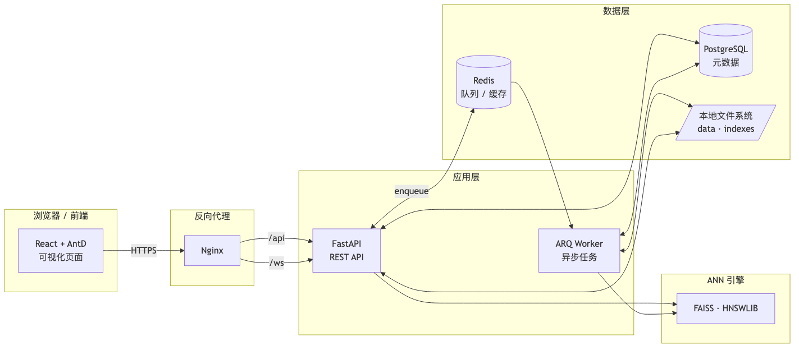
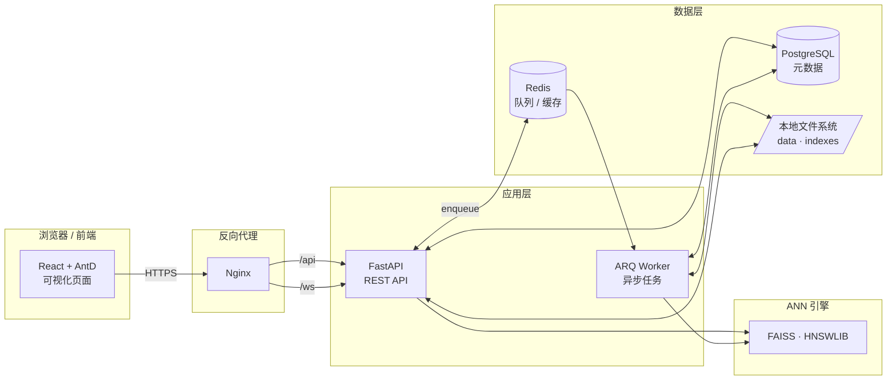
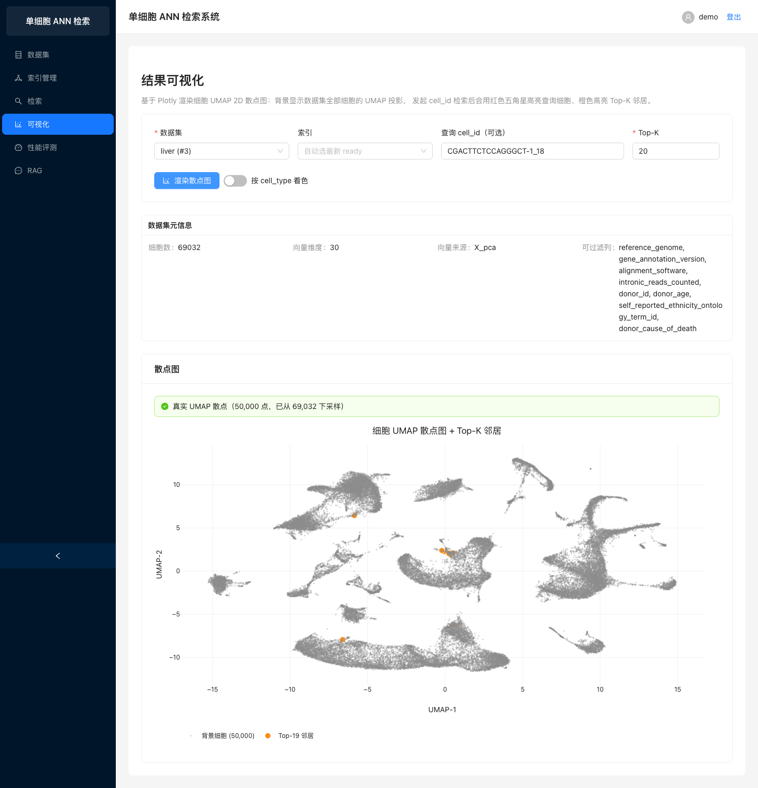
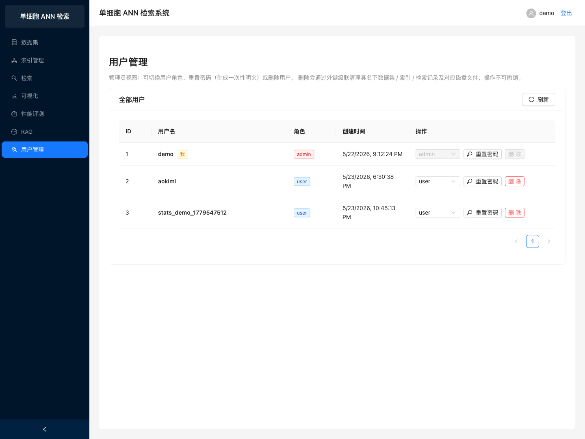
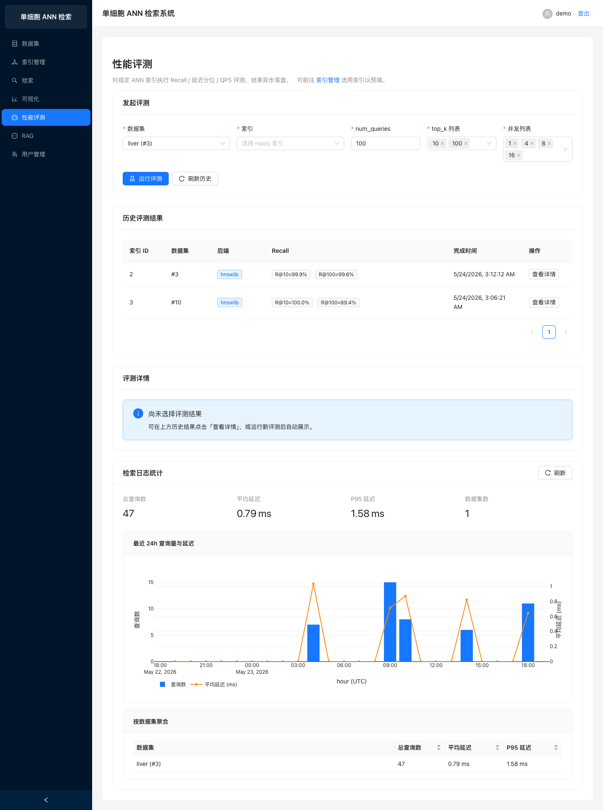
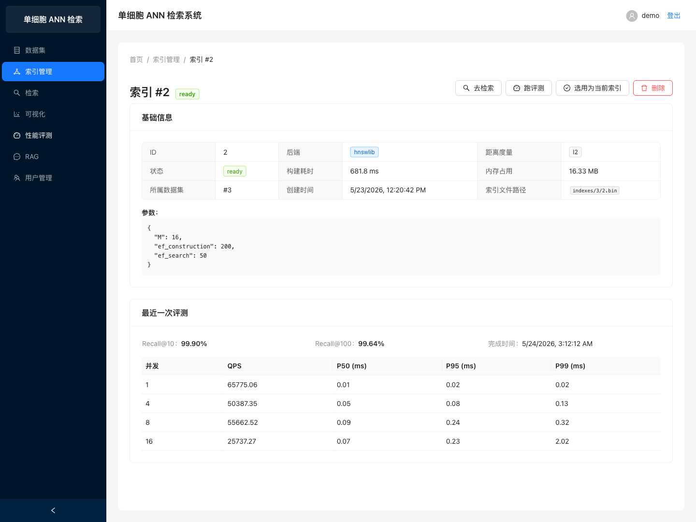

# 单细胞高维向量近似最近邻 (ANN) 检索系统

> 软件工程课程大作业 · 面向单细胞测序数据的可视化 ANN 检索平台。

<p align="center">
  
  
  
  
  
  
  
  
  
  
  
  
</p>

<p align="center">
  <a href="docs/video/demo_final.mp4"></a>
  &nbsp;
  <a href="docs/slides/answer_defense.pdf"></a>
</p>

<p align="center">
  <a href="docs/video/demo_final.mp4">▶ 演示视频 (7'42")</a>
  &nbsp;·&nbsp;
  <a href="docs/slides/answer_defense.pdf">答辩 PPT (31 张)</a>
  &nbsp;·&nbsp;
  <a href="docs/benchmark_report.md">性能基准报告</a>
  &nbsp;·&nbsp;
  <a href="CHANGELOG.md">更新日志</a>
  &nbsp;·&nbsp;
  <a href="docs/progress_summary.md">进展总结</a>
  &nbsp;·&nbsp;
  <a href="submission/MANIFEST.md">提交物清单</a>
  &nbsp;·&nbsp;
  <a href="docs/00_课程需求.md">课程需求</a>
</p>

## 项目简介

随着单细胞测序技术的发展，一次实验可产生数十万级别的细胞样本，每个样本经数值化后即为一个高维向量。传统精确最近邻搜索在高维大规模数据上效率低下，本系统基于 **近似最近邻 (ANN)** 算法（HNSW、IVF、PQ 等）实现端到端的细胞相似性检索流水线：

- 支持 `.h5ad` 单细胞数据的上传、读取与预处理；
- 支持多种 ANN 索引的构建、保存、加载与切换；
- 提供 Top-K 相似细胞检索、条件检索（按细胞类型 / 疾病等过滤）、跨数据集联合检索；
- 内置可视化展示（UMAP / t-SNE 投影、检索结果高亮、性能指标）；
- 评测多种距离度量与索引算法的召回率与查询延迟；
- 扩展能力：RAG + LLM 自然语言查询、自适应 HNSW 算法改进、跨数据集语义对齐。

## 技术栈

| 层 | 选型 | 说明 |
| --- | --- | --- |
| 前端 | React 19 · TypeScript · Vite · Ant Design · Zustand · Plotly.js | SPA、状态管理、交互式可视化 |
| 后端 | Python 3.12 · FastAPI · SQLAlchemy 2 (async) · Pydantic v2 · Alembic | 异步 REST API + ORM + 迁移 |
| 任务队列 | ARQ + Redis | 索引构建 / 数据预处理后台异步任务 |
| 数据库 | PostgreSQL 17 | 元数据、用户、数据集、索引、检索记录 |
| 缓存 | Redis 7 | 任务队列与查询结果缓存 |
| ANN 引擎 | FAISS · HNSWLIB · scikit-learn (brute-force baseline) | IVF / HNSW / PQ / Flat |
| 单细胞分析 | scanpy · anndata · numpy · scipy · scikit-learn | h5ad 读取、PCA / UMAP |
| 基础设施 | Docker Compose · Nginx · GitHub Actions · pre-commit | 一键启动、CI、代码规范 |
| 包管理 | uv (后端) · pnpm/npm (前端) | 快速可复现安装 |

## 系统架构



> 完整架构图集合（含用例图 / 总体架构 / 检索流水线 / ER / 任务状态机）见 [`docs/assets/architecture/`](docs/assets/architecture/)；mermaid 源代码块保留在文档内便于在线编辑。



## 项目结构

```
ann_search/
├── backend/                    # FastAPI 后端
│   ├── app/
│   │   ├── api/                # 路由层
│   │   ├── core/               # 配置 / 安全 / 日志
│   │   ├── db/                 # 数据库 session 与 base
│   │   ├── models/             # SQLAlchemy ORM
│   │   ├── schemas/            # Pydantic 模型
│   │   ├── services/           # 业务服务（数据集 / 索引 / 检索 / RAG）
│   │   └── tasks/              # ARQ 异步任务
│   ├── alembic/versions/       # 数据库迁移（5 个版本）
│   ├── scripts/                # benchmark / sweep / alignment 离线脚本
│   └── tests/                  # pytest 110 用例
├── frontend/                   # React + TS 前端
│   ├── src/
│   │   ├── api/                # axios 客户端
│   │   ├── components/         # 通用组件
│   │   ├── pages/              # 业务页面
│   │   ├── router/             # 路由
│   │   ├── store/              # Zustand 状态
│   │   └── types/              # 类型定义
│   └── public/
├── infra/                      # 基础设施
│   ├── docker-compose.yml      # 生产编排
│   ├── docker-compose.dev.yml  # 开发覆盖（热重载）
│   └── nginx/nginx.conf        # 反向代理
├── e2e/                        # Playwright 端到端测试 + 演示视频脚本
├── data/                       # h5ad 原始 / 预处理数据（gitignored）
│   └── raw/liver.h5ad          # 课程数据集（开发时按需放置）
├── indexes/                    # ANN 索引文件（gitignored）
├── docs/                       # 开发文档 + 基准报告 + PPT + 视频
│   ├── 00_课程需求.md           # 课程原始任务书摘录
│   ├── 00_数据说明.md           # 数据集字段速览
│   ├── 01~06_*.md              # 五份开发文档 + API 速查
│   ├── benchmark_report.md     # 性能基准报告
│   ├── benchmark_data/         # 基准 / sweep / 对齐原始 JSON
│   ├── assets/                 # 架构图 / 截图 / PPT 封面
│   ├── slides/                 # 答辩 PPT（Marp → PDF / PPTX）
│   └── video/                  # 演示视频成片
├── submission/MANIFEST.md      # 课程交付物索引
├── .github/workflows/          # GitHub Actions CI
├── .env.example                # 环境变量样例
├── Makefile                    # 便捷命令
├── CHANGELOG.md                # 版本更新日志
└── README.md
```

## 快速开始

### 1. Docker Compose 一键启动 (推荐)

```bash
git clone <repo-url>
cd ann_search

cp .env.example .env          # 按需修改 SECRET_KEY / LLM_API_KEY
make up                       # 启动 postgres + redis + backend + worker + frontend

make migrate                  # 应用数据库迁移 (首次运行)
make logs                     # 查看运行日志
```

启动后访问：

- 前端 UI: <http://localhost:5173>
- 后端 API 文档 (Swagger): <http://localhost:8000/docs>
- 后端 API 文档 (ReDoc): <http://localhost:8000/redoc>
- PostgreSQL: `localhost:5432` (账号: `ann` / `ann`)
- Redis: `localhost:6379`

停止服务：

```bash
make down
```

### 2. 本地开发（不使用 Docker）

后端：

```bash
cd backend
uv sync                              # 安装 Python 依赖
docker compose -f ../infra/docker-compose.yml up -d postgres redis
uv run alembic upgrade head
uv run uvicorn app.main:app --reload
```

前端：

```bash
cd frontend
pnpm install                          # 或 npm install
pnpm dev                              # http://localhost:5173
```

ARQ Worker：

```bash
cd backend
uv run arq app.tasks.worker.WorkerSettings
```

## 扩展能力总览

v1.0 → v1.2 累计 17 项扩展能力，按版本分组：

### v1.0 课程要求三项（基线交付）

- **多数据集联合检索** — `POST /api/v1/search/multi-dataset`：用 `asyncio.gather` 并发查询多个数据集索引，按 min-max 归一化重排后返回全局 Top-K，每条结果附带 `source_dataset_id`。
- **ANN 算法改进** — `AdaptiveHnswBackend`（[`backend/app/services/ann/adaptive_hnsw_backend.py`](backend/app/services/ann/adaptive_hnsw_backend.py)）：在 HNSWLIB 之上按查询难度自适应调整 `ef_search`，首轮小 `ef` + relative gap 早停，未稳定时升档至上限 512，易查询省算力、难查询自动加召回。
- **RAG + 单细胞 LLM 问答** — `POST /api/v1/rag/query`：parse → search → summarize 三段式；`MockLLMClient`（默认零依赖、关键词规则）与 `AnthropicClient`（Claude Opus 4.7）两种客户端可切换。

### v1.1 工程优化八项（F1~F8）

| 编号 | 能力 | 关键接口 / 模块 | 收益 |
| :---: | --- | --- | --- |
| **F1** | 批量检索 + 缓存复用 | `POST /search/batch` | 单次最多 64 查询，命中缓存零计算 |
| **F2** | Redis 检索结果缓存 | `services/search/cache.py` + `GET /search/cache/stats` | by-id / by-vector 全链路缓存，命中率可观测 |
| **F3** | 索引 mmap 加载 | `IndexCache.load_index` | 大索引冷启动内存减半 |
| **F4** | 启动预热 IndexCache | `worker.on_startup` | 消除首查冷启动 50~200 ms |
| **F5** | 向量 float16 落盘 | `services/preprocess.py` | 向量体积减半 |
| **F6** | SSE 流式检索 | `POST /search/stream` | 浏览器逐条吐结果，无需等待 Top-K 完成 |
| **F7** | ensemble 多后端融合 | `POST /search/ensemble` | z-score 归一化 + 加权融合 hnswlib / faiss / brute |
| **F8** | Anthropic Claude LLM | `LLM_PROVIDER=anthropic` | RAG 第 4 个 provider，支持 Claude Opus |

v1.1 同期还落地了 **P1~P4 性能优化**（100k 真机基准 / numba JIT 3.15× 暴力检索 / `selectinload` 消除 N+1 / brotli + gzip 大 JSON 减 70%+）和 **B1~B3 前端体验优化**（plotly 包体 4.47 MB → 1.07 MB / 移动端响应式 / 全站 Skeleton 骨架屏）。

### v1.2 算法与可视化六项（C3 / C5 / D1 / D2 / D4 / D7）

- **C3 · recall-QPS 帕累托曲线** — `POST /api/v1/evaluation/sweep`：同步扫描 backend × ef_search / nprobe 网格，产出 (recall, qps, p50, p95, mem) 数据点并标记前沿。前端「参数扫描」Tab 用 Plotly 散点画 ANN-Benchmarks 风格曲线；已用 liver PCA 真实数据跑出 25 数据点 / 5 帕累托前沿，见 [`docs/benchmark_report.md`](docs/benchmark_report.md) §7。
- **D1 · 交互式参数仪表盘** — `POST /api/v1/search/with_params`：不重建索引透传 `runtime_params`（`ef_search` / `nprobe`），返回 `effective_params` + `ignored_params`。前端三栏布局：滑块 / 选中点详情 / 实时 Top-K 预览，散点点击反查回滑块。
- **D2 · HNSW 邻居图可视化** — `GET /api/v1/indexes/{id}/subgraph`：暴露 hnswlib 内部邻接表，BFS 展开 depth 跳子图。前端 [`IndexGraphPage.tsx`](frontend/src/pages/IndexGraphPage.tsx) 用 Plotly 渲染节点+边，查询起点红五角星，按 depth 着色，让 HNSW 小世界图可见可触。
- **C5 · 稀疏感知 ANN** — `SparseBruteBackend`：基于 `scipy.sparse.csr_matrix` 实现稀疏-稠密点积，支持单细胞 HVG 5000 维直接检索（跳过 PCA）。`Dataset.vector_format = dense | sparse`，预处理新模式 `raw_sparse` 保存 `.npz` 落盘。
- **D7 · 跨数据集语义对齐** — `POST /api/v1/datasets/align`：同步触发对齐，支持 `intersect_only`（基因集交集 + 重新 PCA）与 `harmony`（可选，缺失依赖时降级）两种策略。AlignedDataset 视为虚拟数据集，multi-dataset 检索新增 `aligned_dataset_id` 参数走对齐空间单库路径。
- **D4 · LLM Function Calling RAG Agent** — 把 v1.1 三段式固定流程升级为 LLM 自主决定的 Agent 风格：5 个工具（`search_by_cell_id / search_by_vector / list_datasets / filter_cells / summarize_results`），4 个 LLM client 全部支持 `chat_with_tools()`。`RagSession / RagMessage` 多轮持久化，前端重构为 ChatGPT 风格气泡 + 工具调用状态条 + 引用追溯面板。

## 实测性能（liver.h5ad 真实数据集）

数据集规模：69032 细胞 × 30 维 PCA 向量；测试机：MacBook（Apple Silicon）。

| 后端 | 构建耗时 | 内存 | Recall@10 | p50 延迟 |
| --- | ---: | ---: | ---: | ---: |
| brute | 0.000 s | 3.4 MB | 1.0000 | 0.582 ms |
| **hnswlib** | **0.218 s** | 7.1 MB | **0.9996** | **0.016 ms** |
| faiss-hnsw | 0.252 s | 3.4 MB | 0.9976 | 0.017 ms |
| faiss-ivfpq | 0.187 s | **0.29 MB** | 0.8046 | 0.018 ms |
| adaptive-hnsw | 0.218 s | 7.1 MB | 0.9994 | 0.045 ms |

完整报告：[`docs/benchmark_report.md`](docs/benchmark_report.md)。

## 演示资源

- **演示视频**：[`docs/video/demo_final.mp4`](docs/video/demo_final.mp4)（**7 分 42 秒**，1440×900，Playwright 自动驱动 + macOS Tingting 中文配音，15 段覆盖登录 → 上传 → 索引 → 检索 → 可视化 → 评测 → RAG → admin → SearchLog Dashboard → IndexDetail → SSE / ensemble）。
- **答辩 PPT**：[`docs/slides/answer_defense.pdf`](docs/slides/answer_defense.pdf) · [`.pptx`](docs/slides/answer_defense.pptx)（**31 张**，含 v1.1 / v1.2 演进专题页；Marp Markdown 一键生成）。
- **配音讲稿**：[`docs/slides/speaker_notes.md`](docs/slides/speaker_notes.md)。
- **端到端测试**：
  - [`e2e/test_liver_e2e.py`](e2e/test_liver_e2e.py)：注入 1.3 GB liver.h5ad 跑通登录 → 上传 → 索引 → 检索 → 可视化 → 评测 → RAG 全链路；
  - [`e2e/test_admin_e2e.py`](e2e/test_admin_e2e.py) / [`test_upload_progress_e2e.py`](e2e/test_upload_progress_e2e.py) / [`test_stats_e2e.py`](e2e/test_stats_e2e.py) / [`test_rag_e2e.py`](e2e/test_rag_e2e.py)：admin / 上传进度 / Dashboard / RAG 四个独立 Playwright 流程，共享 [`e2e/conftest.py`](e2e/conftest.py)；
  - [`e2e/demo_video.py`](e2e/demo_video.py) / [`capture_screenshots.py`](e2e/capture_screenshots.py)：一键重新录制视频与截图。
- **14 张实测截图**：[`docs/e2e_screenshots/`](docs/e2e_screenshots/)，覆盖登录 / 上传 / 数据集 / 索引 / 检索 / 评测 / RAG / 可视化 / 多数据集 / Admin / SearchLog Dashboard / IndexDetail。

## 业务页面预览（liver.h5ad 真实数据）

<table>
<tr>
  <td align="center" width="33%">
    <a href="docs/e2e_screenshots/04_dataset_ready.png"></a><br/>
    <sub>数据集管理 · 69 032 cells × 30 维 X_pca</sub>
  </td>
  <td align="center" width="33%">
    <a href="docs/e2e_screenshots/05_index_page.png"></a><br/>
    <sub>索引管理 · 5 种 ANN 后端可切换</sub>
  </td>
  <td align="center" width="33%">
    <a href="docs/e2e_screenshots/07_search_result.png"></a><br/>
    <sub>相似细胞检索 · 0.97 ms 延迟 · 56 列元数据</sub>
  </td>
</tr>
<tr>
  <td align="center">
    <a href="docs/e2e_screenshots/10_visualization.png"></a><br/>
    <sub>Plotly 散点 · 红五角星=查询 · 橙色=Top-K · 灰色=背景</sub>
  </td>
  <td align="center">
    <a href="docs/e2e_screenshots/08_evaluation.png"></a><br/>
    <sub>Recall@10=99.9% · 并发 vs 延迟 / QPS 折线柱图</sub>
  </td>
  <td align="center">
    <a href="docs/e2e_screenshots/09_rag.png"></a><br/>
    <sub>RAG · 中文提问 · AI 解析 → ANN → 总结</sub>
  </td>
</tr>
<tr>
  <td align="center">
    <a href="docs/e2e_screenshots/12_admin.png"></a><br/>
    <sub>v1.1 · Admin 用户管理 · CRUD + 重置密码</sub>
  </td>
  <td align="center">
    <a href="docs/e2e_screenshots/13_search_log_dashboard.png"></a><br/>
    <sub>v1.1 · SearchLog Dashboard · 24h 滚动统计</sub>
  </td>
  <td align="center">
    <a href="docs/e2e_screenshots/14_index_detail.png"></a><br/>
    <sub>v1.1 · IndexDetail · IndexCache 命中率 + 最近评测</sub>
  </td>
</tr>
</table>

> 上述截图由 [`e2e/capture_screenshots.py`](e2e/capture_screenshots.py) 用 Playwright 自动驱动 UI 完成真实数据交互后捕获，可通过 `make screenshots` 重新生成。

## 故障排查 (Troubleshooting)

### Q1：`make up` 启动后 backend 容器反复重启
**原因**：通常是 `.env` 缺失或 `DATABASE_URL` 指向不存在的 PG。
**解决**：`cp .env.example .env` 后再 `make up`；确认 `docker compose -f infra/docker-compose.yml ps` 中 `postgres` 状态为 `healthy` 再启动 backend。

### Q2：前端上传 `.h5ad` 返回 `422 Field required: name/file`
**原因**：axios 默认 `Content-Type: application/json` 把 FormData 序列化丢失了 boundary。
**解决**：已在 [`frontend/src/api/client.ts`](frontend/src/api/client.ts) 的请求拦截器中针对 `FormData` 自动删除 `Content-Type` 让浏览器生成 `multipart/form-data; boundary=...`，**升级到最新版即可**。

### Q3：上传后 `status` 长时间停在 `preprocessing`
**原因**：首次启动 worker 时 `umap-learn` 需要 numba JIT 编译，单次会冷启动 60 秒；之后所有任务都走编译缓存。
**解决**：[`backend/app/tasks/worker.py`](backend/app/tasks/worker.py) 的 `on_startup` 钩子已预热 JIT，worker 启动多花 30-40 秒但消除冷启动卡顿。如果仍卡，检查 `make logs worker`。

### Q4：跨域报 `CORS_ORIGINS json decode error`
**原因**：pydantic-settings 默认对 list 类型字段使用 JSON 解析，但 `.env` 里写成了逗号分隔。
**解决**：已在 [`backend/app/core/config.py`](backend/app/core/config.py) 用 `NoDecode + field_validator` 兼容两种写法（JSON 数组 / 逗号分隔字符串）。

### Q5：登录后请求 401 / token 失效
**原因**：JWT 默认 24 小时过期（`ACCESS_TOKEN_EXPIRE_MINUTES=1440`），过期后 axios 响应拦截器会清掉 token 并跳 `/login`。
**解决**：重新登录；要修改过期时长在 `.env` 调 `ACCESS_TOKEN_EXPIRE_MINUTES`。

### Q6：`pnpm build` 报 esbuild 二进制缺失
**原因**：pnpm v9+ 默认拒绝运行依赖包的 install 脚本，esbuild 平台原生二进制无法下载。
**解决**：已在 [`frontend/pnpm-workspace.yaml`](frontend/pnpm-workspace.yaml) 中 `allowBuilds: { esbuild: true, es5-ext: true }`；如仍报错运行 `pnpm approve-builds --all`。

### Q7：`uv run pytest` 报 `psycopg2 not installed`
**原因**：测试 fixture 使用了 SQLite in-memory（`aiosqlite`），无需 PG，但有些环境没装 aiosqlite。
**解决**：`uv sync --extra dev` 安装开发依赖（已含 aiosqlite）。

### Q8：演示视频时长不对 / mmdc 渲染失败
**原因**：视频依赖 ffmpeg（用 `imageio-ffmpeg` Python 包提供二进制），架构图依赖 `mmdc`（`@mermaid-js/mermaid-cli`）。
**解决**：`uv pip install imageio-ffmpeg` + `npm i -g @mermaid-js/mermaid-cli`；之后 `make demo-video` / `bash docs/assets/architecture/export_mermaid.sh` 即可一键重生成。

## 常见问题 (FAQ)

**Q：为什么有 5 种 ANN 后端而不是只用 HNSWLIB？**
A：HNSWLIB 召回率高但内存占用大；FAISS-IVFPQ 通过乘积量化把内存压到 1/24；Brute Force 提供准确 Recall 基线；Adaptive-HNSW 在难易查询间自适应 `ef_search` 实现"按需召回"。课程要求"实验评估"，多后端横向对比能直观展示算法权衡。详见 [`docs/benchmark_report.md`](docs/benchmark_report.md)。

**Q：Adaptive-HNSW 改进策略具体是什么？**
A：[`backend/app/services/ann/adaptive_hnsw_backend.py`](backend/app/services/ann/adaptive_hnsw_backend.py)：每个 query 首轮用较小 `ef_search`（默认 32），若 Top-K 距离的 relative gap 小于阈值则早停；否则把 `ef` 升档（×2，上限 512）重查。易查询省算力、难查询自动加召回。

**Q：RAG 没有真实大模型 API Key 能跑吗？**
A：可以。`LLM_PROVIDER=mock`（默认）零依赖工作：[`backend/app/services/rag.py`](backend/app/services/rag.py) 的 `MockLLMClient` 用关键词词典（cell_type / tissue / disease 中英双语）做规则解析 + 模板总结。要接真实模型设 `LLM_PROVIDER=anthropic` 并配 `ANTHROPIC_API_KEY`（或 `LLM_API_KEY`），默认走 Claude Opus 4.7。

**Q：可以重复使用同一个项目名称上传两次数据集吗？**
A：不可以。同一用户名下数据集名称唯一（A3 commit `8170fbb` 加的校验），重名上传返回 `409 数据集名称已存在`。要释放占用先删旧的，或调 `DELETE /datasets/orphan` 批量清理失败/孤儿数据集。

**Q：检索接口能返回多少结果？**
A：单次 `top_k` 上限默认 1000；超大数据集建议分批查询。条件过滤采用 post-filter（先取 `top_k * 5` 候选再用 metadata 过滤），过滤命中率太低时实际返回数可能不足 `top_k`。详见 [`backend/app/services/search.py`](backend/app/services/search.py)。

## 提交清单（课程交付物）

| 类别 | 路径 | 状态 |
| --- | --- | :---: |
| 源代码（前后端 / 基础设施） | [`backend/`](backend/) · [`frontend/`](frontend/) · [`infra/`](infra/) | ✅ |
| 原始课程任务书 | [`docs/00_课程需求.md`](docs/00_课程需求.md) | ✅ |
| 数据集字段说明 | [`docs/00_数据说明.md`](docs/00_数据说明.md) | ✅ |
| 开发文档 — 项目概述 | [`docs/01_项目概述.md`](docs/01_项目概述.md) | ✅ |
| 开发文档 — 需求与设计 | [`docs/02_需求分析与系统设计.md`](docs/02_需求分析与系统设计.md) | ✅ |
| 开发文档 — 系统测试 | [`docs/03_系统测试.md`](docs/03_系统测试.md) | ✅ |
| 开发文档 — 项目管理 | [`docs/04_项目管理.md`](docs/04_项目管理.md) | ✅ |
| 开发文档 — 用户手册 | [`docs/05_用户手册.md`](docs/05_用户手册.md) | ✅ |
| API 接口文档（45+ 接口） | [`docs/06_API接口文档.md`](docs/06_API接口文档.md) | ✅ |
| 性能基准报告（N=100k / sweep / 对齐） | [`docs/benchmark_report.md`](docs/benchmark_report.md) + [`docs/benchmark_data/`](docs/benchmark_data/) | ✅ |
| 答辩 PPT (31 张) | [`docs/slides/answer_defense.pdf`](docs/slides/answer_defense.pdf) · [`.pptx`](docs/slides/answer_defense.pptx) | ✅ |
| 演示视频 (7'42") | [`docs/video/demo_final.mp4`](docs/video/demo_final.mp4) | ✅ |
| 端到端测试（5 个 Playwright 脚本） | [`e2e/`](e2e/) | ✅ |
| CI/CD | [`.github/workflows/ci.yml`](.github/workflows/ci.yml) | ✅ |
| 更新日志 (v1.0 / v1.1 / v1.2) | [`CHANGELOG.md`](CHANGELOG.md) | ✅ |
| 提交物清单 | [`submission/MANIFEST.md`](submission/MANIFEST.md) | ✅ |

## 常用命令

```bash
make help            # 列出全部命令
make up              # 启动开发栈 (热重载)
make down            # 停止并移除
make logs            # 查看日志
make ps              # 查看状态
make backend-shell   # 进入 backend 容器
make db-shell        # 进入 psql
make migrate         # alembic upgrade head
make test            # 运行前后端测试
make lint            # 代码检查
make format          # 自动格式化
```

## 开发规范

- 后端：ruff (lint + format) · mypy (类型) · pytest (测试)；命名采用 `snake_case`，类用 `PascalCase`。
- 前端：ESLint · Prettier · TypeScript strict；组件用 `PascalCase`，hooks 用 `useXxx`。
- Git：约定式提交 (`feat:` / `fix:` / `docs:` / `refactor:` / `test:` / `chore:`)，pre-commit 自动校验。
- 文档：见 [`docs/`](docs/) 目录，含项目概述、需求与设计、测试、项目管理、用户手册。

## 团队分工

| 成员 | 角色 | 主要职责 |
| --- | --- | --- |
| 彭振皓 | 组长 · 后端 / 算法 / PM | 项目管理、API 与服务架构、ANN 引擎与 Adaptive-HNSW、检索 / 评测 / RAG、CI / Docker、文档统稿 |
| 廖望 | 组员 · 前端 / 数据 / 测试 | 前端 8 个页面与 Plotly 可视化、数据集与预处理、pytest / Playwright E2E、用户手册 |

详见 [`docs/04_项目管理.md`](docs/04_项目管理.md)。

## License

仅用于课程作业，未对外发布前请勿用于生产。
