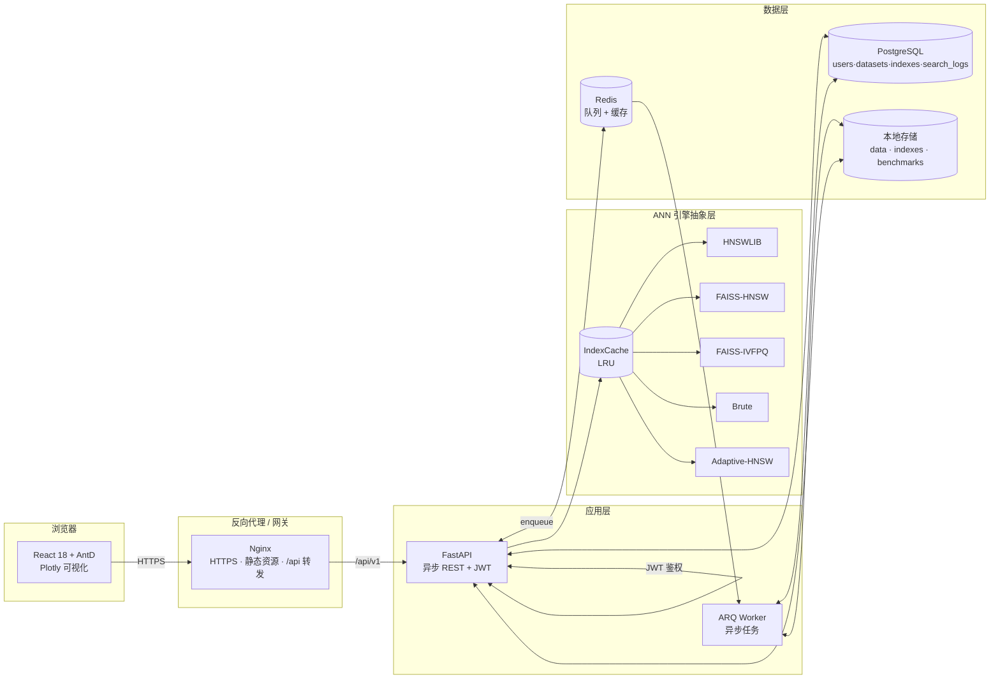
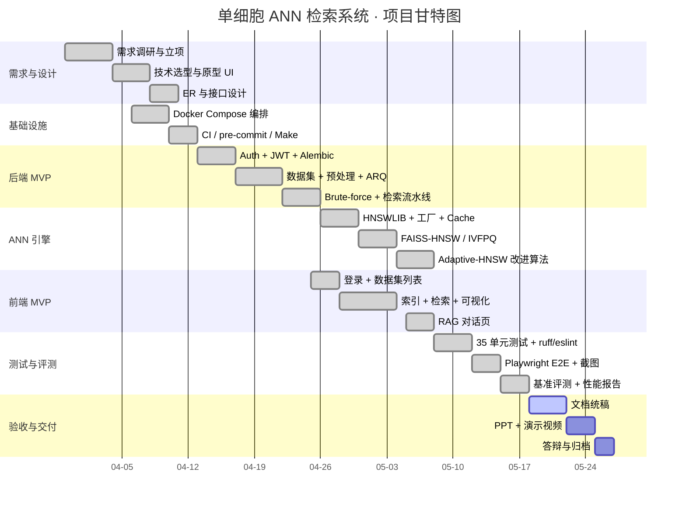

# 一、项目概述

## 1.1 开发背景

### 1.1.1 单细胞测序与高维向量数据

随着单细胞测序 (Single-cell sequencing) 技术从 SMART-seq、Drop-seq 到 10x Genomics 的不断成熟，单次实验产生的细胞规模已从最初的数百量级扩展到数十万乃至上百万。每个细胞经过质量控制 (QC)、文库归一化 (Normalization)、对数变换 (log1p)、高变基因选择 (HVG)、缩放 (Scaling) 等流水线处理后，通常会进一步通过 PCA / scVI / Harmony 等方法降至 30~200 维稠密向量，并在 `obsm` 字段中以 `X_pca`、`X_scvi`、`X_umap` 等键保存。

这些高维向量是后续**细胞类型注释 (Cell type annotation)**、**轨迹分析 (Trajectory analysis)**、**疾病相关亚群发现**以及**跨数据集整合 (Data integration)** 的基础输入。在所有这些任务中，"快速找到一个查询细胞 / 查询向量在大型参考库中的 Top-K 相似细胞"都是最频繁、最底层的核心算子。

### 1.1.2 ANN 算法的演进

传统的精确最近邻 (Exact Nearest Neighbor) 搜索在低维或小规模数据上简单可靠，但在 `N × D` 高维场景下复杂度为 `O(N·D)`，难以满足交互式分析的延迟要求。为缓解"维度灾难 (Curse of Dimensionality)"，近似最近邻 (Approximate Nearest Neighbor, ANN) 算法发展出了几条主要技术路线：

| 阶段 | 代表算法 | 思路 | 优势 | 局限 |
| --- | --- | --- | --- | --- |
| 哈希 | **LSH** (Locality Sensitive Hashing) | 设计随机投影使相近向量大概率落入同桶 | 实现简单、内存低 | 高维下需要大量哈希表，召回波动大 |
| 聚类倒排 | **IVF** (Inverted File Index) | 先用 k-means 聚类，仅在与查询最近的若干簇 (`nprobe`) 中精查 | 构建快、可扩展 | 簇数需精调，召回与 nprobe 强相关 |
| 图索引 | **HNSW** (Hierarchical Navigable Small World) | 构建多层小世界图，从顶层贪心下沉到底层做 best-first search | 召回率高、延迟低，工业界主流 | 内存占用偏大、构建相对慢 |
| 量化压缩 | **PQ / OPQ** (Product Quantization) | 将向量切分为子向量并各自做码本量化，对内存做几十倍压缩 | 内存极低，适合超大规模 | 量化误差导致召回下降 |
| 混合 | **IVF-PQ / IVF-HNSW** | 倒排桶内再叠加量化或图索引 | 兼顾内存与精度 | 调参维度多 |

本系统在工程上**同时实现** Brute / HNSWLIB / FAISS-HNSW / FAISS-IVFPQ 四个主流后端，并自研一个 **Adaptive-HNSW** 后端作为算法改进点，覆盖了上述演进路径中最关键的几类思想，从而能够在同一套数据管线上做真实可比的横向评测。

### 1.1.3 业务驱动

当前主流的单细胞分析工具（如 scanpy 的 `sc.tl.umap` / `sc.pp.neighbors`）大多以 Python 脚本形式运行，缺乏面向多人协作、长期演化的工程化平台；而商用向量数据库（Milvus、Pinecone）在元数据过滤、生物学语义、与 AnnData 生态衔接方面又存在断层。本项目的工程目标即填补这一空白：以 Web 应用形态封装"数据集 → 索引 → 检索 → 可视化 → 评测"的完整闭环，让生物信息学研究者只需通过浏览器即可完成端到端的相似细胞检索分析。

## 1.2 项目目标

按经典的 **MoSCoW** 方法 (Must / Should / Could / Won't) 对系统目标进行分层。

### 1.2.1 Must Have（必须实现）

- **M1 数据上传**：支持上传 `.h5ad` 文件（标准 AnnData 容器），自动解析 `n_obs`、`n_vars`、`obsm` 键集合与 `obs` 元信息列。
- **M2 多 ANN 后端**：至少实现 Brute / HNSWLIB / FAISS-HNSW / FAISS-IVFPQ 四个后端，前端统一参数面板可切换。
- **M3 Top-K 检索**：支持按 `cell_id`、自定义向量两种查询方式，返回 Top-K 命中条目及距离。
- **M4 条件检索**：支持基于 `obs` 元信息（如 `cell_type` / `disease` / `tissue`）的等值与多值过滤。
- **M5 异步索引构建**：长耗时索引构建走 ARQ + Redis 任务队列异步执行，前端轮询任务状态。
- **M6 用户体系**：注册、登录、JWT 鉴权、按拥有者隔离的数据集 / 索引访问控制。
- **M7 可视化**：UMAP / t-SNE 二维投影 + Top-K 高亮 + 距离分布。
- **M8 性能评测**：与 Brute-force ground truth 对比的 `Recall@K`、`P50/P95/P99` 延迟、QPS。

### 1.2.2 Should Have（应实现）

- **S1 跨数据集联合检索**：在多个数据集上并发检索，距离归一化后合并 Top-K。
- **S2 索引缓存 (LRU)**：进程内 LRU 缓存已加载的 `IndexBackend` 实例，避免重复反序列化。
- **S3 检索历史**：每次检索写 `search_logs` 表，可回放参数与结果。
- **S4 完整 OpenAPI**：FastAPI 自动生成 `openapi.json` + Swagger UI，便于前后端联调与第三方集成。

### 1.2.3 Could Have（可选实现，作为加分）

- **C1 改进的 ANN 算法**：自研 **Adaptive-HNSW**，按 query 粒度动态扩张 `ef_search`，在保持 P95 延迟可控的前提下提升尾部召回。
- **C2 RAG 自然语言查询**：自然语言 → LLM 解析为结构化检索参数 → ANN → LLM 生成自然语言总结。
- **C3 评测自动化报告**：评测结果落盘为 JSON，前端按索引聚合展示。

### 1.2.4 Won't Have（本期不做）

- **W1 GPU 加速**：评估表明 30 万 × 30 维场景下 CPU 已能达到 P95 < 0.2 ms，本期不引入 `faiss-gpu`。
- **W2 多租户计费**：不实现按用户配额与计费的 SaaS 能力。
- **W3 持久化向量数据库 (Milvus / Qdrant)**：本期仍以本地文件 + LRU 缓存承载索引，不引入外部向量数据库。

## 1.3 开发环境

### 1.3.1 软硬件清单

| 类别 | 选型 | 版本 |
| --- | --- | --- |
| 操作系统 | macOS 14 / Ubuntu 22.04 | 任意 |
| 容器化 | Docker · Docker Compose v2 | latest |
| 后端语言 | Python | 3.12 |
| 后端框架 | FastAPI · SQLAlchemy 2 (async) · Pydantic v2 · Alembic | latest |
| 任务队列 | ARQ · Redis | 7 |
| 数据库 | PostgreSQL | 17 |
| 前端语言 | TypeScript | 5.x |
| 前端框架 | React · Vite · Ant Design · Plotly.js | 18 / 5 / 5 / 2 |
| ANN 库 | HNSWLIB · FAISS · NumPy | 0.8 / 1.13 / 2.x |
| 单细胞分析 | scanpy · anndata · scipy · scikit-learn | latest |
| 包管理 | uv (Python) · pnpm/npm (JS) | latest |
| 代码规范 | ruff · prettier · ESLint · pre-commit | latest |
| CI / 版本控制 | GitHub Actions · Git · GitHub | - |
| E2E 测试 | Playwright (Python) | 1.50+ |

### 1.3.2 系统总体架构

数据从前端表单经过 Nginx 转发到 FastAPI，按"轻读写 + 重计算异步化"原则切分：

- **同步路径**：登录鉴权、元数据 CRUD、Top-K 检索（命中内存索引）；
- **异步路径**：`.h5ad` 解析与 PCA 提取、ANN 索引构建、批量评测（Recall + QPS）。

任务通过 Redis 在 API 与 ARQ Worker 之间传递，索引文件以 `<index_id>.bin/.faiss` 形式落盘到 `indexes/` 目录，由 `IndexCache` 在 API 进程内做 LRU 缓存。

## 1.4 可行性分析

### 1.4.1 技术可行性

- **数据规模**：以课程提供的 `liver.h5ad` 为例，`n_obs ≈ 69 032`、`X_pca` 维度 30，单精度浮点占用约 8 MB，可全部驻留内存；索引文件均 < 15 MB。
- **算法成熟度**：FAISS（Meta AI）与 HNSWLIB（Yandex）均为工业级开源库，已被 Milvus、Qdrant、Elastic Vector 等大规模生产系统采用。
- **框架成熟度**：FastAPI + Uvicorn + SQLAlchemy 2 async 经过 PyPI 月下载量 5000 万级别的实战验证；React 18 + Vite 5 + Plotly.js 在生物信息学社区（Cellxgene、scanpy.ext.napari）均有大量先例。
- **团队能力**：核心成员已有 Python / TypeScript / Docker 项目经验，熟悉 Git 协作流；ANN 与单细胞分析方向有学术资料覆盖。
- **工程基础**：项目自第一天即引入 Ruff / ESLint / Prettier / pre-commit + GitHub Actions CI，规避后期"屎山"风险。

### 1.4.2 资源可行性

- **硬件**：单台 MacBook Pro / 任意 8 GB+ Linux 即可承载开发与小规模评测，无需 GPU；
- **软件许可**：全部依赖均为 OSS（MIT / Apache 2.0 / BSD），零授权费；
- **数据**：课程提供 `liver.h5ad`（约 1.4 GB，~7 万细胞 × 30 维 PCA），数据来源合法、可复用；
- **算力**：本地 Docker Compose 即可启动 5 个容器（PG / Redis / API / Worker / Frontend），开发 / 演示零云成本。

### 1.4.3 时间可行性

按里程碑划分（详见 1.5）：基础设施与 MVP 约 2 周；ANN 多后端 + 前端联调约 2 周；加分项 + 性能调优约 1.5 周；测试 + 文档 + 答辩约 1.5 周。在 7 周内完成全部交付物可行。

### 1.4.4 法律 / 合规可行性

数据集为公开学术数据 (CZI cellxgene)，无个人隐私；系统不对外发布前不存在第三方接口合规风险。LLM 调用走可配置 Provider，可在 `mock` 模式下完全离线，不向外发送数据。

## 1.5 项目计划

### 1.5.1 阶段划分

| 阶段 | 周次 | 主要任务 | 关键产物 |
| --- | --- | --- | --- |
| 需求与设计 | W1 | 立项、需求确认、技术选型、ER 设计 | 设计文档 v0.1 |
| 基础设施 | W2 | Docker Compose / Makefile / CI / pre-commit / 骨架 | 可运行的 dev 栈 |
| 后端 MVP | W3 | Auth / Dataset / Brute-force 检索 / Alembic | 后端可演示版本 |
| ANN 引擎 | W4 | HNSWLIB / FAISS 集成 / ARQ 异步构建 / 缓存 | 多后端可切换 |
| 前端 MVP | W4 | 登录 / 数据集 / 索引 / 检索 / Plotly 可视化 | 前后端联调 |
| 加分功能 | W5 | 条件过滤 / 跨数据集 / Adaptive-HNSW / RAG | 加分项落地 |
| 测试与评测 | W6 | pytest / Playwright E2E / 基准评测 | 测试 + 性能报告 |
| 验收与交付 | W7 | 视频 / PPT / 答辩 / 文档统稿 | 最终交付包 |

### 1.5.2 Gantt 图

### 1.5.3 风险与应对

| 风险 | 概率 | 影响 | 应对 |
| --- | --- | --- | --- |
| FAISS 在 macOS arm64 编译失败 | 中 | 中 | 使用 `faiss-cpu` PyPI wheel，Docker 镜像基于 `python:3.12-slim` |
| 大文件上传超时 | 中 | 中 | 8 MB 分片流式写盘 + ARQ 异步预处理（实测 1.3 GB 上传 38 s）|
| LLM API Key 不可控 | 低 | 低 | `LLM_PROVIDER=mock` 关键词规则 + 模板兜底，CI 中默认走 mock |
| 团队 Git 冲突 | 中 | 低 | main 分支保护 + Pull Request + 约定式提交 + pre-commit |
| 索引文件膨胀 | 低 | 中 | LRU Cache + 单数据集索引上限 5，超出自动驱逐 |

## 1.6 项目交付成果

### 1.6.1 代码与制品

| 类别 | 内容 | 位置 |
| --- | --- | --- |
| 源代码 | 后端 19+ commit / 前端 8 个页面 / E2E 1 个脚本 | GitHub 仓库（`backend/`、`frontend/`、`e2e/`）|
| 部署编排 | Docker Compose / Nginx / Makefile / `.env.example` | `infra/`、根目录 |
| 数据集 | `liver.h5ad` (~1.4 GB)，已 git-ignore | `data/raw/liver/`（运行时上传）|
| ANN 索引 | 实测产物（hnswlib / faiss-hnsw / faiss-ivfpq / adaptive-hnsw）| `indexes/<dataset_id>/` |
| 基准结果 | `benchmark_results.json`、`benchmark_report.md` | `docs/` |
| E2E 截图 | 9 张全流程截图（登录 → 上传 → 索引 → 检索 → RAG）| `docs/e2e_screenshots/` |

### 1.6.2 文档清单

| 编号 | 文档 | 用途 |
| --- | --- | --- |
| 01 | [`docs/01_项目概述.md`](01_项目概述.md) | 背景、目标、环境、计划、交付 |
| 02 | [`docs/02_需求分析与系统设计.md`](02_需求分析与系统设计.md) | 角色、需求、架构、ER、接口、UI |
| 03 | [`docs/03_系统测试.md`](03_系统测试.md) | 测试策略、用例、性能、缺陷 |
| 04 | [`docs/04_项目管理.md`](04_项目管理.md) | 分工、里程碑、Git 工作流、PR |
| 05 | [`docs/05_用户手册.md`](05_用户手册.md) | 部署、操作、故障排查、调优 |
| 06 | [`docs/06_API接口文档.md`](06_API接口文档.md) | 21 个 REST 接口速查表 |
| 附 | [`docs/benchmark_report.md`](benchmark_report.md) | 5 后端横向性能基准报告 |
| 附 | [`README.md`](../README.md) | 仓库总览与快速开始 |

### 1.6.3 演示物料

| 物料 | 形式 | 位置 |
| --- | --- | --- |
| 演示视频 | 5~8 分钟全流程录屏 | `docs/video/` |
| 答辩 PPT | 包含 ER / 架构 / 评测对比 / 加分项亮点 | `docs/slides/` |
| 在线 API 文档 | Swagger UI / ReDoc | <http://localhost:8000/docs> · <http://localhost:8000/redoc> |
| 性能基准报告 | Markdown + JSON | [`docs/benchmark_report.md`](benchmark_report.md) |

### 1.6.4 关键指标快照（最终实测）

| 指标 | 实测值 | 备注 |
| --- | --- | --- |
| 数据集规模 | 69 032 细胞 × 30 维 PCA | `liver.h5ad`，PCA 已由数据提供方完成 |
| 索引构建（HNSWLIB） | 0.224 s | M=16, ef_construction=200 |
| Recall@10（HNSWLIB） | 0.9996 | 以 Brute 为 ground truth |
| Recall@10（Adaptive-HNSW） | 0.9994 | 平均 ef=50.6，最大重试 2 |
| P95 延迟（HNSWLIB, c=1, k=10） | 0.020 ms | 单线程同步检索 |
| 峰值 QPS（HNSWLIB, c=8, k=10） | 85 711 | 8 线程并发 |
| 单元测试通过率 | 35 / 35 | pytest 全绿 |
| E2E 全流程 | 上传 → 索引 → 检索 → RAG 全流程跑通 | 9 张截图归档 |
| 代码静态检查 | ruff 0 警告 / eslint 0 错误 | CI 强制 |
