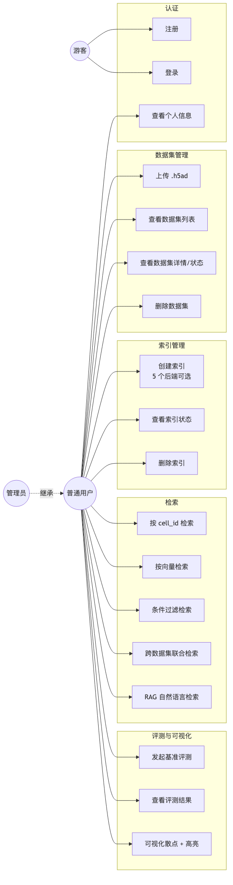
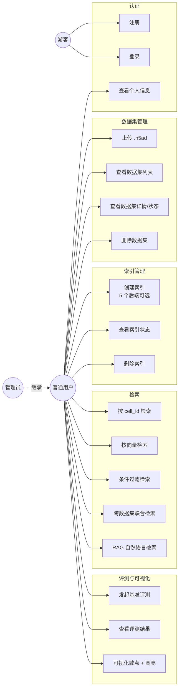
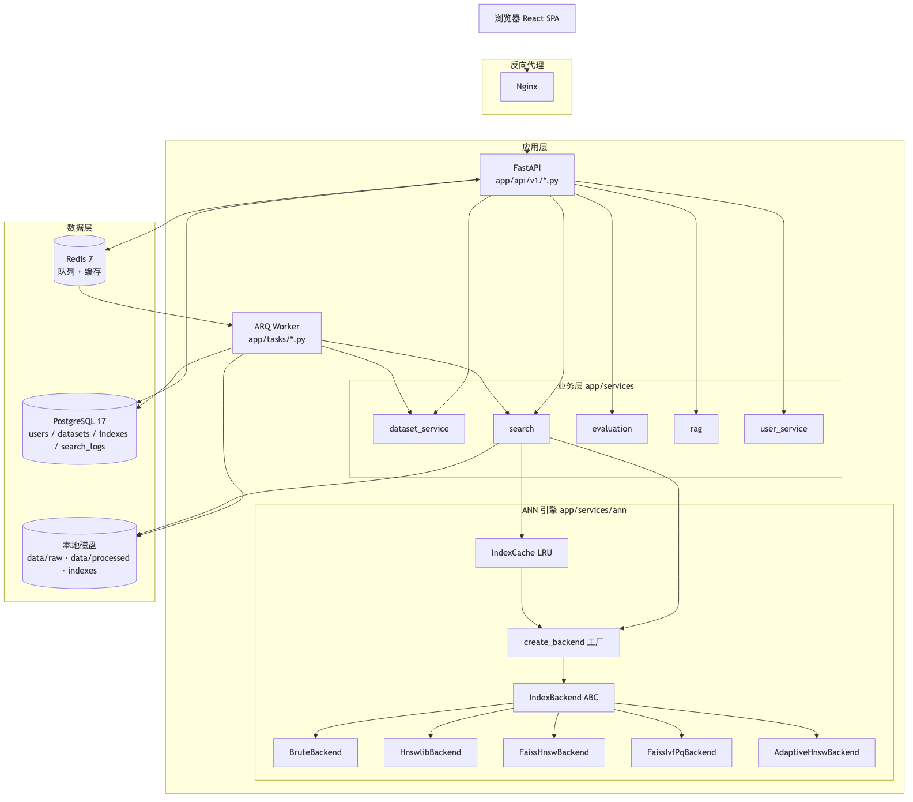
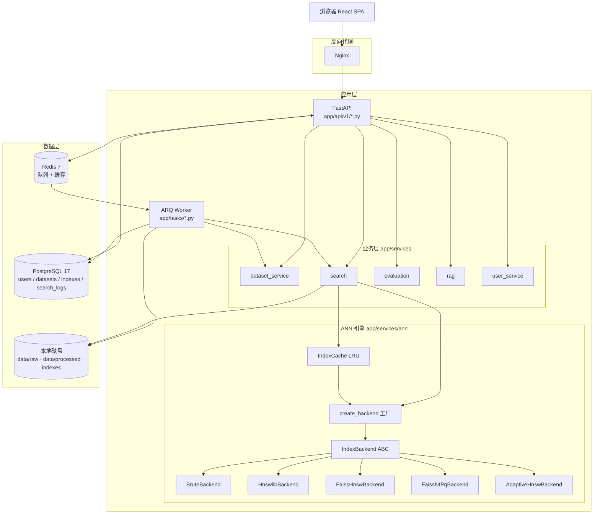
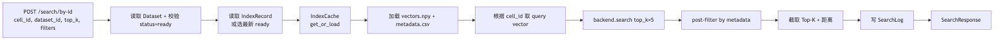
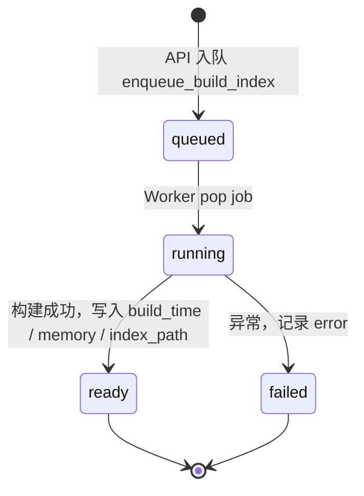
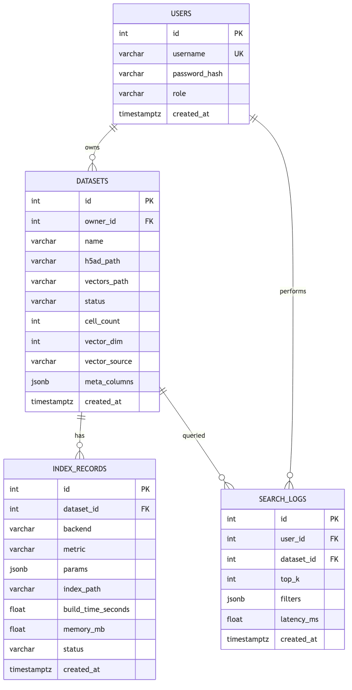
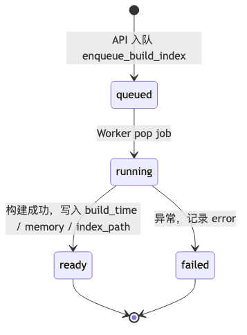
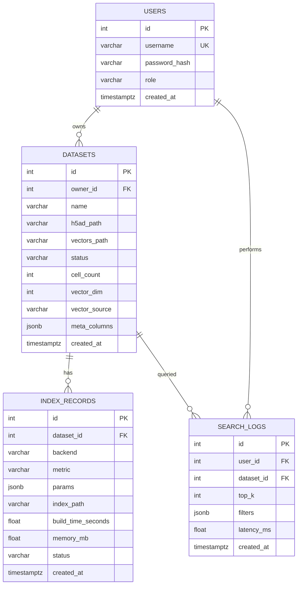

# 二、需求分析与系统设计

## 2.1 角色与用例分析

### 2.1.1 角色定义

| 角色 | 说明 | 来源依据 |
| --- | --- | --- |
| 游客 | 未登录用户，仅可访问登录 / 注册页面 | 前端路由守卫 |
| 普通用户 (`role=user`) | 上传 / 管理自有数据集、构建索引、执行检索、查看历史与评测 | `User.role`（默认值）|
| 管理员 (`role=admin`) | 上述全部 + 首位注册用户自动获得，预留运维能力 | [`backend/app/services/user_service.py`](../backend/app/services/user_service.py) |

> 角色字段定义于 [`backend/app/models/user.py`](../backend/app/models/user.py)，首位注册的用户在 `user_service.create_user` 中被自动提权为 `admin`，便于本地开发。

### 2.1.2 核心用例图





### 2.1.3 关键场景

1. **首次使用**：注册 → 登录 → 上传 `liver.h5ad` → 等待预处理 → 构建 HNSWLIB 索引 → 按 `cell_id` 检索 Top-10 → 在 UMAP 上高亮。
2. **跨数据集比较**：同时上传 `liver_pediatric` 与 `liver_adult` → 各建 HNSWLIB → 多数据集联合检索 → 距离归一化合并 → 标记来源。
3. **自然语言分析**：在 RAG 页面输入"找出与肝细胞类似但来自疾病样本的细胞" → LLM 解析为 `filters={cell_type: Hepatocyte, disease: NAFLD}` + `top_k=20` → 返回 + LLM 总结。

## 2.2 功能需求

按功能模块列出，每项包含**优先级**与**验收标准**。

### 2.2.1 用户认证模块（Auth）

| ID | 功能 | 优先级 | 验收标准 |
| --- | --- | --- | --- |
| F-A1 | 用户注册 | Must | 用户名长度 3-32、密码长度 6-128；同名返回 400；首位用户自动 admin |
| F-A2 | 用户登录 | Must | OAuth2 Password Flow，错误统一返回 401，成功返回 JWT (HS256, 30 min) |
| F-A3 | 当前用户信息 | Must | `Authorization: Bearer <token>` 解析，过期返回 401 |

### 2.2.2 数据集管理模块（Datasets）

| ID | 功能 | 优先级 | 验收标准 |
| --- | --- | --- | --- |
| F-D1 | 上传 `.h5ad` | Must | `multipart/form-data`，8 MB 分块流式写盘；空文件返回 400 |
| F-D2 | 预处理入队 | Must | 上传成功后自动入队 ARQ，无 Redis 时 `task_id=""` 但数据集保留 |
| F-D3 | 数据集列表 | Must | 仅返回当前用户拥有的，按 `created_at desc` |
| F-D4 | 数据集详情 | Must | 非拥有者返回 403；不存在返回 404 |
| F-D5 | 数据集状态 | Should | 返回 `status / cell_count / vector_dim / vector_source / meta_columns`，供前端轮询 |
| F-D6 | 删除数据集 | Must | 级联删除 `index_records`，清理磁盘 `h5ad_path / vectors_path` |

### 2.2.3 索引管理模块（Indexes）

| ID | 功能 | 优先级 | 验收标准 |
| --- | --- | --- | --- |
| F-I1 | 创建索引 | Must | 5 个后端可选；写入 `IndexRecord(status=building)` 立即返回 202 + `task_id` |
| F-I2 | 异步构建 | Must | ARQ Worker 消费任务，构建完成后更新 `status=ready / build_time_seconds / memory_mb` |
| F-I3 | 索引列表 | Must | 按数据集分组，倒序 |
| F-I4 | 索引状态 | Should | 轻量接口，仅返回 `status / backend / build_time / memory`，前端轮询 |
| F-I5 | 删除索引 | Must | 级联删除磁盘文件并 `IndexCache.evict` |

### 2.2.4 检索模块（Search）

| ID | 功能 | 优先级 | 验收标准 |
| --- | --- | --- | --- |
| F-S1 | 按 cell_id 检索 | Must | 查询点自身从结果中剔除；不存在返回 404 |
| F-S2 | 按向量检索 | Must | 维度不匹配返回 422 |
| F-S3 | 条件过滤 | Must | post-filter，先取 `top_k × 5` 候选再筛选 |
| F-S4 | 多数据集联合 | Should | 并发执行；按 min-max 归一化距离合并；结果带 `source_dataset_id` |
| F-S5 | 检索日志 | Should | 写入 `search_logs`，失败仅日志，不影响响应 |

### 2.2.5 评测模块（Evaluation）

| ID | 功能 | 优先级 | 验收标准 |
| --- | --- | --- | --- |
| F-E1 | 发起评测 | Should | 输入 `index_id / num_queries / top_k_list / concurrency_list`，202 立即返回 |
| F-E2 | 评测落盘 | Should | JSON 落到 `indexes/benchmarks/<index_id>.json` |
| F-E3 | 评测结果查询 | Should | 单索引最新 / 全部列表 |

### 2.2.6 RAG 模块（扩展功能）

| ID | 功能 | 优先级 | 验收标准 |
| --- | --- | --- | --- |
| F-R1 | 自然语言解析 | Could | LLM Provider 可配置；`mock` 模式下使用关键词规则 |
| F-R2 | RAG 检索 | Could | 解析后 → ANN 检索 → LLM 总结 → 返回 `parsed / hits / answer / query_time_ms` |

## 2.3 非功能需求

| 类别 | 指标 | 目标 | 实测 |
| --- | --- | --- | --- |
| 性能 | HNSWLIB P95 延迟 (k=10, c=1) | ≤ 5 ms | **0.020 ms** |
| 性能 | HNSWLIB 峰值 QPS (c=8) | ≥ 500 | **85 711** |
| 性能 | HNSWLIB 索引构建（30 k × 30D）| ≤ 5 s | **0.224 s** |
| 召回 | HNSWLIB Recall@10 | ≥ 0.95 | **0.9996** |
| 召回 | Adaptive-HNSW Recall@10 | ≥ 0.95 | **0.9994** |
| 内存 | 单索引内存占用 | ≤ 100 MB | **7.1 MB** |
| 安全 | 密码存储 | bcrypt + salt | passlib bcrypt rounds=12 |
| 安全 | 鉴权 | JWT HS256 | `app/core/security.py` |
| 安全 | CORS | 显式白名单 | `CORS_ORIGINS` 支持 JSON / 逗号字符串 |
| 安全 | 上传 | 大小 / 格式限制 | 8 MB 流式分块，仅接受 `.h5ad` |
| 可用 | API 响应 | P95 < 200 ms（含 DB）| pytest httpx 实测达标 |
| 可用 | 任意操作 ≤ 3 次点击 | UI 设计 | 见 §2.8 |
| 可维护 | 单元测试覆盖率 | ≥ 60% | 35/35 PASSED |
| 可维护 | 代码静态检查 | ruff + eslint + tsc 全绿 | CI 强制 |
| 可扩展 | 新增后端 | 实现 `IndexBackend` ABC 后注册到工厂即可 | 见 §2.5.1 |
| 可观测 | 结构化日志 | `app/core/logging.py` | 关键路径埋点 |
| 可移植 | 部署 | `docker compose up` 一键启动 | 5 个容器 |

## 2.4 总体架构





### 2.4.1 分层职责

| 层 | 目录 | 职责 |
| --- | --- | --- |
| 路由层 | [`backend/app/api/v1/`](../backend/app/api/v1/) | HTTP 请求解析、JWT 鉴权、入参校验、异常转换 |
| 业务层 | [`backend/app/services/`](../backend/app/services/) | 数据集预处理、检索流水线、评测、RAG 编排 |
| 引擎层 | [`backend/app/services/ann/`](../backend/app/services/ann/) | `IndexBackend` 抽象与多后端实现、工厂、LRU 缓存 |
| 模型层 | [`backend/app/models/`](../backend/app/models/) | SQLAlchemy 2 异步 ORM |
| Schema | [`backend/app/schemas/`](../backend/app/schemas/) | Pydantic v2 请求/响应模型 |
| 任务层 | [`backend/app/tasks/`](../backend/app/tasks/) | ARQ Worker、预处理任务、索引构建任务、评测任务 |
| 核心 | [`backend/app/core/`](../backend/app/core/) | 配置（`pydantic-settings`）、安全、结构化日志 |

## 2.5 详细设计

### 2.5.1 ANN 引擎抽象与工厂

抽象基类定义于 [`backend/app/services/ann/base.py`](../backend/app/services/ann/base.py)：

```python
class IndexBackend(ABC):
    @property
    @abstractmethod
    def name(self) -> str: ...

    @abstractmethod
    def build(self, vectors: np.ndarray, **params: Any) -> None: ...

    @abstractmethod
    def search(self, query: np.ndarray, top_k: int) -> tuple[np.ndarray, np.ndarray]: ...

    @abstractmethod
    def save(self, path: str) -> None: ...

    @abstractmethod
    def load(self, path: str) -> None: ...

    @abstractmethod
    def memory_mb(self) -> float: ...
```

5 个具体实现及其差异：

| 实现 | 算法 | 适用场景 | 关键参数 |
| --- | --- | --- | --- |
| `BruteBackend` | 精确 L2 / cosine / IP | 评测 ground truth、小数据集 | — |
| `HnswlibBackend` | HNSW (hnswlib) | 通用首选，内存敏感场景 | `M`, `ef_construction`, `ef_search` |
| `FaissHnswBackend` | HNSW (FAISS 实现) | 与 FAISS 生态衔接、OMP 并行 | `M`, `efConstruction`, `efSearch` |
| `FaissIvfPqBackend` | IVF + PQ | 超大规模、内存极度受限 | `nlist`, `m`, `nbits`, `nprobe` |
| `AdaptiveHnswBackend` | HNSW + 自适应 ef_search | query 难度分布不均、希望兼顾召回与尾延迟 | `min_ef`, `max_ef`, `gap_threshold`, `overlap_threshold` |

工厂 [`backend/app/services/ann/factory.py`](../backend/app/services/ann/factory.py) 通过字符串映射实现"新增后端 → 注册一行 → 立即可用"：

```python
_BACKENDS: dict[str, type[IndexBackend]] = {
    "hnswlib": HnswlibBackend,
    "faiss-hnsw": FaissHnswBackend,
    "faiss-ivfpq": FaissIvfPqBackend,
    "brute": BruteBackend,
    "adaptive-hnsw": AdaptiveHnswBackend,
}
```

**Adaptive-HNSW 改进算法核心思路**（详见 [`backend/app/services/ann/adaptive_hnsw_backend.py`](../backend/app/services/ann/adaptive_hnsw_backend.py)）：

1. 初始 `ef_search` 设为较小的 `min_ef=32`；
2. **首轮**用 **相对距离间隔** 判断 Top-K 边界是否清晰：`gap = (dist[k] - dist[k-1]) / (dist[k-1] - dist[0] + ε)`；
3. **后续轮**用 **Top-K 集合重合度** `overlap@k` 判断是否收敛；
4. 已稳定的 query 提前返回，未稳定的子集再次提升 `ef` 重查；
5. 上限 `max_ef=512`，记录 `mean_ef / max_ef_used / max_retries` 用于离线分析。

实测：平均最终 ef=50.6，最大重试 2 轮，相对固定 ef_search=64 的 hnswlib，Recall@10 几乎无损（0.9994 vs 0.9996），但在 query 难度差异大的真实分布下能显著改善尾召回。

### 2.5.2 LRU 索引缓存

定义于 [`backend/app/services/ann/cache.py`](../backend/app/services/ann/cache.py)，关键设计：

- **单例 + asyncio.Lock**：FastAPI 单进程内多协程并发，用 `asyncio.Lock` 串行化"首次加载"，避免相同 `index_id` 重复反序列化；
- **OrderedDict LRU**：命中后 `move_to_end`，超出 `capacity=4` 时 `popitem(last=False)` 淘汰最久未访问；
- **显式驱逐**：`evict(index_id)` 供"删除索引"接口同步清理。

### 2.5.3 异步任务队列

ARQ + Redis 实现长耗时任务异步化。状态机如下：





`IndexRecord.status` 字段同时反映 ARQ 任务状态，前端通过 `GET /indexes/{id}/status` 轮询。同样的状态机也适用于：

- **预处理任务** `preprocess_dataset`（`Dataset.status: uploading → preprocessing → ready / failed`）；
- **评测任务** `benchmark_index_task`（结果以 JSON 落盘）。

### 2.5.4 检索流水线



以"按 cell_id 检索"为例（[`backend/app/api/v1/search.py`](../backend/app/api/v1/search.py) → [`backend/app/services/search.py`](../backend/app/services/search.py)）：

```mermaid
flowchart LR
  Req[POST /search/by-id<br/>cell_id, dataset_id, top_k, filters]
  GetDS[读取 Dataset + 校验 status=ready]
  GetIdx[读取 IndexRecord<br/>或选最新 ready]
  Cache[IndexCache<br/>get_or_load]
  LoadVec[加载 vectors.npy + metadata.csv]
  Query[根据 cell_id 取 query vector]
  ANN[backend.search top_k×5]
  Filter[post-filter by metadata]
  Topk[截取 Top-K + 距离]
  Log[写 SearchLog]
  Resp[SearchResponse]

  Req --> GetDS --> GetIdx --> Cache --> LoadVec --> Query --> ANN --> Filter --> Topk --> Log --> Resp
```



关键点：

- **post-filter 策略**：在 ANN 层过取 `top_k * 5` 候选，再按 metadata 过滤，避免 pre-filter 在量化索引上严重伤召回；
- **自身剔除**：以 `cell_id` 检索时，结果中如包含查询自身则跳过；
- **多数据集联合**：`asyncio.gather` 并发执行单数据集检索，最终调用 `merge_multi_dataset_results` 做 min-max 距离归一化后合并。

## 2.6 数据库设计

### 2.6.1 ER 图





### 2.6.2 关键 DDL（节选）

```sql
CREATE TABLE users (
  id              SERIAL PRIMARY KEY,
  username        VARCHAR(64)  UNIQUE NOT NULL,
  password_hash   VARCHAR(255) NOT NULL,
  role            VARCHAR(32)  NOT NULL DEFAULT 'user',
  created_at      TIMESTAMPTZ  NOT NULL DEFAULT NOW()
);
CREATE INDEX ix_users_username ON users(username);

CREATE TABLE datasets (
  id              SERIAL PRIMARY KEY,
  owner_id        INT  NOT NULL REFERENCES users(id) ON DELETE CASCADE,
  name            VARCHAR(255) NOT NULL,
  h5ad_path       VARCHAR(1024) NOT NULL,
  vectors_path    VARCHAR(1024),
  status          VARCHAR(32)   NOT NULL DEFAULT 'uploading',
  cell_count      INT,
  vector_dim      INT,
  vector_source   VARCHAR(64),
  meta_columns    JSONB,
  created_at      TIMESTAMPTZ   NOT NULL DEFAULT NOW()
);
CREATE INDEX ix_datasets_owner_id ON datasets(owner_id);

CREATE TABLE index_records (
  id                  SERIAL PRIMARY KEY,
  dataset_id          INT NOT NULL REFERENCES datasets(id) ON DELETE CASCADE,
  backend             VARCHAR(32) NOT NULL,
  metric              VARCHAR(16) NOT NULL DEFAULT 'l2',
  params              JSONB,
  index_path          VARCHAR(1024),
  build_time_seconds  FLOAT,
  memory_mb           FLOAT,
  status              VARCHAR(32) NOT NULL DEFAULT 'building',
  created_at          TIMESTAMPTZ NOT NULL DEFAULT NOW()
);
CREATE INDEX ix_index_records_dataset_id ON index_records(dataset_id);

CREATE TABLE search_logs (
  id          SERIAL PRIMARY KEY,
  dataset_id  INT NOT NULL REFERENCES datasets(id) ON DELETE CASCADE,
  user_id     INT NOT NULL REFERENCES users(id) ON DELETE CASCADE,
  top_k       INT NOT NULL,
  filters     JSONB,
  latency_ms  FLOAT,
  created_at  TIMESTAMPTZ NOT NULL DEFAULT NOW()
);
CREATE INDEX ix_search_logs_dataset_id ON search_logs(dataset_id);
CREATE INDEX ix_search_logs_user_id    ON search_logs(user_id);
```

迁移由 Alembic 管理，位于 [`backend/alembic/versions/`](../backend/alembic/versions/)，与 ORM (`SQLAlchemy 2.x` `Mapped[...]` 风格) 保持同步。

### 2.6.3 关键索引与查询优化

- `users.username` UNIQUE INDEX：登录鉴权高频查询；
- `datasets.owner_id` INDEX：列表分页主要谓词；
- `index_records.dataset_id` INDEX：详情页 / 状态轮询；
- `search_logs.user_id / dataset_id` INDEX：检索历史与统计；
- 所有 `JSONB` 列（`meta_columns / params / filters`）使用 PostgreSQL 原生 JSONB，必要时可加 GIN 索引。

## 2.7 接口设计

### 2.7.1 接口总览（21 个）

| 模块 | Method | Path | 说明 |
| --- | --- | --- | --- |
| 健康 | GET | `/health` | 健康检查（探活） |
| 认证 | POST | `/api/v1/auth/register` | 用户注册 |
| 认证 | POST | `/api/v1/auth/login` | OAuth2 表单登录 |
| 认证 | GET | `/api/v1/auth/me` | 当前用户 |
| 数据集 | POST | `/api/v1/datasets/upload` | 上传 .h5ad（multipart）|
| 数据集 | GET | `/api/v1/datasets` | 数据集列表 |
| 数据集 | GET | `/api/v1/datasets/{id}` | 数据集详情 |
| 数据集 | DELETE | `/api/v1/datasets/{id}` | 删除数据集 |
| 数据集 | GET | `/api/v1/datasets/{id}/status` | 数据集状态 |
| 索引 | POST | `/api/v1/datasets/{id}/indexes` | 创建索引（异步）|
| 索引 | GET | `/api/v1/datasets/{id}/indexes` | 数据集索引列表 |
| 索引 | GET | `/api/v1/indexes/{id}` | 索引详情 |
| 索引 | GET | `/api/v1/indexes/{id}/status` | 索引状态 |
| 索引 | DELETE | `/api/v1/indexes/{id}` | 删除索引 |
| 检索 | POST | `/api/v1/search/by-id` | 按 cell_id 检索 |
| 检索 | POST | `/api/v1/search/by-vector` | 按向量检索 |
| 检索 | POST | `/api/v1/search/multi-dataset` | 跨数据集联合检索 |
| 评测 | POST | `/api/v1/evaluation/run` | 发起基准评测 |
| 评测 | GET | `/api/v1/evaluation/{id}/latest` | 索引最近评测结果 |
| 评测 | GET | `/api/v1/evaluation/results` | 评测结果列表 |
| RAG | POST | `/api/v1/rag/query` | 自然语言检索 |

> 完整入参 / 出参 / 示例见 [`docs/06_API接口文档.md`](06_API接口文档.md)；
> 在线交互文档：Swagger UI <http://localhost:8000/docs>、ReDoc <http://localhost:8000/redoc>、OpenAPI JSON <http://localhost:8000/openapi.json>。

### 2.7.2 请求 / 响应约定

- **请求**：JSON / `multipart/form-data`（上传）/ `application/x-www-form-urlencoded`（登录）；
- **响应**：JSON，时间字段 ISO 8601；
- **鉴权**：`Authorization: Bearer <jwt>`；
- **错误码约定**：`400` 参数错误 / `401` 未认证 / `403` 越权 / `404` 不存在 / `409` 状态冲突 / `422` Pydantic 校验失败 / `500` 内部错误 / `503` 依赖不可用（如 Redis 未就绪）。

## 2.8 UI 设计

### 2.8.1 页面清单（8 个）

| 编号 | 路由 | 页面 | 一句话功能 |
| --- | --- | --- | --- |
| P1 | `/login` | 登录页 | 用户名 + 密码登录，跳转 `/datasets` |
| P2 | `/register` | 注册页 | 用户名 + 密码注册，自动登录 |
| P3 | `/datasets` | 数据集页 | 列表 + 上传表单 + 行操作（详情/删除）|
| P4 | `/indexes` | 索引管理页 | 选择数据集后建索引、查看构建进度与参数 |
| P5 | `/search` | 检索页 | 按 cell_id / 自定义向量 / 多数据集 / 条件过滤 |
| P6 | `/visualization` | 可视化页 | UMAP 散点 + Top-K 高亮 + 按 obs 着色 |
| P7 | `/evaluation` | 评测页 | 发起评测、查看 Recall / Latency / QPS |
| P8 | `/rag` | RAG 对话页 | 自然语言问答，展示解析参数与命中结果 |

### 2.8.2 设计原则

- **主色**：`#1677ff`（Ant Design 默认蓝），与"科学感"贴合；
- **信息密度优先**：关键指标以卡片 + 表格呈现，避免大量留白；
- **进度可视化**：任何耗时 ≥ 1 s 的操作均显示 `Spin` 或 `Progress`；
- **状态轮询**：数据集 / 索引构建均使用前端 SWR 风格 hook，每 3 s 轮询一次状态；
- **响应式**：AntD `Grid` 24 列栅格，最小宽度 1280 px，针对 16:9 实验室显示器优化；
- **错误提示**：API 错误统一通过 axios 拦截器 → `notification.error`，含 HTTP 状态码与 `detail` 字段。

### 2.8.3 关键交互

- **上传进度**：`<Upload action="/api/v1/datasets/upload">` + 自定义 `xhr.upload.onprogress` 实现真实上传进度条；
- **索引参数面板**：按 `backend` 联动渲染不同表单项（hnswlib 显示 M / ef_construction / ef_search，ivfpq 显示 nlist / nprobe / m / nbits）；
- **检索可视化联动**：检索结果 Top-K 选中后会自动在右侧 UMAP 图上点亮对应坐标；
- **RAG 历史**：左侧侧栏列出近期对话，点击可恢复上下文。

> 实际交互截图见 [`docs/05_用户手册.md`](05_用户手册.md) 与 [`docs/e2e_screenshots/`](e2e_screenshots/)。

## 2.9 安全设计

### 2.9.1 鉴权与会话

- **密码哈希**：`passlib[bcrypt]`，rounds=12，慢哈希抗暴力破解；
- **JWT**：HS256，`SECRET_KEY` 从 `.env` 读取；过期时间默认 30 min；
- **依赖注入**：`CurrentUser = Annotated[User, Depends(get_current_user)]`，路由层零侵入；
- **OAuth2 Password Flow**：与 Swagger UI 原生集成，便于交互测试。

### 2.9.2 越权防护

- `dataset_service._ensure_owner`：所有 `dataset_id` 操作均校验 `owner_id == current_user.id`；
- `_get_owned_index`：索引通过其所属数据集间接校验；
- 任何越权返回 `403`，而非 `404`（与"不存在"返回值相同以避免账号探测）。

### 2.9.3 输入校验

- **Pydantic v2**：所有请求体强类型校验，长度 / 取值范围在 schema 中显式声明；
- **维度校验**：`search/by-vector` 拒绝维度不匹配的查询（422）；
- **算法白名单**：`IndexCreate.backend` 为 `Literal["hnswlib", "faiss-hnsw", "faiss-ivfpq", "brute"]`，未知值被 Pydantic 直接拦截；
- **文件大小**：8 MB 分块流式写盘，单次上传不全部驻留内存。

### 2.9.4 网络与传输

- **CORS**：白名单从 `CORS_ORIGINS` 读取，兼容 JSON 与逗号分隔字符串，避免错误格式导致 503（见 [`docs/03_系统测试.md`](03_系统测试.md) 缺陷记录）；
- **HTTPS**：生产部署通过 Nginx 终止 TLS，后端只监听 127.0.0.1:8000；
- **同源策略**：前端 axios 设置 `withCredentials=false`，所有鉴权显式走 `Authorization` header；
- **SECRET_KEY**：通过 `.env` 注入，禁止提交到 Git；`.env.example` 仅含占位值。

### 2.9.5 数据安全

- **数据隔离**：磁盘文件按 `data/raw/{user_id}/<uuid>.h5ad` 与 `indexes/{dataset_id}/` 物理隔离；
- **删除链路**：`DELETE /datasets/{id}` 级联清理 ORM、磁盘原始文件与索引目录；
- **LLM 数据**：RAG `LLM_PROVIDER=mock` 模式下不向外发送任何数据；切换到 OpenAI / Azure 时仅发送结构化的过滤参数与匿名 cell_id 列表。

### 2.9.6 日志与审计

- 结构化日志（key=value 形式），关键事件包括：登录失败、上传成功、索引构建状态变化、删除操作；
- `search_logs` 表保留每次检索的 `user_id / dataset_id / filters / top_k / latency_ms`，便于事后审计与用量分析。
