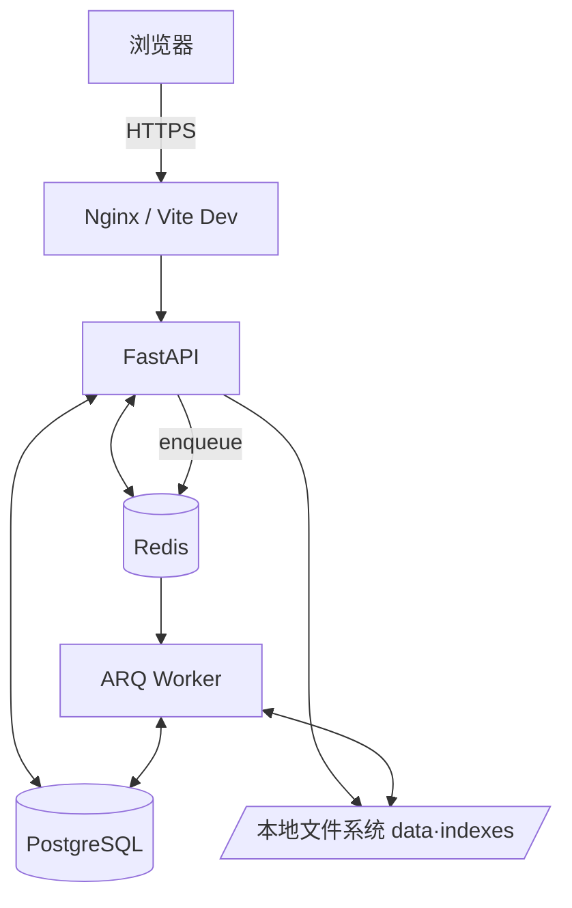
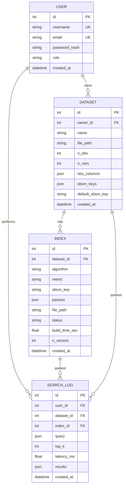

# 二、需求分析与系统设计

## 2.1 需求分析

### 2.1.1 角色

| 角色 | 说明 |
| --- | --- |
| 游客 | 仅可访问登录 / 注册页面 |
| 普通用户 | 上传数据集、构建索引、执行检索、查看结果与历史 |
| 管理员 | 上述全部 + 管理用户、查看系统级数据集 / 索引 |

### 2.1.2 功能需求

1. **用户信息模块**
   - 注册、登录、登出（JWT）；
   - 个人信息查看与修改；
   - 管理员可查看 / 启停 / 删除用户。

2. **数据管理模块**
   - 上传 `.h5ad` 数据集；
   - 自动解析并展示 `n_obs`、`n_vars`、`obs` 列、`obsm` 可用向量字段；
   - 数据集预览（前 N 行 obs、UMAP 投影）；
   - 删除 / 重命名 / 切换私有 / 公开。

3. **索引构建模块**
   - 在指定向量字段上构建 ANN 索引（Brute-force / FAISS-Flat / FAISS-IVF / HNSW）；
   - 选择距离度量 (L2 / cosine / inner product)；
   - 调参（IVF 的 `nlist` / `nprobe`、HNSW 的 `M` / `efConstruction` / `efSearch`）；
   - 异步构建（ARQ Worker），实时查询任务状态；
   - 索引保存 / 加载 / 卸载 / 删除。

4. **查询检索模块**
   - 输入细胞 ID 或自定义向量；
   - 选择数据集、索引、Top-K、距离度量；
   - 条件检索（按 obs 列做等值 / 范围过滤）；
   - 多数据集联合检索（加分）；
   - 自然语言查询入口（加分，RAG）；
   - 返回 Top-K 细胞元信息 + 距离 + 高亮坐标。

5. **可视化展示模块**
   - UMAP / t-SNE 2D 散点图，按 obs 列着色；
   - Top-K 命中点高亮；
   - 距离分布直方图；
   - 性能指标看板（QPS、平均延迟、召回率）。

6. **历史与评测**
   - 查询历史记录列表与回放；
   - 不同索引的批量评测脚本与报告。

### 2.1.3 非功能需求

- **性能**：单数据集 10 万级细胞，Top-K=10，HNSW 查询延迟 P95 < 50ms；
- **可用性**：Web 端响应式布局，主要操作 ≤ 3 次点击；
- **安全**：密码 bcrypt 加盐存储、JWT 鉴权、CORS 白名单、上传文件大小限制；
- **可维护性**：模块化设计、单元测试覆盖率 ≥ 60%、自动 lint / format；
- **可移植性**：Docker Compose 一键部署，开发与生产环境一致；
- **可观测性**：结构化日志、健康检查、关键指标埋点。

## 2.2 系统设计

### 2.2.1 总体架构



### 2.2.2 后端分层

| 层 | 目录 | 职责 |
| --- | --- | --- |
| 路由层 | `app/api/` | 参数校验、鉴权、依赖注入、调用 service |
| 业务层 | `app/services/` | 数据集、索引、检索、用户业务逻辑 |
| ANN 引擎 | `app/services/index_engines/` | 统一 `IndexEngine` 抽象 + 多实现 |
| 数据层 | `app/db/` · `app/models/` | SQLAlchemy session、ORM 模型 |
| 任务层 | `app/tasks/` | ARQ worker、索引构建、数据预处理任务 |
| Schema | `app/schemas/` | Pydantic 请求 / 响应模型 |
| 核心 | `app/core/` | 配置、安全、日志、依赖工厂 |

### 2.2.3 前端架构

- 路由：`react-router` `/login`、`/datasets`、`/datasets/:id`、`/search`、`/admin`；
- 状态：`zustand` 拆分 `authStore`、`datasetStore`、`searchStore`；
- 数据获取：基于 `openapi-typescript` 生成 axios 客户端；
- 组件：Ant Design + Plotly.js（散点 / 热图）。

## 2.3 详细设计

### 2.3.1 ANN 引擎抽象

```python
class IndexEngine(Protocol):
    def build(self, vectors: np.ndarray, ids: list[int]) -> None: ...
    def save(self, path: str) -> None: ...
    def load(self, path: str) -> None: ...
    def search(self, query: np.ndarray, top_k: int) -> tuple[np.ndarray, np.ndarray]: ...
```

实现类：`BruteForceEngine`、`FaissFlatEngine`、`FaissIvfEngine`、`HnswEngine`。

### 2.3.2 主要接口

| Method | Path | 描述 |
| --- | --- | --- |
| POST | `/api/auth/register` | 注册 |
| POST | `/api/auth/login` | 登录 |
| GET | `/api/users/me` | 当前用户 |
| GET | `/api/datasets` | 数据集列表 |
| POST | `/api/datasets` | 上传数据集 (multipart) |
| GET | `/api/datasets/{id}` | 数据集详情 |
| DELETE | `/api/datasets/{id}` | 删除 |
| GET | `/api/datasets/{id}/preview` | 预览 obs / obsm |
| POST | `/api/indexes` | 创建索引（异步） |
| GET | `/api/indexes/{id}` | 索引详情 / 状态 |
| GET | `/api/tasks/{id}` | 任务状态 |
| POST | `/api/search` | Top-K 检索 |
| POST | `/api/search/multi` | 多数据集联合检索 |
| POST | `/api/search/nl` | 自然语言检索 (RAG) |
| GET | `/api/search/history` | 检索历史 |

### 2.3.3 异步任务流

1. 用户提交「构建索引」请求；
2. API 写入 `indexes` 表 (status=`pending`)，将 task_id enqueue 到 Redis；
3. ARQ Worker 消费：读取 h5ad → 取出向量 → 构建索引 → 落盘到 `indexes/<index_id>.bin` → 更新 `status=ready`；
4. 前端轮询 / WS 订阅任务状态。

## 2.4 数据库设计

### 2.4.1 ER 图



### 2.4.2 关键索引

- `dataset.owner_id`；
- `index.dataset_id`、`index.status`；
- `search_log.user_id`、`search_log.created_at`。

## 2.5 UI 设计

主要页面：

1. **登录 / 注册**：统一样式表单，错误提示在表单内。
2. **数据集列表**：表格 + 上传按钮 + 搜索 + 分页。
3. **数据集详情**：左侧元信息卡片，右侧 Tab（预览 obs / UMAP 投影 / 索引列表 / 检索）。
4. **索引构建**：表单（算法 / 度量 / 参数 / obsm key），提交后显示任务进度条。
5. **检索页**：查询输入（cell id / 向量 / 自然语言）+ 参数 + Top-K 结果表 + 散点图。
6. **历史**：检索记录列表，可回放结果。
7. **管理后台**（管理员）：用户管理、系统数据集。

设计原则：

- 主色：科学感的深蓝 (#1677ff)，辅以浅灰背景；
- 信息密度 > 装饰，关键指标卡片化；
- 所有耗时操作有明确进度反馈；
- 暗色模式作为可选项。
