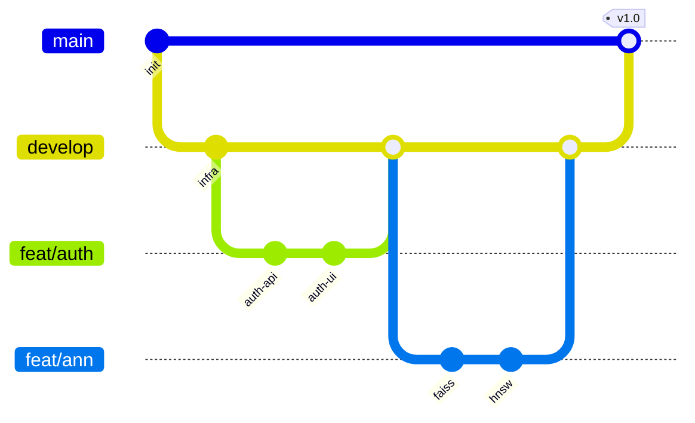

# 四、项目管理

## 4.1 参与人员与分工

> 实际姓名 / 学号在交付前完整填入。

| 序号 | 姓名 | 学号 | 角色 | 主要职责 | 贡献度 |
| --- | --- | --- | --- | --- | --- |
| 1 | TBD | TBD | 项目经理 / 后端 | 项目规划、API 设计、ANN 引擎集成、文档统稿 | 25% |
| 2 | TBD | TBD | 后端 / 算法 | 数据预处理、索引构建、检索服务、Alembic | 25% |
| 3 | TBD | TBD | 前端 / 可视化 | React 页面、Plotly 可视化、状态管理、UI 交互 | 25% |
| 4 | TBD | TBD | 测试 / DevOps | pytest / locust 用例、CI、Docker 编排、性能评测 | 25% |

如团队为 3 人，将测试 / DevOps 与前端或后端合并。

### 4.1.1 责任矩阵 (RACI)

| 任务 | PM/后端 | 后端/算法 | 前端 | 测试/DevOps |
| --- | --- | --- | --- | --- |
| 需求与设计 | R/A | C | C | C |
| 数据库与迁移 | A | R | I | C |
| ANN 引擎实现 | A | R | I | C |
| API 与服务 | R | R/A | C | C |
| 前端页面 | C | C | R/A | C |
| 可视化 | I | C | R/A | C |
| 测试与基准 | C | C | C | R/A |
| CI / Docker / 部署 | C | C | C | R/A |
| 演示视频 / 答辩 | R/A | C | C | C |

R = 负责，A = 决策，C = 咨询，I = 知会。

## 4.2 项目进展记录

| 里程碑 | 计划完成 | 实际完成 | 主要交付 | 备注 |
| --- | --- | --- | --- | --- |
| M1 立项与设计 | Wx-x | TBD | 设计文档 v0.1 | - |
| M2 基础设施 | Wx-x | TBD | Compose / Makefile / CI | - |
| M3 后端 MVP | Wx-x | TBD | 数据集 + Brute-force 检索 | 中期演示 |
| M4 ANN 多引擎 | Wx-x | TBD | FAISS / HNSW 切换 | - |
| M5 前端 MVP | Wx-x | TBD | 登录 / 列表 / 检索 / 可视化 | - |
| M6 加分功能 | Wx-x | TBD | 多数据集 / RAG / 改进算法 | - |
| M7 测试与评测 | Wx-x | TBD | 测试报告 / 性能报告 | - |
| M8 最终交付 | Wx-x | TBD | 视频 / PPT / 答辩 | - |

### 4.2.1 周报模板

```
# 第 N 周周报 (YYYY-MM-DD ~ YYYY-MM-DD)

## 本周进展
- [姓名] 完成了 ...

## 下周计划
- [姓名] 计划 ...

## 风险与阻塞
- ...

## 关键指标
- 已合并 PR: x，新增 issue: x
```

## 4.3 项目管理工具

| 工具 | 用途 |
| --- | --- |
| GitHub | 代码托管 + Issues + Projects + Actions |
| GitHub Projects (Kanban) | Todo / In Progress / In Review / Done |
| Git (主干 + 分支) | `main` 保护、`develop` 集成、`feat/*` `fix/*` 功能分支 |
| Pull Request | Code Review，至少 1 名队员 approve 后合并 |
| Pre-commit | 本地提交前自动 lint / format |
| GitHub Actions | CI：lint + test + build |
| 飞书 / 微信群 | 即时沟通、视频会议 |
| 在线文档 (本仓库 `docs/`) | 设计文档统一管理 |

### 4.3.1 Git 工作流



### 4.3.2 提交规范（约定式提交）

| 类型 | 用途 | 示例 |
| --- | --- | --- |
| feat | 新功能 | `feat(search): 支持条件检索` |
| fix | 修复 | `fix(index): 修正 IVF nprobe 默认值` |
| docs | 文档 | `docs: 完善 README 快速开始` |
| refactor | 重构 | `refactor(service): 抽象 IndexEngine` |
| test | 测试 | `test: 增加 HNSW 召回率基准` |
| chore | 杂项 | `chore: 升级 ruff 至 0.7.4` |
| ci | CI | `ci: 增加前端 build 步骤` |

### 4.3.3 代码评审 Checklist

- [ ] 功能是否对应 issue / 设计；
- [ ] 是否覆盖正常 / 异常 / 边界用例；
- [ ] 是否补充 / 更新文档；
- [ ] 是否通过 ruff / eslint / tests；
- [ ] 命名 / 注释是否清晰；
- [ ] 是否暴露敏感信息（密钥、token）；
- [ ] 性能影响是否可接受。
