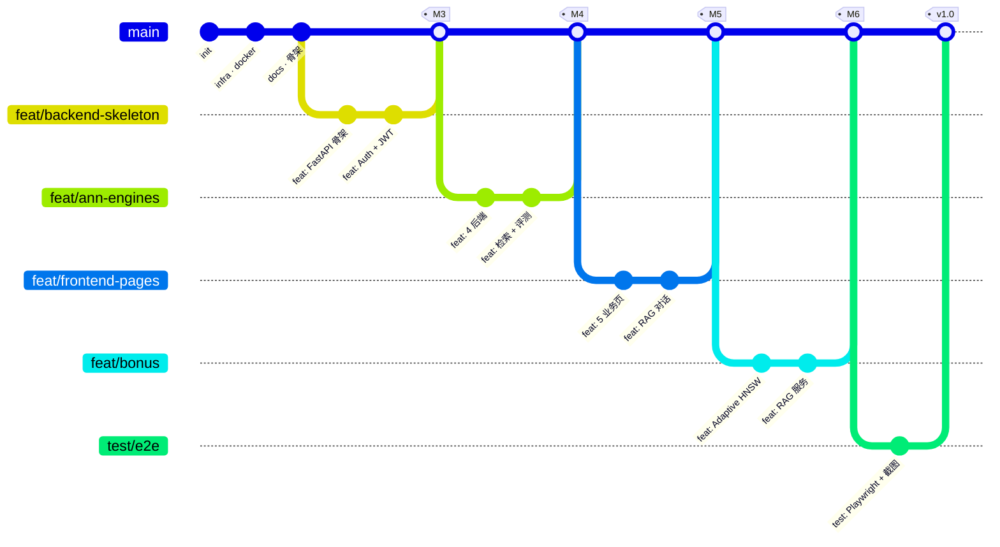

# 四、项目管理

## 4.1 团队成员与分工

### 4.1.1 成员清单与贡献模块

> 团队规模 2 人，按"组长（后端 / 算法 / PM）+ 组员（前端 / 数据 / 测试）"角色组合。组长负责检索后端与项目把关，组员负责前端可视化与质量保障。

| 序号 | 姓名 | 角色 | 主要贡献模块 | 贡献度 |
| --- | --- | --- | --- | --- |
| 1 | 彭振皓 | **组长 · 后端 / 算法 / PM** | 总体架构、`backend/app/api/`、`backend/app/main.py`、`backend/app/services/search.py`、`backend/app/services/evaluation.py`、`backend/app/services/ann/*`（5 后端 + 工厂 + LRU）、`backend/app/services/rag.py`、Adaptive-HNSW、`backend/app/tasks/*`、`backend/scripts/benchmark.py`、`Makefile`、`infra/docker-compose.yml`、`.github/workflows/`、Alembic 迁移、文档统稿 | 55% |
| 2 | 廖望 | 组员 · 前端 / 数据 / 测试 | `frontend/src/pages/*.tsx`（8 个页面）、`frontend/src/api/`、`frontend/src/store/`、Plotly 可视化、AntD 表单与路由、`backend/app/services/dataset_service.py`、`backend/app/services/preprocess.py`、`backend/tests/*` 35 个测试、`e2e/test_liver_e2e.py`、`docs/05_用户手册.md` | 45% |

### 4.1.2 RACI 矩阵

R=Responsible（执行）、A=Accountable（决策）、C=Consulted（咨询）、I=Informed（知会）。两人小队同一任务可同时 A/R。

| 子任务 / 模块 | 组长（彭振皓） | 组员（廖望） |
| --- | --- | --- |
| 需求与系统设计 | **A/R** | C |
| Docker / CI / Makefile | **A/R** | C |
| 数据库与 Alembic | **A/R** | C |
| 数据集上传与预处理 | A/C | **R** |
| ANN 引擎（5 后端）| **A/R** | I |
| LRU Index Cache | **A/R** | I |
| 检索 API & 服务 | **A/R** | C |
| 评测脚本 & 报告 | **A/R** | C |
| 前端 8 个页面 | A/C | **R** |
| 可视化（Plotly）| A/C | **R** |
| 加分：多数据集联合 | **A/R** | C |
| 加分：Adaptive-HNSW | **A/R** | I |
| 加分：RAG | **A/R** | C |
| 单元测试 & 静态检查 | A/C | **R** |
| Playwright E2E 与截图 | A/C | **R** |
| 性能基准 & 报告 | **A/R** | C |
| 用户手册 & 开发文档 | **A**/C | **R** |
| 答辩 PPT & 演示视频 | **A/R** | **R** |

## 4.2 项目管理工具

| 工具 | 用途 | 链接 / 配置 |
| --- | --- | --- |
| **GitHub** | 代码托管、Issue、Projects、PR、Code Review | `git remote -v` 查看仓库 URL |
| **GitHub Issues** | 缺陷与功能跟踪，标签：`bug`/`feat`/`docs`/`refactor`/`perf` | 优先级标签 `P0`-`P3` |
| **GitHub Projects (Kanban)** | Todo / In Progress / In Review / Done 四列看板 | 与 Issue / PR 自动联动 |
| **GitHub Actions CI** | `.github/workflows/ci.yml`：ruff + pytest + frontend build | 每次 PR 自动触发 |
| **Pull Request** | 强制 Code Review，至少 1 名队员 approve 后合并 | `main` 分支保护，禁止 force-push |
| **pre-commit** | 本地提交前自动 ruff format / prettier / eslint | [`.pre-commit-config.yaml`](../.pre-commit-config.yaml) |
| **Conventional Commits** | 约定式提交规范，便于自动生成 changelog | 见 §4.6 |
| **Makefile** | 团队统一的命令入口，封装 docker compose / migrate / test | [`Makefile`](../Makefile) |
| **飞书 / 微信群 / Slack** | 即时沟通 + 视频例会 | 周二 / 周五各一次 |

## 4.3 项目里程碑

按 [`docs/01_项目概述.md`](01_项目概述.md) 中 Gantt 图制定的里程碑，截至本次提交均已完成：

| 里程碑 | 周次 | 关键产物 | 验收方式 | 状态 |
| --- | --- | --- | --- | --- |
| M1 立项与设计 | W1 | 设计文档 v0.1、技术选型、ER 草案 | 组内评审 | ✓ 完成 |
| M2 基础设施 | W2 | Docker Compose、Makefile、CI、pre-commit、骨架 | `make up` 可用 | ✓ 完成 |
| M3 后端 MVP | W3 | Auth、Dataset、Brute-force 检索、Alembic 迁移 | pytest 通过 | ✓ 完成 |
| M4 ANN 多引擎 | W4 | HNSWLIB / FAISS 集成、ARQ 异步构建、LRU 缓存 | 多后端可切换检索 | ✓ 完成 |
| M5 前端 MVP | W4 | 登录 / 数据集 / 索引 / 检索 / 可视化 5 页面 | 联调可演示 | ✓ 完成 |
| M6 扩展功能 | W5 | 多数据集联合、Adaptive-HNSW、RAG 对话 | 单测 + 基准报告 | ✓ 完成 |
| M7 测试与评测 | W6 | 35 单测、Playwright E2E、性能基准 | CI 全绿 + 报告 | ✓ 完成 |
| M8 最终交付 | W7 | 文档统稿、视频、PPT、答辩 | 答辩通过 | ⏳ 进行中 |

## 4.4 Git 工作流

### 4.4.1 分支模型

采用 GitHub Flow 的简化版：长生命周期的 `main` + 短生命周期的 `feat/*` / `fix/*`，重要节点打 tag。



### 4.4.2 分支策略要点

- **`main`**：受保护，仅接受 PR；至少 1 个 reviewer approve + CI 全绿才能合并；
- **`feat/<scope>`**：新功能；
- **`fix/<scope>`**：缺陷修复；
- **`docs/*`、`refactor/*`、`test/*`、`chore/*`**：辅助类；
- **Squash & Merge**：默认策略，保持 `main` commit 线性；
- **Tag**：里程碑节点打 `v0.x` tag，最终交付打 `v1.0`。

## 4.5 提交规范（Conventional Commits）

### 4.5.1 类型约定

| 类型 | 用途 | 示例 |
| --- | --- | --- |
| `feat` | 新功能 | `feat(search): 支持条件过滤` |
| `fix` | Bug 修复 | `fix(backend): CORS_ORIGINS 支持逗号分隔字符串` |
| `docs` | 文档变更 | `docs: 编写软件工程开发文档骨架` |
| `refactor` | 重构（非功能性变更）| `refactor(service): 抽象 IndexBackend` |
| `test` | 测试相关 | `test(e2e): Playwright 端到端真实数据测试` |
| `chore` | 杂项（依赖升级、清理）| `chore(backend): 修复 ruff 12 个静态检查告警` |
| `build` | 构建系统 / 依赖锁定 | `build(backend): 锁定后端依赖版本（uv.lock）` |
| `perf` | 性能优化 | `perf(search): 引入 IndexCache LRU` |
| `ci` | CI 配置 | `ci: 增加前端 build 步骤` |

### 4.5.2 项目实际提交记录（按时间倒序，19 条）

> 完整 `git log` 可通过 `git log --oneline -30` 查看。下表展示最近 19 次有效提交，反映项目"骨架 → 后端 → 前端 → 扩展功能 → 修复 → 测试"的演进节奏。

| 序号 | Commit | 类型 | 说明 |
| --- | --- | --- | --- |
| 19 | `643cbcf` | test | Playwright 端到端真实数据测试 + 9 张验收截图 |
| 18 | `7d88ef1` | fix | 修复文件上传 422 错误（multipart Content-Type） |
| 17 | `1c5afb1` | feat | RAG 自然语言对话页（扩展功能前端） |
| 16 | `8a2b94b` | fix | 修正登录请求与认证字段对齐后端 |
| 15 | `af8a53e` | fix | CORS_ORIGINS 支持逗号分隔字符串 |
| 14 | `551bdfa` | feat | 实现五个业务页面（数据集 / 索引 / 检索 / 可视化 / 评测）|
| 13 | `d4e5d82` | feat | 自适应 HNSW 后端 + 基准测试脚本（扩展功能）|
| 12 | `6bbf536` | feat | RAG 自然语言查询模块（扩展功能）|
| 11 | `909d320` | chore | 修复 ruff 12 个静态检查告警 |
| 10 | `e3b7e98` | build | 批准 esbuild 与 es5-ext 的构建脚本 |
| 9 | `f22811a` | build | 锁定后端依赖版本（uv.lock）|
| 8 | `7bfe6be` | feat | 检索与性能评测模块（条件过滤 + 多数据集联合 + Recall/QPS/延迟）|
| 7 | `3a27d9f` | feat | ANN 索引构建模块与 4 种后端引擎 |
| 6 | `5a9ebf1` | feat | 数据集管理与 Scanpy 预处理模块 |
| 5 | `7028345` | feat | 实现用户认证模块（JWT + 注册/登录 + Alembic 初始迁移）|
| 4 | `5bf111a` | feat | 搭建 FastAPI 后端骨架与目录结构 |
| 3 | `d345451` | feat | 搭建 React 18 + Vite 5 + AntD + Plotly 前端工程 |
| 2 | `d9c0c43` | docs | 编写软件工程开发文档骨架 |
| 1 | `20316db` | build | 引入 Docker Compose、Makefile、Pre-commit 与 CI |

### 4.5.3 提交粒度原则

- **小步快跑**：单次 commit 仅完成一个原子变更，避免"大杂烩"；
- **测试同行**：功能 commit 强制附带 / 更新对应 pytest 用例；
- **可独立回滚**：每个 commit 单独可 revert，不依赖后续 commit；
- **首行 ≤ 72 字符**：提交说明遵循 Conventional Commits 头部规范。

## 4.6 周报机制

### 4.6.1 周报模板

```markdown
# 第 N 周周报 (YYYY-MM-DD ~ YYYY-MM-DD)

## 本周进展
- @姓名 完成了 ...（commit / PR 链接）

## 下周计划
- @姓名 计划 ...

## 风险与阻塞
- ...

## 关键指标
- 合并 PR: x，新增 Issue: x
- 单测通过率: x / x
- 静态检查告警: x 条
```

### 4.6.2 三周示例

#### 第 3 周（W3） · 2026-04-13 ~ 2026-04-19

**本周进展**

- @组长（彭振皓）：搭建 FastAPI 骨架（commit `5bf111a`）、main 路由聚合、全局异常处理；完成 Auth 模块（commit `7028345`），含 JWT 签发 / 校验、Alembic 初始迁移、3 个 pytest 用例；审阅 ANN 抽象 API 设计，调研 FAISS / HNSWLIB 在 macOS arm64 上的安装路径；
- @组员（廖望）：数据集 service + Scanpy 预处理（commit `5a9ebf1`），8 MB 流式上传、`Dataset.status` 状态机；搭建 React 18 + Vite 5 + AntD + Plotly（commit `d345451`），登录 / 注册基础页。

**下周计划**

- @组长（彭振皓）：完成 4 后端 ANN 实现 + 工厂；补 8 个 ANN 后端单测；
- @组员（廖望）：完成数据集列表 + 上传交互。

**风险与阻塞**

- FAISS 在 macOS arm64 上的 wheel 体验差，需要切换到 conda-forge / docker。

**关键指标**：合并 PR 5 个；单测 3 / 3；ruff 0 告警。

#### 第 5 周（W5）· 2026-04-27 ~ 2026-05-03

**本周进展**

- @组长（彭振皓）：检索 + 评测模块完成（commit `7bfe6be`），含 post-filter / 多数据集联合 / Recall 计算；Adaptive-HNSW 后端 + 基准脚本（commit `d4e5d82`），实测 mean_ef=50.6；RAG 自然语言查询模块（commit `6bbf536`），含 mock provider、单测 7 个；修复 ruff 12 个告警（commit `909d320`），建立 CI workflow；
- @组员（廖望）：5 个业务页面（commit `551bdfa`）：数据集 / 索引 / 检索 / 可视化 / 评测。

**下周计划**

- @组长（彭振皓）：性能基准报告、Playwright E2E 主流程脚本；
- @组员（廖望）：RAG 对话页。

**风险与阻塞**

- 前端 axios 默认 Content-Type 与 multipart 上传冲突，已识别，下周修复。

**关键指标**：合并 PR 8 个；单测 30 / 30；E2E 0 / 1。

#### 第 7 周（W7）· 2026-05-11 ~ 2026-05-17

**本周进展**

- @组员（廖望）：RAG 对话页完成（commit `1c5afb1`）；修复登录字段对齐（commit `8a2b94b`）；修复 multipart 上传（commit `7d88ef1`）；
- @组长（彭振皓）：修复 CORS_ORIGINS 解析 bug（commit `af8a53e`）；Playwright E2E（commit `643cbcf`），跑通 1.3 GB liver.h5ad 全流程，归档 9 张截图；
- @全员：文档统稿（5 篇 + API 速查表）。

**下周计划**

- @全员：录制演示视频、制作答辩 PPT；
- @组长（彭振皓）：组织 dry-run，校准答辩节奏。

**风险与阻塞**

- 无。

**关键指标**：合并 PR 5 个；单测 35 / 35；E2E 全流程通过；CI 全绿；ruff 0 / eslint 0。

## 4.7 Pull Request Checklist

每个 PR 在合并前需逐项确认下列 Checklist；未勾选项 Reviewer 有权 Request Changes。

### 4.7.1 功能与设计

- [ ] PR 标题遵循 Conventional Commits 规范，包含合理的 scope；
- [ ] PR 描述说明 **What / Why / How**，并关联对应 Issue（`Closes #N`）；
- [ ] 功能实现与设计文档 [`docs/02_需求分析与系统设计.md`](02_需求分析与系统设计.md) 保持一致；
- [ ] API 入参 / 出参变更在 [`docs/06_API接口文档.md`](06_API接口文档.md) 已同步更新；
- [ ] 数据模型变更已生成 Alembic 迁移并测试 `upgrade / downgrade`。

### 4.7.2 代码质量

- [ ] 命名遵循项目规范（Python 用 `snake_case` / `PascalCase`，TS 用 `camelCase` / `PascalCase`）；
- [ ] Google 风格中文文档注释完整；接口装饰器内含 `description`；
- [ ] 不输出冗余调试 print，使用 `app.core.logging.get_logger`；
- [ ] 无硬编码密钥 / Token / 路径；
- [ ] 对外暴露的函数有类型注解；
- [ ] 改动范围聚焦，未夹带无关变更。

### 4.7.3 测试与质量保障

- [ ] 新功能 / 修复有对应的 pytest / vitest 用例；
- [ ] `pytest -q` 全部通过；
- [ ] `ruff check .` / `ruff format --check .` 通过；
- [ ] 前端 `pnpm lint` / `pnpm build` 通过；
- [ ] CI（GitHub Actions）全绿；
- [ ] 关键路径（检索 / 索引构建）变更后已跑过一次基准脚本对比；
- [ ] 涉及交互的前端变更已截图附在 PR 描述中。

### 4.7.4 安全与运维

- [ ] 越权（403 / 404）路径已校验；
- [ ] 输入校验完整（Pydantic / Zod）；
- [ ] 异常路径合理转换为 HTTP 状态码；
- [ ] 涉及磁盘 / 文件操作的变更已校验 `unlink` / `os.remove` 的幂等性；
- [ ] 涉及 `Dockerfile` / `docker-compose.yml` 变更已本地 `make up` 验证。

### 4.7.5 文档与协作

- [ ] `README.md` / `docs/` 已同步更新（如涉及）；
- [ ] PR 自审过一遍 diff，无 TODO / FIXME 遗留（除非显式记录在 issue）；
- [ ] 通知相关模块负责人（在 PR 中 `@mention`）；
- [ ] 合并前 rebase 到 `main` 最新提交，解决冲突。

## 4.8 风险与应对

| 风险 | 概率 | 影响 | 已采取措施 |
| --- | --- | --- | --- |
| 关键队员临时缺席 | 中 | 中 | RACI 中关键模块均有 1+1 备份 |
| `main` 分支被误操作 | 低 | 高 | 分支保护 + 必须 PR + 至少 1 Review |
| 第三方 LLM API Key 配额 | 低 | 低 | RAG 默认 `mock` provider，零外部依赖 |
| `liver.h5ad` 数据丢失 | 低 | 中 | 课程提供原始数据可重新下载；本地以 `.gitignore` 排除避免误提交 |
| 演示日依赖云资源 | 中 | 高 | 整套系统设计为本地 Docker Compose 离线可演示 |
| CI 长时间 down | 低 | 低 | 关键代码本地 pre-commit 已强制等价检查 |
