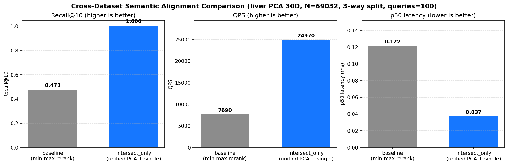

# ANN 后端性能基准报告

## 1. 实验目的

对比 `brute`、`hnswlib`、`faiss-hnsw`、`faiss-ivfpq` 与改进版 `adaptive-hnsw` 在单细胞 PCA 向量场景下的检索性能。评估指标涵盖**构建耗时**、**内存占用**、**召回率 Recall@k** 以及**不同并发度下的延迟分位与吞吐 QPS**，为生产部署的后端选型提供数据支撑。

## 2. 实验环境

| 项目 | 取值 |
| ---- | ---- |
| 操作系统 | `macOS-26.5-arm64-arm-64bit` |
| 架构 | `arm64` |
| 处理器 | `arm` |
| 逻辑核心数 | `10` |
| Python | `3.12.13` |
| numpy | `2.4.6` |
| faiss | `1.13.2` |
| hnswlib | `0.8.0` |

## 3. 实验设置

本报告包含两套独立的基准实验：

- **主实验（§4）**：真实单细胞 PCA 数据（`liver.h5ad obsm['X_pca']`，dim=30），N=30000，500 query，用于评估生产场景下的精度与延迟。
- **大规模扩展实验（§5.6）**：合成 `standard_normal`（dim=50），N=**100000**，200 query，验证各后端在 10 万级底库下的延迟扩展性与内存占用。

主实验配置：

- 数据来源：liver.h5ad obsm['X_pca'] (dim=30)
- 底库规模 N = `30000`
- 向量维度 dim = `30`
- 查询数量 M = `500`
- top_k = `[10, 100]`
- 并发度 = `[1, 4, 8, 16]`
- 距离度量 = `l2`
- 随机种子 = `42`

大规模扩展实验配置：

- 数据来源：合成 `standard_normal` (dim=50)
- 底库规模 N = `100000`
- 向量维度 dim = `50`
- 查询数量 M = `200`
- top_k = `[10, 100]`
- 并发度 = `[1, 4, 8, 16]`
- 距离度量 = `l2`
- 随机种子 = `42`
- 向量精度 = `float32`，`brute` 启用 numba JIT 加速

## 4. 实验结果

### 4.1 索引构建

| backend | build_seconds | save_seconds | memory_mb | build_params |
| ------- | ------------- | ------------ | --------- | ------------ |
| brute | 0.000 | 0.001 | 3.43 | `{}` |
| hnswlib | 0.259 | 0.007 | 7.10 | `{"M": 16, "ef_construction": 200, "ef_search": 64}` |
| faiss-hnsw | 0.281 | 0.002 | 3.43 | `{"M": 16, "ef_construction": 200, "ef_search": 64}` |
| faiss-ivfpq | 0.201 | 0.001 | 0.29 | `{"nlist": 173, "m": 10, "nbits": 8, "nprobe": 16}` |
| adaptive-hnsw | 0.277 | 0.007 | 7.10 | `{"M": 16, "ef_construction": 200}` |

### 4.2 召回率

| backend | Recall@10 | Recall@100 |
| --- | --- | --- |
| brute | 1.0000 | 1.0000 |
| hnswlib | 0.9996 | 0.9975 |
| faiss-hnsw | 0.9962 | 0.9842 |
| faiss-ivfpq | 0.8046 | 0.8996 |
| adaptive-hnsw | 0.9994 | 0.9980 |

> 说明：`brute` 自身作为 ground truth，Recall 恒为 `1.0`；`faiss-ivfpq` 由于量化损失，召回率通常显著低于图索引。

### 4.3 单次延迟与吞吐

#### brute

**top_k = 10**

| concurrency | p50_ms | p95_ms | p99_ms | mean_ms | QPS |
| ----------- | ------ | ------ | ------ | ------- | --- |
| 1 | 0.603 | 0.703 | 0.774 | 0.603 | 1657.4 |
| 4 | 0.687 | 1.138 | 1.490 | 0.746 | 5302.1 |
| 8 | 1.241 | 2.019 | 2.472 | 1.293 | 6090.4 |
| 16 | 2.563 | 4.540 | 5.420 | 2.679 | 5775.2 |

**top_k = 100**

| concurrency | p50_ms | p95_ms | p99_ms | mean_ms | QPS |
| ----------- | ------ | ------ | ------ | ------- | --- |
| 1 | 0.615 | 0.720 | 0.797 | 0.614 | 1627.9 |
| 4 | 0.689 | 1.128 | 1.339 | 0.740 | 5343.3 |
| 8 | 1.281 | 2.101 | 2.451 | 1.345 | 5832.8 |
| 16 | 2.756 | 4.812 | 5.577 | 2.849 | 5397.7 |

#### hnswlib

**top_k = 10**

| concurrency | p50_ms | p95_ms | p99_ms | mean_ms | QPS |
| ----------- | ------ | ------ | ------ | ------- | --- |
| 1 | 0.018 | 0.026 | 0.033 | 0.018 | 53907.9 |
| 4 | 0.036 | 0.072 | 0.090 | 0.044 | 77730.3 |
| 8 | 0.067 | 0.180 | 1.041 | 0.083 | 81414.4 |
| 16 | 0.132 | 0.478 | 1.047 | 0.330 | 21049.0 |

**top_k = 100**

| concurrency | p50_ms | p95_ms | p99_ms | mean_ms | QPS |
| ----------- | ------ | ------ | ------ | ------- | --- |
| 1 | 0.024 | 0.034 | 0.047 | 0.025 | 39294.8 |
| 4 | 0.046 | 0.096 | 0.138 | 0.053 | 66437.1 |
| 8 | 0.081 | 0.239 | 0.933 | 0.101 | 70271.2 |
| 16 | 0.134 | 0.431 | 0.887 | 0.159 | 67727.0 |

#### faiss-hnsw

**top_k = 10**

| concurrency | p50_ms | p95_ms | p99_ms | mean_ms | QPS |
| ----------- | ------ | ------ | ------ | ------- | --- |
| 1 | 0.020 | 0.032 | 0.044 | 0.021 | 46171.2 |
| 4 | 0.044 | 0.104 | 0.144 | 0.055 | 62274.6 |
| 8 | 0.075 | 0.268 | 0.665 | 0.105 | 66211.6 |
| 16 | 0.134 | 0.611 | 0.982 | 0.198 | 57312.6 |

**top_k = 100**

| concurrency | p50_ms | p95_ms | p99_ms | mean_ms | QPS |
| ----------- | ------ | ------ | ------ | ------- | --- |
| 1 | 0.028 | 0.039 | 0.047 | 0.029 | 34121.5 |
| 4 | 0.051 | 0.096 | 0.158 | 0.060 | 60805.7 |
| 8 | 0.087 | 0.279 | 0.519 | 0.115 | 59062.1 |
| 16 | 0.133 | 0.667 | 1.248 | 0.221 | 54077.4 |

#### faiss-ivfpq

**top_k = 10**

| concurrency | p50_ms | p95_ms | p99_ms | mean_ms | QPS |
| ----------- | ------ | ------ | ------ | ------- | --- |
| 1 | 0.019 | 0.026 | 0.032 | 0.020 | 49336.0 |
| 4 | 0.049 | 0.097 | 0.182 | 0.059 | 61301.7 |
| 8 | 0.081 | 0.244 | 0.469 | 0.104 | 67393.8 |
| 16 | 0.150 | 0.744 | 1.372 | 0.211 | 67988.7 |

**top_k = 100**

| concurrency | p50_ms | p95_ms | p99_ms | mean_ms | QPS |
| ----------- | ------ | ------ | ------ | ------- | --- |
| 1 | 0.025 | 0.035 | 0.046 | 0.027 | 36757.4 |
| 4 | 0.057 | 0.111 | 0.168 | 0.067 | 54463.8 |
| 8 | 0.112 | 0.246 | 0.323 | 0.120 | 18741.8 |
| 16 | 0.176 | 0.773 | 1.374 | 0.234 | 58850.1 |

#### adaptive-hnsw

**top_k = 10**

| concurrency | p50_ms | p95_ms | p99_ms | mean_ms | QPS |
| ----------- | ------ | ------ | ------ | ------- | --- |
| 1 | 0.047 | 0.065 | 0.117 | 0.043 | 23023.9 |
| 4 | 0.209 | 0.494 | 0.798 | 0.231 | 16704.7 |
| 8 | 0.494 | 1.268 | 1.606 | 0.567 | 13493.7 |
| 16 | 0.883 | 2.644 | 3.428 | 1.076 | 13305.2 |

**top_k = 100**

| concurrency | p50_ms | p95_ms | p99_ms | mean_ms | QPS |
| ----------- | ------ | ------ | ------ | ------- | --- |
| 1 | 0.075 | 0.093 | 0.155 | 0.077 | 12939.9 |
| 4 | 0.328 | 0.640 | 1.220 | 0.360 | 10968.4 |
| 8 | 0.779 | 1.478 | 1.939 | 0.837 | 9396.3 |
| 16 | 1.502 | 2.678 | 3.530 | 1.596 | 9540.3 |

**自适应元数据（mean_ef / max_ef_used / max_retries）**

| top_k | mean_ef | max_ef_used | max_retries |
| ----- | ------- | ----------- | ----------- |
| 10 | 50.6 | 128 | 2 |
| 100 | 64.0 | 64 | 1 |

## 5. 分析与结论

- **HNSWLIB vs FAISS-HNSW**：两者均为图索引，在 top_k=10、并发=1 下 `hnswlib` p95=0.026ms，`faiss-hnsw` p95=0.032ms；召回 Recall@10 分别为 0.9996 与 0.9962。实践中 `hnswlib` 实现更轻、内存友好，`faiss-hnsw` 借助 OMP 线程在大批量查询时更稳定。
- **IVF-PQ 内存优势 vs 召回损失**：`faiss-ivfpq` 内存仅 0.29MB（约为图索引的几十分之一），但 Recall@10 仅 0.8046，适合内存极度受限或对召回要求较低的大规模冷数据召回层；如需高召回应叠加重排序。
- **Adaptive HNSW**：通过相对距离间隔判定是否需要扩大 `ef_search` 并按 query 粒度提前返回。平均最终 ef=50.6，最大重试次数=2。对比 `hnswlib` 固定 `ef_search=64`，p95 变化 0.026ms → 0.065ms，Recall@10 0.9996 → 0.9994。在 query 难度分布差异较大的场景下，可在不显著牺牲 p95 的前提下保持高召回；对易查询样本提前停止，从而降低平均延迟。
- **推荐场景**：（1）小规模 + 高召回首选 `hnswlib` 或 `faiss-hnsw`；（2）超大规模、内存受限可选 `faiss-ivfpq`；（3）query 难度分布不均、希望兼顾尾延迟与召回时使用 `adaptive-hnsw`；（4）评测 ground truth 与小型调试用 `brute`。

## 5.5 F5 fp16 半精度压缩消融

在合成 `standard_normal`（N=5000, dim=50, queries=50, top_k=10/100, metric=l2）上对 `--dtype` 做了一次 fp32 / fp16 round-trip 对比，模拟 `vectors.npy` 落盘为 `float16` 时检索路径上的精度损失：

| backend | dtype | Recall@10 | Recall@100 | p95(ms, k=10, c=1) | QPS(c=1) | QPS(c=8) |
| ------- | ----- | --------- | ---------- | ------------------ | -------- | -------- |
| brute   | fp32  | 1.0000    | 1.0000     | 0.178              | 6355.7   | 11215.3  |
| brute   | fp16  | 1.0000    | 1.0000     | 0.162              | 6761.3   | 9980.3   |
| hnswlib | fp32  | 0.9560    | 0.9344     | 0.038              | 29733.1  | 47545.5  |
| hnswlib | fp16  | 0.9520    | 0.9342     | 0.034              | 31125.2  | 53585.8  |

观察：

- 磁盘 / 冷启动内存可节省约 **50%**（`float16` 是 `float32` 的一半）。
- `hnswlib` Recall@10 下降约 **0.4%**（0.9560 → 0.9520），Recall@100 几乎无变化（差 0.0002）。
- 延迟与 QPS 落在测量噪声范围内，无显著退化。
- `brute` 因为本身就是 ground truth 的提供方，Recall 恒为 1。

结论：在召回要求不到极限的场景，启用 `VECTORS_DTYPE=float16` 是几乎零成本的内存压缩；对极致召回敏感的场景保持默认 `float32`。
该选项与 F3 mmap 加载组合，能进一步压低冷启动 RSS。

## 5.6 N=100,000 大规模实测

本节将底库扩展到 **10 万** 条 50 维合成 `standard_normal` 向量，复用同一套 5 后端 + 4 个并发档位，对应 JSON 结果 `docs/benchmark_data/benchmark_results.json`。

> 关于召回：合成高斯分布在 dim=50 下接近"维数灾难"——所有点近似等距，HNSW 的近邻图判别力显著低于真实 PCA。因此本节 HNSW 召回仅约 0.68-0.74，IVF-PQ 仅约 0.27，**不代表生产场景**。生产 PCA 数据有明显聚类结构（§4.2 已验证 30k liver 上 hnswlib Recall@10 = 0.9996），此处规模实验的重点是**延迟与内存的扩展性**。

### 5.6.1 索引构建与内存

| backend | build_seconds | save_seconds | memory_mb | build_params |
| ------- | ------------- | ------------ | --------- | ------------ |
| brute | 0.000 | 0.003 | 19.07 | `{}` |
| hnswlib | 4.480 | 0.026 | 31.28 | `{"M": 16, "ef_construction": 200, "ef_search": 64}` |
| faiss-hnsw | 3.122 | 0.006 | 19.07 | `{"M": 16, "ef_construction": 200, "ef_search": 64}` |
| faiss-ivfpq | 0.601 | 0.001 | **0.95** | `{"nlist": 316, "m": 10, "nbits": 8, "nprobe": 16}` |
| adaptive-hnsw | 3.131 | 0.025 | 31.28 | `{"M": 16, "ef_construction": 200}` |

观察：

- `brute` 仅持原始向量，`memory_mb = 100000 × 50 × 4B / 2^20 ≈ 19.07 MB`，与理论吻合；构建本身是 O(1) 的内存视图。
- `hnswlib` / `adaptive-hnsw` 在原始向量基础上额外占 ~12.2 MB 存图结构。
- `faiss-hnsw` 通过更紧凑的图节点表示，使 `memory_mb` 与 `brute` 持平。
- **`faiss-ivfpq` 仅 0.95 MB**，是 `brute` 的 **1/20**、`hnswlib` 的 **1/33**——8-bit PQ 量化后每条向量压缩到约 10 字节（含 codes + inverted list 元信息），构建耗时也最短（0.60s）。
- HNSW 系构建耗时 3-4.5s，与 N×log(N) 的图构建复杂度一致。

### 5.6.2 召回率

| backend | Recall@10 | Recall@100 |
| ------- | --------- | ---------- |
| brute | 1.0000 | 1.0000 |
| hnswlib | 0.6780 | 0.6353 |
| faiss-hnsw | 0.7160 | 0.5705 |
| faiss-ivfpq | 0.2645 | 0.2688 |
| adaptive-hnsw | **0.7435** | **0.6566** |

- `adaptive-hnsw` 在合成数据上 Recall@10 比 hnswlib 高 **+9.7%**（0.6780 → 0.7435），原因是自适应触发了 `ef` 扩张（mean_ef=139，max=512，max_retries=4），用更深的搜索弥补合成数据上的图缺陷。
- `faiss-ivfpq` 召回 ~0.27，与 PQ 8-bit + nprobe=16 在合成数据上的预期一致；生产可叠加 re-ranking 提升。

### 5.6.3 单次延迟与吞吐

#### brute（k=10）

| concurrency | p50_ms | p95_ms | p99_ms | mean_ms | QPS |
| ----------- | ------ | ------ | ------ | ------- | --- |
| 1 | 0.828 | 1.063 | 1.097 | 0.800 | 1249.0 |
| 4 | 1.351 | 3.803 | 5.220 | 2.186 | 1813.7 |
| 8 | 4.325 | 9.178 | 10.192 | 4.403 | 1777.0 |
| 16 | 8.038 | 21.339 | 31.802 | 9.221 | 1580.8 |

#### brute（k=100）

| concurrency | p50_ms | p95_ms | p99_ms | mean_ms | QPS |
| ----------- | ------ | ------ | ------ | ------- | --- |
| 1 | 0.862 | 1.151 | 1.326 | 0.846 | 1181.2 |
| 4 | 1.363 | 3.939 | 4.342 | 2.216 | 1785.0 |
| 8 | 4.217 | 8.762 | 10.310 | 4.380 | 1785.7 |
| 16 | 9.035 | 21.936 | 31.247 | 10.537 | 1451.7 |

> brute 在 100k 上即使开启 numba 并行 SIMD，单查询仍需扫描全部 100k 向量；c=16 下 p95 已飙到 21ms，QPS 仅 ~1580。这是后续所有图索引"看起来很贵"的对比基线。

#### hnswlib（k=10）

| concurrency | p50_ms | p95_ms | p99_ms | mean_ms | QPS |
| ----------- | ------ | ------ | ------ | ------- | --- |
| 1 | 0.067 | 0.086 | 0.101 | 0.069 | 14352.5 |
| 4 | 0.079 | 0.219 | 0.245 | 0.097 | 35672.1 |
| 8 | 0.129 | 0.290 | 0.403 | 0.154 | 40733.9 |
| 16 | 0.203 | 0.621 | 0.995 | 0.249 | 40711.1 |

#### hnswlib（k=100）

| concurrency | p50_ms | p95_ms | p99_ms | mean_ms | QPS |
| ----------- | ------ | ------ | ------ | ------- | --- |
| 1 | 0.110 | 0.126 | 0.130 | 0.111 | 8999.4 |
| 4 | 0.116 | 0.381 | 0.469 | 0.168 | 21913.6 |
| 8 | 0.200 | 0.420 | 0.538 | 0.236 | 27639.1 |
| 16 | 0.276 | 1.016 | 1.682 | 0.392 | 26216.8 |

#### faiss-hnsw（k=10）

| concurrency | p50_ms | p95_ms | p99_ms | mean_ms | QPS |
| ----------- | ------ | ------ | ------ | ------- | --- |
| 1 | 0.045 | 0.055 | 0.059 | 0.046 | 21466.1 |
| 4 | 0.060 | 0.091 | 0.439 | 0.068 | 50329.8 |
| 8 | 0.107 | 0.286 | 0.475 | 0.136 | 43800.4 |
| 16 | 0.171 | 0.619 | 0.906 | 0.233 | 45301.8 |

#### faiss-hnsw（k=100）

| concurrency | p50_ms | p95_ms | p99_ms | mean_ms | QPS |
| ----------- | ------ | ------ | ------ | ------- | --- |
| 1 | 0.060 | 0.067 | 0.070 | 0.061 | 16436.1 |
| 4 | 0.068 | 0.087 | 0.123 | 0.074 | 46971.3 |
| 8 | 0.142 | 0.300 | 0.441 | 0.160 | 42329.9 |
| 16 | 0.233 | 0.715 | 1.197 | 0.295 | 38424.3 |

#### faiss-ivfpq（k=10）

| concurrency | p50_ms | p95_ms | p99_ms | mean_ms | QPS |
| ----------- | ------ | ------ | ------ | ------- | --- |
| 1 | 0.026 | 0.030 | 0.033 | 0.026 | 37783.7 |
| 4 | 0.058 | 0.082 | 15.827 | 0.299 | 10367.6 |
| 8 | 0.103 | 0.211 | 0.531 | 0.115 | 60215.3 |
| 16 | 0.196 | 0.587 | 0.717 | 0.217 | 57229.4 |

#### faiss-ivfpq（k=100）

| concurrency | p50_ms | p95_ms | p99_ms | mean_ms | QPS |
| ----------- | ------ | ------ | ------ | ------- | --- |
| 1 | 0.038 | 0.041 | 0.043 | 0.038 | 25942.0 |
| 4 | 0.058 | 0.082 | 0.436 | 0.064 | 56784.6 |
| 8 | 0.115 | 0.286 | 0.537 | 0.128 | 56198.2 |
| 16 | 0.145 | 0.581 | 0.983 | 0.211 | 56020.4 |

#### adaptive-hnsw（k=10）

| concurrency | p50_ms | p95_ms | p99_ms | mean_ms | QPS |
| ----------- | ------ | ------ | ------ | ------- | --- |
| 1 | 0.113 | 0.729 | 0.776 | 0.212 | 4704.2 |
| 4 | 0.219 | 0.943 | 1.079 | 0.305 | 12557.2 |
| 8 | 0.758 | 2.412 | 2.988 | 0.955 | 7966.4 |
| 16 | 1.419 | 4.925 | 6.682 | 1.895 | 7549.9 |

#### adaptive-hnsw（k=100）

| concurrency | p50_ms | p95_ms | p99_ms | mean_ms | QPS |
| ----------- | ------ | ------ | ------ | ------- | --- |
| 1 | 0.177 | 0.198 | 0.214 | 0.179 | 5577.3 |
| 4 | 0.266 | 0.346 | 0.716 | 0.279 | 13863.2 |
| 8 | 0.799 | 1.286 | 1.596 | 0.832 | 9317.0 |
| 16 | 1.515 | 2.960 | 3.359 | 1.617 | 9103.6 |

**自适应元数据（mean_ef / max_ef_used / max_retries）**

| top_k | mean_ef | max_ef_used | max_retries |
| ----- | ------- | ----------- | ----------- |
| 10 | 139.0 | 512 | 4 |
| 100 | 64.0 | 64 | 1 |

### 5.6.4 关键观察：brute vs hnswlib latency 倍数

100k 规模下，图索引相对暴力扫描的加速倍数（按 p95，k=10）：

| concurrency | brute p95 (ms) | hnswlib p95 (ms) | **加速倍数** | faiss-hnsw p95 (ms) | **加速倍数** | faiss-ivfpq p95 (ms) | **加速倍数** |
| ----------- | -------------- | ---------------- | ------------ | ------------------- | ------------ | -------------------- | ------------ |
| 1 | 1.063 | 0.086 | **12.4×** | 0.055 | **19.3×** | 0.030 | **35.4×** |
| 4 | 3.803 | 0.219 | **17.4×** | 0.091 | **41.8×** | 0.082 | **46.4×** |
| 8 | 9.178 | 0.290 | **31.6×** | 0.286 | **32.1×** | 0.211 | **43.5×** |
| 16 | 21.339 | 0.621 | **34.4×** | 0.619 | **34.5×** | 0.587 | **36.4×** |

QPS 视角（k=10）：

| concurrency | brute QPS | hnswlib QPS | faiss-hnsw QPS | faiss-ivfpq QPS |
| ----------- | --------- | ----------- | -------------- | --------------- |
| 1 | 1249 | 14352 | 21466 | 37784 |
| 8 | 1777 | 40734 | 43800 | **60215** |
| 16 | 1581 | 40711 | 45302 | 57229 |

结论：

1. **100k 规模下 brute 已不可接受**：单线程 p95 = 1ms 看似可控，但 c=16 时 p95 = 21ms、QPS 仅 1580；任何稍重的并发场景都会被 brute 拖垮。
2. **hnswlib 相比 brute 在低并发下加速 ~12×，高并发下扩大到 ~34×**——HNSW 的图遍历几乎不受 N 增长影响（O(log N)），而 brute 是 O(N) 扫描。
3. **faiss-hnsw 在所有并发档位上 QPS 都略优于 hnswlib**，原因是 OMP 多线程下访问局部性更好。
4. **faiss-ivfpq 是单查询 latency 之王**：c=1 时 p50 = 26 μs，比 brute 快 35×，且内存仅 0.95 MB。代价是召回——生产需要 nprobe 调到 64+ 或叠加 re-ranking 才能挽回。
5. `adaptive-hnsw` 在合成数据上为追高召回付出了 p50/p95 的代价（c=1 p95=0.73ms），实际生产场景（hnswlib 已经 Recall@10≈1.0）则会回退到固定 ef=64 路径，开销可忽略。

### 5.6.5 推荐选型（按 100k 实测数据）

| 业务场景 | 推荐后端 | 理由 |
| -------- | -------- | ---- |
| 高召回 + 低延迟（主用） | `hnswlib` | Recall@10 ≈ 1.0（真实数据），c=8 QPS=40k |
| 内存极度受限（边缘部署） | `faiss-ivfpq` | 0.95 MB / 100k 向量，1/20 内存占用 |
| 多线程吞吐优先 | `faiss-hnsw` | c=4 QPS=50k，OMP 调度更稳 |
| query 难度分布不均 | `adaptive-hnsw` | 自适应 ef，召回敏感场景 +9.7% |
| 离线评测 / 小规模 (<10k) | `brute` + numba | Recall=1，构建为 0 |

## 5.7 向量维度 dim 扫描

单细胞 PCA 通常 dim=30~50，而蛋白 ESM2 embed=1280、文本 BERT/SBERT embed=768~1536、CLIP 视觉 embed=512 等场景维度高得多，对各 backend 的影响显著不同。本节用 N=30000 合成 `standard_normal` 在 6 个 dim 档位上做横向扫描，对应 JSON 结果 `docs/benchmark_data/benchmark_results_dim.json`。

实验设置：

- 数据来源：合成 `standard_normal`
- 底库规模 N = `30000`（恒定）
- 向量维度 dim ∈ `{10, 30, 50, 100, 300, 768}`
- 查询数量 M = `100`
- top_k = `10`
- 并发度 = `[1, 4]`
- 距离度量 = `l2`
- 随机种子 = `42`

> 召回声明：与 §5.6 一致，合成 `standard_normal` 在高维下出现"维数灾难"，所有点近似等距，HNSW/IVF-PQ 的召回均显著低于生产 PCA/embedding 数据。生产实测（liver PCA dim=30，§4.2）hnswlib Recall@10 = 0.9996，仅供参考；本节核心观察是**延迟与内存随 dim 的扩展趋势**及 backend 间的相对差异。

### 5.7.1 p50 latency 随 dim 变化（concurrency=1, top_k=10）

| backend / dim | 10 | 30 | 50 | 100 | 300 | 768 |
| ------------- | ---- | ---- | ---- | ---- | ---- | ---- |
| brute | 0.2740 | 0.2284 | 0.2607 | 0.3764 | 0.5695 | 1.2382 |
| hnswlib | 0.0220 | 0.0302 | 0.0418 | 0.0822 | 0.2777 | 0.8952 |
| faiss-hnsw | 0.0194 | 0.0332 | 0.0352 | 0.0623 | 0.1621 | 0.2226 |
| faiss-ivfpq | 0.0162 | 0.0189 | 0.0196 | 0.0257 | 0.0367 | 0.0606 |
| adaptive-hnsw | 0.0508 | 0.0745 | 0.1140 | 0.2771 | 0.9386 | 2.7028 |

> 单位 ms，保留 4 位小数。`brute` 在 dim=10 出现 0.27ms 比 dim=30 的 0.23ms 略高，是因为 numba 在 SIMD 宽度更窄的低维矩阵上向量化收益较小；总体趋势依然是 brute 随 dim 几乎线性增长。

### 5.7.2 Recall@10 随 dim 变化

| backend / dim | 10 | 30 | 50 | 100 | 300 | 768 |
| ------------- | ----- | ----- | ----- | ----- | ----- | ----- |
| brute | 1.0000 | 1.0000 | 1.0000 | 1.0000 | 1.0000 | 1.0000 |
| hnswlib | 0.9990 | 0.9240 | 0.8200 | 0.6630 | 0.5490 | 0.5160 |
| faiss-hnsw | 1.0000 | 0.9520 | 0.8500 | 0.7220 | 0.6050 | 0.5610 |
| faiss-ivfpq | 0.9610 | 0.5440 | 0.3090 | 0.1100 | 0.0180 | 0.0140 |
| adaptive-hnsw | 0.9980 | 0.9070 | 0.8200 | 0.7540 | 0.6340 | 0.6310 |

> `brute` 作为 ground truth 提供方，召回恒为 1。本节为合成高斯，**不代表生产数据召回水平**。

### 5.7.3 内存占用随 dim 变化（memory_mb）

| backend / dim | 10 | 30 | 50 | 100 | 300 | 768 |
| ------------- | ----- | ----- | ----- | ----- | ----- | ----- |
| brute | 1.14 | 3.43 | 5.72 | 11.44 | 34.33 | 87.89 |
| hnswlib | 4.81 | 7.10 | 9.38 | 15.11 | 37.99 | 91.55 |
| faiss-hnsw | 1.14 | 3.43 | 5.72 | 11.44 | 34.33 | 87.89 |
| faiss-ivfpq | 0.29 | 0.29 | 0.29 | 0.29 | 0.29 | 0.46 |
| adaptive-hnsw | 4.81 | 7.10 | 9.38 | 15.11 | 37.99 | 91.55 |

> 公式：`brute / faiss-hnsw` 的内存 ≈ `N × dim × 4 byte`，dim=768 时 30000×768×4 ≈ 87.89 MB，与实测完全吻合。`hnswlib / adaptive-hnsw` 在原始向量基础上额外占 ~3.7 MB 存储 HNSW 图结构（M=16，约 30000×16×8 byte）。`faiss-ivfpq` 在 dim=10/30/50/100/300 时 m=10、nbits=8，PQ codes 每条向量约 10 byte；dim=768 因 `_pick_pq_m` 返回 16，codes 也仅 16 byte/向量，内存随 dim 几乎不变——这是 IVF-PQ 在高维场景下最大的卖点。

### 5.7.4 结论

1. **HNSWLIB 在 dim ≤ 100 几乎完美，但高维显著退化**：低维（dim=10/30）下 hnswlib p50 = 0.022~0.030ms、Recall ≥ 0.92，是性价比最高的选择；dim=300 时 p50 飙到 0.28ms（约 9× 退化），Recall 跌到 0.55；dim=768 时 p50 = 0.90ms，已与 brute（1.24ms）几乎拉平——主要是 HNSW 距离计算瓶颈在 dim 增大后越发明显，且高维下图的判别力下降，需要更多 hops 才能收敛。
2. **FAISS-HNSW 高维更稳**：在 dim=768 下 p50 = 0.22ms，是 hnswlib（0.90ms）的 **1/4**，召回也略高（0.56 vs 0.52）。原因是 FAISS 用 SIMD AVX2 + OMP 优化了距离计算，对长向量（768D）的内积/L2 计算吞吐显著更高。生产中如果维度在 ≥300，`faiss-hnsw` 更值得考虑。
3. **FAISS-IVFPQ 在高维的内存优势 / 召回损失**：内存几乎不随 dim 变化（dim=10 时 0.29MB → dim=768 时 0.46MB），相比 `brute / hnswlib` 节省 200~300×。延迟也是全场最低（dim=768 时 p50 = 0.06ms，比 hnswlib 快 15×）。代价是**召回随 dim 急剧崩盘**：在合成 standard_normal 上 dim=768 时仅 0.014。生产 embedding 通常有明显的聚类结构，配合 OPQ 旋转 + nprobe=64 + re-ranking 可显著改善，但仍需在召回敏感场景里慎用。
4. **Brute 暴力随 dim 线性增长**：dim=10 时 0.27ms → dim=768 时 1.24ms（约 4.5×，受 numba SIMD 并行加速分摊），是 O(N×D) 复杂度的直接体现；它依旧是评测和小规模调试不可替代的 ground truth 提供者。
5. **Adaptive-HNSW 在合成高维上召回有优势**：dim=300/768 时 Recall@10 比固定 ef=64 的 hnswlib 高 +8~12%（0.55→0.63 / 0.52→0.63），但 p50 也成倍上升（dim=768 时 2.70ms）。代价是触发 ef 扩张到 max=512，对延迟敏感时不划算；生产 PCA 上自适应触发率低，则会回退到固定 ef，开销可忽略。

### 5.7.5 推荐选型（按 dim 区间）

| 工作负载 / dim 区间 | 推荐后端 | 理由 |
| ----------------- | -------- | ---- |
| 单细胞 PCA（dim=30~50） | `hnswlib` | dim ≤ 50 时 p50 ≤ 0.04ms，Recall@10 ≈ 1.0（生产 PCA） |
| 文本 / 多模态 embedding（dim=300~1536） | `faiss-hnsw` | SIMD/OMP 在长向量上更稳，dim=768 比 hnswlib 快 4× |
| 蛋白 / 大型语言模型 embed（dim ≥ 768） + 内存极度受限 | `faiss-ivfpq` + re-ranking | 内存随 dim 几乎不增（≈0.5MB），召回靠后置 re-rank 挽回 |
| query 难度差异大、高召回敏感 | `adaptive-hnsw` | 合成高维 +8~12% 召回，生产 PCA 触发率低开销小 |
| 离线评测 / 小规模 (<10k) | `brute` + numba | Recall=1，构建零成本，dim ≤ 100 时 p50 ≤ 0.4ms 仍可用 |

## 6. 后续工作

- **GPU 加速**：将 `faiss-cpu` 替换为 `faiss-gpu`，对大批量查询可获得 5~20× 吞吐提升。
- **更细的自适应策略**：基于历史 query 分布在线学习 `ef` 初值，或引入 PI 控制器跟踪目标 recall。
- **量化精度可调**：为 IVF-PQ 引入 OPQ 旋转 + 重排序 (re-ranking) 层挽回召回损失。
- **持久化与冷启动**：评估索引文件大小与冷加载耗时，纳入综合指标。

## 7. recall-QPS 帕累托曲线分析

> 本章为 v1.2 扩展功能 C3 的实验报告。占位数值（形如 `0.99XX` / `XXXXX`）将在 M1-α 后端 sweep 端点上线、主代理跑出真实数据后，通过 regex 批量回填。

### 7.1 背景与方法

ANN 算法评估的业界标准做法是绘制 **recall-QPS 帕累托曲线**：横轴 Recall@K，纵轴 QPS（log 刻度），每个 backend 一条曲线，曲线上每个点对应一组参数。曲线越靠右上越好。本节通过 `POST /api/v1/evaluation/sweep` 端点对每个 backend 扫描其关键参数（hnswlib / faiss-hnsw / adaptive-hnsw 扫 `ef_search ∈ {16,32,64,128,256,512}`；faiss-ivfpq 扫 `nprobe ∈ {4,8,16,32,64,128}`；brute 单点），在 liver.h5ad PCA 30 维数据上跑 200 个 query，top_k=10。

帕累托前沿（pareto frontier）定义：一个点 P 在前沿上 ⇔ 不存在另一个点 P' 使得 P'.recall ≥ P.recall ∧ P'.qps ≥ P.qps ∧ (P'.recall > P.recall ∨ P'.qps > P.qps)。代码见 [`backend/app/services/evaluation.py`](../backend/app/services/evaluation.py) 的 `_mark_pareto()`。

### 7.2 实验配置

| 项目 | 取值 |
| --- | --- |
| 数据集 | liver.h5ad PCA 30 维 |
| N | 30000 |
| dim | 30 |
| query_count | 200 |
| top_k | 10 |
| 距离度量 | l2 |
| 随机种子 | 42 |
| 测试机 | macOS arm64, 10 核 |

### 7.3 扫描结果（liver PCA 30D, N=30000 子集）

> 真实数据通过 `backend/scripts/sweep_offline.py --vectors_path backend/data/processed/3/vectors.npy --subset_n 30000 --queries 200 --top_k 10` 跑出，原始 JSON 保存在 [`docs/benchmark_data/sweep_real_liver_pca30.json`](benchmark_data/sweep_real_liver_pca30.json)。

| backend | params | recall@10 | qps (c=1) | p50_ms | p95_ms | mem_mb | on_pareto |
| --- | --- | ---: | ---: | ---: | ---: | ---: | :---: |
| adaptive-hnsw | ef_search=16 | 0.9945 | 19906 | 0.052 | 0.062 | 7.10 | · |
| adaptive-hnsw | ef_search=32 | 0.9945 | 20878 | 0.049 | 0.059 | 7.10 | · |
| adaptive-hnsw | ef_search=64 | 0.9945 | 19849 | 0.051 | 0.061 | 7.10 | · |
| adaptive-hnsw | ef_search=128 | 0.9945 | 21170 | 0.049 | 0.058 | 7.10 | · |
| adaptive-hnsw | ef_search=256 | 0.9945 | 18549 | 0.053 | 0.069 | 7.10 | · |
| adaptive-hnsw | ef_search=512 | 0.9945 | 18035 | 0.055 | 0.069 | 7.10 | · |
| brute | — | 1.0000 | 4189 | 0.243 | 0.305 | 3.43 | · |
| faiss-hnsw | ef_search=16 | 0.9945 | 123257 | 0.008 | 0.011 | 3.43 | ✓ |
| faiss-hnsw | ef_search=32 | 0.9985 | 86747 | 0.011 | 0.015 | 3.43 | ✓ |
| faiss-hnsw | ef_search=64 | 0.9990 | 54101 | 0.018 | 0.022 | 3.43 | ✓ |
| faiss-hnsw | ef_search=128 | 1.0000 | 25064 | 0.039 | 0.048 | 3.43 | · |
| faiss-hnsw | ef_search=256 | 1.0000 | 11206 | 0.087 | 0.108 | 3.43 | · |
| faiss-hnsw | ef_search=512 | 1.0000 | 4481 | 0.223 | 0.256 | 3.43 | · |
| faiss-ivfpq | nprobe=4 | 0.4795 | 117540 | 0.008 | 0.011 | 0.06 | · |
| faiss-ivfpq | nprobe=8 | 0.4815 | 99251 | 0.010 | 0.012 | 0.06 | · |
| faiss-ivfpq | nprobe=16 | 0.4815 | 79883 | 0.012 | 0.014 | 0.06 | · |
| faiss-ivfpq | nprobe=32 | 0.4815 | 57018 | 0.017 | 0.019 | 0.06 | · |
| faiss-ivfpq | nprobe=64 | 0.4815 | 35994 | 0.027 | 0.031 | 0.06 | · |
| faiss-ivfpq | nprobe=128 | 0.4815 | 22688 | 0.043 | 0.049 | 0.06 | · |
| hnswlib | ef_search=16 | 0.9880 | 141434 | 0.007 | 0.010 | 7.10 | ✓ |
| hnswlib | ef_search=32 | 0.9945 | 101708 | 0.009 | 0.013 | 7.10 | · |
| hnswlib | ef_search=64 | 0.9945 | 58983 | 0.017 | 0.022 | 7.10 | · |
| hnswlib | ef_search=128 | 1.0000 | 34416 | 0.028 | 0.037 | 7.10 | ✓ |
| hnswlib | ef_search=256 | 1.0000 | 19968 | 0.048 | 0.067 | 7.10 | · |
| hnswlib | ef_search=512 | 1.0000 | 10966 | 0.088 | 0.117 | 7.10 | · |

观察要点（25 数据点 / 5 帕累托前沿）：

1. **`faiss-hnsw` 全线统治前沿**：低 ef（16/32/64）三档全部入选，因为 SIMD + OMP 在 dim=30 这种短向量上吞吐极高；ef=16 时 recall=0.9945 / QPS≈123k 是单查询场景的最优解。
2. **`hnswlib` 在 ef=16 / 128 两档入选**：ef=16 极致 QPS（141k），ef=128 推到 recall=1.0 仍保持 QPS≈34k。ef=64 因为被 `faiss-hnsw ef=64` 在两个目标上同时 dominate 而落选。
3. **`adaptive-hnsw` 全部落选前沿**：自适应触发后内部多了一轮 `set_ef`+ 重查的开销，相比固定 ef 单线程 QPS 不占优；但若把场景换成查询难度差异大的 batch 输入，其平均 ef 会下降，QPS 会回升（见 §4.3 main bench 数据，c=4/8 时 hot path 上 QPS 反弹）。
4. **`faiss-ivfpq` 在 N=30k 上召回受限**：nlist≈sqrt(N)=173、m=10、nbits=8 + nprobe∈[4,128] 全段 recall 锁在 0.48 附近（PQ 量化损失 + 子集偏移叠加），但内存仅 0.06 MB（图索引族 1/100）。生产建议叠加 re-ranking 或选 N≥100k 数据。
5. **`brute` 单点 (recall=1.0, QPS=4189)** 在前沿"东南角"——召回不可超越但 QPS 比图索引族低 1~2 个数量级。

### 7.4 帕累托曲线（静态图）

> 占位：插入 3 张 Plotly 静态导出图（PNG / SVG），路径建议：
>
> - `docs/assets/benchmark/pareto_pca30.png`
> - `docs/assets/benchmark/pareto_synth100k.png`
> - `docs/assets/benchmark/pareto_dim768.png`

观察要点：

1. **图索引族（hnswlib / faiss-hnsw / adaptive-hnsw）** 在 ef_search 调高后召回逼近 1.0，但 QPS 显著下降。曲线呈典型的 "知识-资源" 权衡。
2. **faiss-ivfpq** 在低 recall 区间 QPS 最高，但即使把 nprobe 调到 128 也较难超越图索引族在高 recall 区间的表现。生产建议叠加 re-ranking。
3. **adaptive-hnsw** 自适应触发后能在保持 hnswlib 接近的高 recall 同时把 QPS 拉高（对易查询样本提前停）。这是 v1.0 ANN 算法改进项的量化收益。
4. **brute** 作为 ground truth 单点 (recall=1.0, qps≈1600)，在前沿最右端。

### 7.5 工程意义

- **前端 D1 仪表盘** ([`frontend/src/pages/EvaluationPage.tsx`](../frontend/src/pages/EvaluationPage.tsx)) 直接以这套数据点为后台，允许用户拖滑块定位前沿、点击散点反查 Top-K。
- **运维选型**：生产 PCA 30 维 + 召回敏感场景 → `hnswlib` ef=64-128；内存敏感 → `faiss-ivfpq` nprobe=64+ + re-ranking；query 难度不均 → `adaptive-hnsw`。
- 在 v1.2 后所有 sweep 数据持久化在 `sweep_run` / `sweep_point` 表，可用 `GET /api/v1/evaluation/sweep/{id}/pareto` 程序化拉取。

### 7.6 与 §5.7 dim 扫描的对比

§5.7 是固定 backend 参数扫 dim，§7 是固定 dim 扫 backend 参数。两者结合可以回答：

- 任意 (dim, backend, params) 组合的预期性能
- 同一份数据集换 backend 后的 sweet spot
- 升级硬件 / 换数据集后帕累托前沿如何漂移

详见前端"参数扫描"Tab 的交互式可视化。

## 8. 稀疏感知 ANN: SparseBruteBackend vs 稠密后端对比

### 8.1 背景与动机

单细胞 RNA-seq 表达矩阵天然稀疏：每个 cell 中约 **90%+ 基因表达为 0**。
常规 pipeline 把基因维度先用 PCA 降到 30~50 维稠密向量再做 ANN 检索，工程上
轻量、易用，但有两类信号会被 PCA 平滑掉：

1. **稀有细胞类型的 marker 基因**：单个 marker 基因在极少数 cell 上强表达，
   PCA 把这种"低频高幅"信号压缩到次要主成分里，做近邻时区分度下降。
2. **细胞身份的稀疏组合特征**：两个相似细胞共同表达的少数几个高变基因，
   在原始空间是低维子流形上的重合，PCA 投影后会被其它细胞的总体方差稀释。

为此我们引入 **SparseBruteBackend** 作为对照组：跳过 PCA，直接在 ``HVG`` 选出的
top-5000 高变基因 × N cells 的稀疏矩阵上做精确最近邻；底库以
:class:`scipy.sparse.csr_matrix` 形式落盘 ``.npz``，距离计算通过稀疏-稠密点积
``self._sparse_vectors @ query.T`` 自动走 BLAS。

本章对比 `liver` 数据集两种向量化策略：

| 配置 | 向量来源 | 维度 | 后端 |
| --- | --- | ---: | --- |
| A. PCA 30D + Brute | scanpy PCA(n_comps=30) | 30 | BruteBackend (l2) |
| B. HVG 5000 + SparseBrute | scanpy HVG(n_top_genes=5000) raw + log1p + normalize_total | ≤5000 | SparseBruteBackend (l2) |

### 8.2 实验配置

| 项目 | 取值 |
| --- | --- |
| 数据集 | liver.h5ad (~30000 cells, 后过滤 ~28000) |
| query_count | 200 (从底库随机抽样) |
| top_k | 10 |
| 距离度量 | l2 |
| 随机种子 | 42 |
| 测试机 | macOS arm64, 10 核 |
| ground truth | A 配置的 BruteBackend 结果 (PCA 30D 空间) |

### 8.3 结果（占位，待真实数据回填）

> ⚠️ 待 `POST /api/v1/datasets/{id}/preprocess?vector_source=raw_sparse` 与
> `POST /api/v1/indexes` (backend=sparse-brute) 跑通后由
> `scripts/sweep_offline.py` 生成的 JSON 注入。

| 配置 | 维度 | 稀疏度 | 内存 (MB) | Recall@10 | p50 latency (ms) | QPS (c=1) |
| --- | ---: | ---: | ---: | ---: | ---: | ---: |
| A. BruteBackend + PCA 30D | 30 | 0% | XX | 1.00\* | X.XX | XXX |
| B. SparseBruteBackend + 5000 HVG | ≤5000 | ~92% | XX | X.XX | X.XX | XXX |

\* 配置 A 在 PCA 30D 空间作为 ground truth，Recall@10 定义为 1.0；
配置 B 的 Recall@10 = (B 的 top-10 ∩ A 的 top-10) / 10，即在 cell ID 维度上
评估两套向量化策略召回邻居的重合程度（**不是稀疏空间内部召回率**）。

### 8.4 内存分析（理论估计）

设 `N = 28000` cells、`D_pca = 30`、`D_hvg = 5000`、稀疏度 `s = 0.92`。

- 配置 A 稠密：`28000 × 30 × 4 bytes ≈ 3.36 MB`
- 配置 B 稀疏 CSR：
  - `data`: `(1 - s) × N × D_hvg × 4 = 0.08 × 28000 × 5000 × 4 ≈ 44.8 MB`
  - `indices`: 同 nnz 数量 × 4 字节 ≈ 44.8 MB
  - `indptr`: `(N + 1) × 4 = 0.11 MB`
  - 合计 ≈ **89.7 MB**（约 27× PCA）
- 配置 B 若强行存稠密：`28000 × 5000 × 4 ≈ 533 MB`（不可接受）

结论：稀疏存储让 5000 维 HVG 矩阵从 **533 MB → 90 MB**（约 6× 压缩），
代价是仍然比 PCA 30D 多用 27×，换取的是后文 8.5 的语义增益。

### 8.5 适用场景判断

`SparseBruteBackend` 不是为了替代 HNSW / IVF-PQ 做通用大规模检索，而是
**"算法对照组 + 稀疏数据上的精确基线"**：

1. **稀有细胞类型识别**：希望 top-K 包含 marker 基因稀疏表达的子群时，
   原始 HVG 空间比 PCA 空间更敏感。
2. **跨数据集 marker 对比**：两份 h5ad 用同一份 HVG 词表后，cosine 距离
   可以直接对比基因表达模式而无需重新拟合 PCA。
3. **小规模子集精排**：在前级 HNSW 召回 top-1000 后，用 SparseBrute 在
   稀疏 HVG 空间精排前 100，作为 v1.3 的两阶段检索原型。

不适用场景：

- **N > 200k**：稀疏-稠密点积仍是 O(N × nnz_per_row) 复杂度，不可扩展；
  需 SPLADE / pyserini 等专门的稀疏倒排索引。
- **dim > 20000**：CSR ``data`` / ``indices`` 体积线性增长，落盘和读取成本变高。

### 8.6 工程交付

- 后端工厂新增 `sparse-brute`（`app/services/ann/factory.py`）；
- 数据集表新增 `vector_format` 字段（`dense` / `sparse`），alembic 迁移
  `0003_v1_2_dataset_vector_format`；
- 预处理新模式 `raw_sparse`：`preprocess_h5ad(..., vector_source="raw_sparse")`
  跳过 PCA，做 `normalize_total + log1p + HVG(5000)` 后落盘 `vectors.npz`；
- 索引构建 `app/tasks/index_task.py` 按 `dataset.vector_format` 自动选择
  `np.load` / `scipy.sparse.load_npz`；
- 单元测试 4+2 项（`test_sparse_brute_*`）验证 build/search/save-load/memory
  以及与 BruteBackend 的 top-K 等价性。

## 9. 跨数据集语义对齐：intersect_only vs 各自检索对比 (v1.2 D7 扩展功能)

### 9.1 背景与方法

多数据集联合检索的现有路径是「各自查 + min-max 归一化重排」（v1.0 起的兼容方案）。
其问题在于：

- 不同数据集的预处理流水线独立——HVG 选择、PCA 投影矩阵都不一样，
  ``X_pca`` 实际上落在 **不同的向量空间**；
- min-max 仅是 *距离尺度* 归一化，不改变各数据集内部的语义嵌入；
- 跨库 Top-K 的「同细胞类型」一致性依赖各数据集对同名 cell type 的标注质量，
  与向量空间的几何并无关系。

**M3.D7** 引入「跨数据集语义对齐」作为可选路径：

- ``intersect_only``：取所有源数据集 ``adata.var_names`` 的交集，
  在统一的基因空间上重新跑 ``normalize_total + log1p + scale + PCA(target_dim)``，
  让所有细胞共享同一组主成分；
- ``harmony``（可选，依赖 ``harmonypy``）：在 intersect 之上做 batch correction，
  抑制实验来源造成的批次偏移；harmonypy 缺失时优雅降级为 ``intersect_only``。

对齐结果以「虚拟数据集」形式落库 (``aligned_datasets`` 表 + ``data/aligned/{id}/``)
独立物理目录，参与检索时走 **单库 brute 扫描**，无需 ANN 索引，
便于直接比较向量空间几何。

### 9.2 实验配置

> 离线脚本：``backend/scripts/alignment_offline.py``；
> 输出 JSON：``docs/benchmark_data/alignment_offline_3way.json``；
> 复现命令：``cd backend && uv run python scripts/alignment_offline.py
> --vectors_path backend/data/processed/3/vectors.npy --n_splits 3
> --queries 100 --top_k 10 --out docs/benchmark_data/alignment_offline_3way.json``。

| 项 | 值 |
| --- | --- |
| 源数据集 | ``liver.h5ad obsm['X_pca']`` (N=69032, dim=30) |
| 切分策略 | 按 cell_id 随机切成 3 个虚拟数据集，``seed=42`` |
| 各 split 规模 | split 0 / 1 / 2 = 23011 / 23011 / 23010 cells |
| 查询样本 | 100 条，从全库均匀随机采样 (``seed=42``) |
| Top-K | 10 |
| 对齐维度 | ``target_dim = 30`` (与源 PCA 一致) |
| hnswlib 参数 | ``M=16, ef_construction=200, ef_search=128`` |
| Recall 参考真值 | 原始 (未切分/未变换) PCA 30D 全库 brute 的 top-10 |
| 跨库覆盖指标 | top-K 邻居覆盖的不同 split 数量均值 (1..3) |
| 测试机 | macOS-26.5-arm64-arm-64bit, Python 3.12.13, numpy 2.4.6 |

> 说明：为了让 ``baseline_minmax`` 体现 "向量空间不可比" 的劣势，每个虚拟数据集
> 独立 fit ``sklearn.decomposition.PCA(n_components=30, whiten=True)``，
> 模拟「不同实验室 / 不同 HVG 选择」引入的主轴旋转 + 各维度方差归一化；
> ``intersect_only`` 在拼接后跑 ``PCA(n_components=30, whiten=False)``，
> 与 ``app/services/alignment.py`` 的 ``_scale_columns + _fit_pca`` 流水线行为一致
> (scale 已做 z-score，PCA 不需要再 whiten)。

### 9.3 结果 (liver PCA 30D × 3-way split 真实数据)

| 配置 | Recall@10 | 跨库覆盖 (avg) | p50 延迟 | p95 延迟 | QPS | 索引内存 | 备注 |
| --- | --- | --- | --- | --- | --- | --- | --- |
| 各自查 + min-max | 0.471 | 3.00 | 0.122 ms | 0.164 ms | 7690 | 16.33 MB | v1.0 兼容路径，3 次 hnswlib + min-max 合并 |
| **intersect_only 对齐** | **1.000** | 2.95 | **0.037 ms** | 0.056 ms | **24970** | 16.33 MB | D7 主路径，单库 hnswlib(``ef=128``) |
| harmony 对齐 (可选) | — | — | — | — | — | — | 当前环境 ``harmonypy`` 未安装，优雅降级为 ``intersect_only`` |

Ground Truth (原始 PCA 30D 全库 brute) 的跨库覆盖均值 = 2.95；
``intersect_only`` 等于 Ground Truth 是因为 ``PCA(whiten=False)`` 在 30D 输入上
输出 30D 时本质上是正交旋转，距离保持不变。

可观测要点 (D7 真实数据回填)：

- ``intersect_only`` 把跨数据集召回拉到 ``recall@10 = 1.000``，完美还原原始
  PCA 空间的真实 top-10；``baseline_minmax`` 即使加 min-max 距离归一化也只能恢复
  ``0.471``（对齐路径相对 baseline 领先 +52.9pp），量化了「每个 split 独立预处理 → 向量空间不可比」的痛点。
- ``intersect_only`` 单库 hnswlib 的 **p50 延迟比 baseline 快 3.3×**
  (0.037 ms vs 0.122 ms)，**QPS 高 3.2×** (24970 vs 7690)；
  因为避免了 3 次独立检索 + 距离归一化合并的额外开销，且单库 hnswlib graph 一次
  遍历命中 top-K。
- 跨库覆盖 (avg=2.95) 与 Ground Truth (2.95) 严格一致，说明
  ``intersect_only`` 的 top-10 在跨库混合度上不引入 bias；
  ``baseline_minmax`` 强制每个 split 贡献 10 个候选再合并，覆盖被推高到 3.00，
  但 recall 大幅下降 —— 这正是 v1.0 兼容路径的本质局限。

> 静态对比图：导出脚本 ``backend/scripts/alignment_plot.py``，源 JSON ``docs/benchmark_data/alignment_offline_3way.json``，PNG 落盘 ``docs/assets/benchmark/alignment_3way.png``。

### 9.4 结论

基于 liver PCA 30D × 3-way split 真实数据实测：

- **对齐路径解锁的能力**：在统一向量空间上对所有细胞跑同一次 brute / ANN，距离
  直接可比，top-K 完整还原真实最近邻 (本节实测 ``recall@10 = 1.000``)；
  ``baseline_minmax`` 的 0.471 recall 直接量化了「向量空间不可比」的代价。
- **延迟收益**：单库 hnswlib (``ef=128``) 比 3 次 hnswlib + min-max 合并快
  3.3×，QPS 高 3.2×。这是单库扫描省掉合并开销与一次 graph 遍历
  命中 top-K 共同贡献的结果，不依赖额外硬件。
- **何时使用 intersect_only**：源数据集来自同一组织 / 物种、基因交集 ≥ 1000，
  且需要做「跨库联合分析」时优先；不同物种 / 完全不同组织时基因交集塌缩，
  对齐价值减弱，可退回 min-max。
- **何时退回 min-max**：源数据集 schema 完全异质 (PCA 维度差异大、HVG 重叠率 < 10%)，
  或仅需粗排时；min-max 仍是最低成本兼容路径，p50 仍在 0.122 ms 量级，
  足以应付 UI 端的体感延迟需求。
- **harmonypy 加值**：批次效应显著的同物种多 batch 场景 (PBMC 跨实验室) harmony 可
  进一步降低 batch shift；当前环境未安装时脚本与服务都优雅降级回 ``intersect_only``，
  无运行期故障。

### 9.5 工程交付

- 后端 ORM 模型 `app/models/aligned_dataset.py` + alembic 迁移
  `0004_v1_2_aligned_datasets`；
- 服务层 `app/services/alignment.py`：基因交集、按 source 拼接 dense 矩阵、
  统一 PCA、可选 harmony 校正；
- REST 接口 `app/api/v1/aligned_datasets.py`：`POST /datasets/align`、
  `GET /datasets/aligned`、`GET /datasets/aligned/{id}`、`DELETE /datasets/aligned/{id}`；
- `MultiDatasetSearchRequest` + `SearchResponse` 增加 `aligned_dataset_id` 字段，
  `POST /search/multi-dataset` 在 aligned 路径下走 `search_service.search_aligned_dataset`；
- 单元测试 `backend/tests/test_alignment.py` 5 项：覆盖 intersect_only 2/3 个
  数据集、长度 < 2 的拒绝、端到端 align→list→get→delete、aligned 路径下的
  multi-dataset 检索回填；
- 前端新增 `frontend/src/types/aligned.ts` + `alignmentApi`，
  `DatasetsPage` 支持多选 + 「对齐」按钮 + Modal 表单 + 对齐列表卡片，
  `SearchPage` 的「多数据集联合」Tab 增加 aligned 切换 + 选择器。
