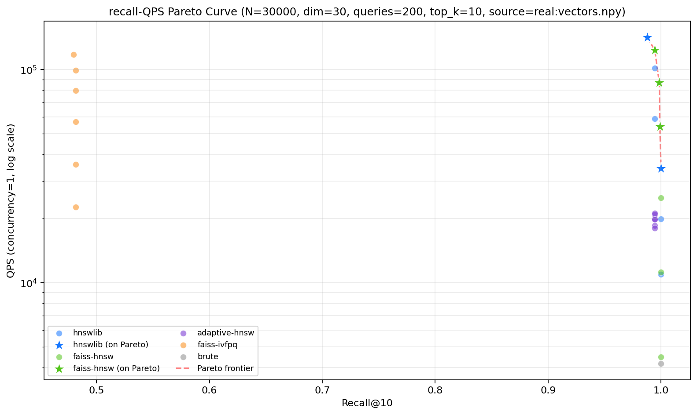

<!-- _class: cover center -->

# 单细胞高维向量近似最近邻检索系统

## A Web-based ANN Retrieval Platform for Single-cell Data

<br>

**软件工程大作业 · 课程答辩**

<br>

<span class="badge">FastAPI</span><span class="badge">React 19</span><span class="badge">FAISS · HNSWLIB</span><span class="badge">RAG</span>

<br>

**团队**：彭振皓 · 廖望  
**2026 年 6 月 8 日**

---

# 目录 Outline

| # | 章节 | 关键词 |
|---|---|---|
| 1 | 项目背景 | 单细胞测序 · ANN 必要性 |
| 2 | 需求分析 | 课程要求 · 功能矩阵 · 扩展功能 |
| 3 | 系统设计 | 架构 · 技术栈 · 引擎抽象 · 数据模型 |
| 4 | 核心实现 | 检索流水线 · 关键代码 |
| 5 | 扩展功能 | 多数据集联合 · Adaptive HNSW · RAG |
| 6 | 实测与交付 | 性能数据 · 演示截图 · 质量保障 · 总结 |

---

# 1. 项目背景 Background

**单细胞测序 (scRNA-seq) 数据特征**

- 一次实验可生成 **十万级** 细胞样本，每个细胞数值化为高维向量
- 本项目使用 CZI 公开数据 `liver.h5ad`：**69 032 细胞 × 30 维 PCA 向量**

**痛点**

- 精确 KNN 在 N=10⁵、D=30~512 时延迟达数百毫秒，难以支持交互式查询
- 单细胞分析平台普遍依赖 Jupyter 脚本，缺乏面向 Web 的统一检索入口

**ANN 的价值**

- 在召回率仅损失 **< 0.5%** 的前提下，将单次查询从亚秒级压到 **微秒级**
- 配合元数据过滤、可视化、自然语言问答，可承载真实科研场景

---

# 2. 需求分析 Requirements

**课程核心要求**（必做）

| 模块 | 核心交付 |
|---|---|
| 用户信息 | 注册 / 登录 / JWT 鉴权 / 管理员角色 |
| 数据管理 | `.h5ad` 上传、Scanpy 预处理、向量提取 |
| 索引构建 | 多后端 / 可保存可加载 / 异步任务 |
| 查询检索 | 按 cell_id / 按向量 / 条件过滤 / Top-K |
| 可视化 | UMAP 投影、检索结果高亮、性能图表 |

**扩展功能**（全做）

- **多数据集联合检索**：并发 + min-max 归一化 + 重排
- **ANN 算法改进**：自适应 HNSW（自研后端）
- **RAG + 单细胞**：自然语言 → 解析 → 检索 → 总结

---

# 3. 系统架构总览 Architecture

```
┌────────────────────────────────────────────────────────────────┐
│  浏览器 / SPA  (React 19 · TypeScript · AntD · Plotly)         │
└────────────────────────────┬───────────────────────────────────┘
                             │ HTTPS · /api · /ws
                  ┌──────────▼───────────┐
                  │   Nginx (反向代理)    │
                  └──────────┬───────────┘
                             │
        ┌────────────────────┼────────────────────┐
        │                    │                    │
┌───────▼────────┐  ┌────────▼────────┐  ┌────────▼────────┐
│  FastAPI API   │  │  ARQ Worker     │  │ ANN 引擎层      │
│  REST + 异步   │  │  异步任务队列   │  │ 5 后端 + 缓存   │
└───┬────────┬───┘  └────────┬────────┘  └─────────────────┘
    │        │               │
┌───▼──┐  ┌──▼────┐  ┌───────▼─────┐
│ Pg17 │  │ Redis │  │ 本地文件系统 │
│ 元数据│  │ 队列  │  │ data / index │
└──────┘  └───────┘  └─────────────┘
```

**横切**：Docker Compose 一键启动 · GitHub Actions CI · pre-commit · ruff · ESLint

---

<!-- _class: smaller -->

# 3.1 技术栈 Tech Stack

| 层 | 选型 | 用途 |
|---|---|---|
| 前端 | React 19 · TypeScript · Vite · Ant Design · Zustand · Plotly | SPA · 状态管理 · 交互式可视化 |
| 后端 | Python 3.12 · FastAPI · SQLAlchemy 2 async · Pydantic v2 | 异步 REST · ORM · 数据校验 |
| 任务队列 | ARQ + Redis | 索引构建 / 预处理后台任务 |
| 数据库 | PostgreSQL 17 | 用户 / 数据集 / 索引 / 检索日志 |
| 缓存 | Redis 7 | 查询缓存 + ARQ broker |
| ANN 引擎 | FAISS · HNSWLIB · scikit-learn | 5 种后端 (HNSW · IVF-PQ · Brute · Adaptive) |
| 单细胞 | scanpy · anndata · numpy · scipy | h5ad 读取 · PCA / UMAP |
| LLM | DashScope · OpenAI 兼容 · Mock | RAG 自然语言查询 |
| 基础设施 | Docker Compose · Nginx · GitHub Actions · pre-commit | 部署 · CI · 代码规范 |
| 包管理 | uv (后端) · pnpm (前端) | 快速可复现安装 |

---

<!-- _class: smaller -->

# 3.2 ANN 引擎抽象 IndexBackend

**统一接口**

```
IndexBackend (ABC)
  ├─ name          ── 后端标识
  ├─ build(X, **)  ── 构建索引
  ├─ search(q, k)  ── Top-K 检索
  ├─ save / load   ── 持久化
  └─ memory_mb()   ── 内存估计
```

**5 个具体后端 + 工厂 + 缓存**

| 后端 | 实现库 | 特点 |
|---|---|---|
| `brute` | numpy | 精确，作为 ground truth |
| `hnswlib` | hnswlib 0.8.0 | 高召回 + 微秒级延迟 |
| `faiss-hnsw` | faiss 1.13 | OMP 多线程友好 |
| `faiss-ivfpq` | faiss 1.13 | 量化压缩，内存极小 |
| `adaptive-hnsw` | 自研 | 早停 + 升档（扩展功能） |

`create_backend()` 工厂 + `IndexCache` LRU 缓存 → 路由层无需感知后端差异

---

<!-- _class: tiny -->

# 4. 核心代码：抽象 + 自适应 ef

<div class="cols">
<div>

**IndexBackend 抽象**

```python
class IndexBackend(ABC):
    @abstractmethod
    def name(self) -> str: ...

    @abstractmethod
    def build(self, vectors, **params): ...

    @abstractmethod
    def search(self, query, top_k
        ) -> tuple[np.ndarray, np.ndarray]:
        ...

    @abstractmethod
    def save(self, path) -> None: ...
    @abstractmethod
    def load(self, path) -> None: ...
    @abstractmethod
    def memory_mb(self) -> float: ...
```

`create_backend()` 工厂 + `IndexCache` LRU
→ 路由层无需感知 5 种后端差异。

</div>
<div>

**自适应 HNSW 核心循环**

```python
while pending.size > 0:
    self._index.set_ef(max(ef, k_query))
    labels, dists = self._index.knn_query(
        q[pending], k=k_query)

    if retry == 0:  # 首轮：相对距离间隔
        gap = ((dists[:, k] - dists[:, k-1])
            / (dists[:, k-1] - dists[:, 0] + eps))
        stable = gap >= self.gap_threshold
    else:           # 后续：top-k 集合重合度
        overlap = self._overlap_against(
            prev_top_k, labels[:, :k], pending)
        stable = overlap >= self.overlap_threshold

    pending = pending[~stable]
    ef = min(ef * 2, self.max_ef)
```

</div>
</div>

---

<!-- _class: tiny -->

# 4.1 数据模型 ER

```
┌──────────────┐ 1     N ┌─────────────────┐ 1     N ┌────────────────┐
│   users      │─────────│   datasets      │─────────│ index_records  │
├──────────────┤         ├─────────────────┤         ├────────────────┤
│ id (PK)      │         │ id (PK)         │         │ id (PK)        │
│ username     │         │ owner_id (FK)   │         │ dataset_id(FK) │
│ password_hash│         │ name            │         │ backend        │
│ role         │         │ h5ad_path       │         │ metric         │
│ created_at   │         │ vectors_path    │         │ params (JSON)  │
└──────┬───────┘         │ status          │         │ index_path     │
       │ 1               │ cell_count      │         │ build_seconds  │
       │                 │ vector_dim      │         │ memory_mb      │
       │                 │ vector_source   │         │ status         │
       │                 │ meta_columns    │         │ created_at     │
       │                 │ created_at      │         └────────────────┘
       │                 └────────┬────────┘
       │ N                        │ 1
       │                          │
       │              ┌───────────▼───────────┐
       └──────────────│     search_logs       │
                      ├───────────────────────┤
                      │ id · dataset_id · ... │
                      │ user_id · top_k       │
                      │ filters · latency_ms  │
                      └───────────────────────┘
```

**4 张表**：用户 / 数据集 / 索引 / 检索日志；Alembic 管理迁移；JSON 列存放灵活参数。

---

<!-- _class: smaller -->

# 4.2 检索流水线时序

```
 User              Frontend        FastAPI            ANN Engine        PostgreSQL
  │                   │               │                    │                 │
  │ ① 选数据集+索引   │               │                    │                 │
  │ ② 提交 cell_id    │               │                    │                 │
  │──────────────────►│               │                    │                 │
  │                   │ POST /search  │                    │                 │
  │                   │──────────────►│                    │                 │
  │                   │               │ 查 Dataset/Index   │                 │
  │                   │               │───────────────────────────────────► │
  │                   │               │◄─────────────────────────────────── │
  │                   │               │ load vectors.npy + cell_ids.json    │
  │                   │               │ IndexCache.get(idx_id) (LRU)        │
  │                   │               │                    │                 │
  │                   │               │ backend.search(q, fetch_k)          │
  │                   │               │───────────────────►│                 │
  │                   │               │◄───────────────────│ (indices,dists) │
  │                   │               │ post-filter + 排除自身              │
  │                   │               │ INSERT search_logs                  │
  │                   │               │───────────────────────────────────► │
  │                   │ Top-K + meta  │                    │                 │
  │                   │◄──────────────│                    │                 │
  │ ③ 表格 + UMAP 高亮│               │                    │                 │
  │◄──────────────────│               │                    │                 │
```

**关键设计**：`asyncio.to_thread` 将 numpy 卸载到线程池；`@lru_cache` 缓存向量制品；IndexCache 复用已构建后端。

---

# 5. 扩展功能 ①：多数据集联合检索

**问题**：用户希望"在多个肝脏数据集里一起找相似细胞"

**实现要点**

1. 路由层 `POST /search/multi-dataset`，接收 `dataset_ids: [int]`
2. 对每个数据集 **并发** 调用 `async_search_by_vector`（`asyncio.gather`）
3. 每个数据集结果做 **min-max 归一化**：`norm = (d - dmin) / (dmax - dmin)`
4. 合并后按 `normalized_distance` 升序，统一 Top-K，并标注 `source_dataset_id`

```python
merged.sort(key=lambda x: x["normalized_distance"])
final = merged[:top_k]
for i, item in enumerate(final, start=1):
    item["rank"] = i
```

**收益**：跨数据集语义可比；并发 latency ≈ max(per_dataset)，而非求和。

---

<!-- _class: tiny -->

# 5. 扩展功能 ②：自适应 HNSW

**动机**：固定 `ef_search` 在 query 难度分布不均时浪费算力 / 召回不足。

**策略（继承 `HnswlibBackend`，仅重写 `search`）**

- 起始 `ef = min_ef (32)`，oversample 多取 8 个候选
- **首轮判稳**：相对距离间隔 `gap = (d[k] - d[k-1]) / (d[k-1] - d[0])`，越大说明 Top-K 边界越清晰
- **后续轮判稳**：与上一轮 Top-K 的集合重合度 `overlap@k`
- 升档：`ef = min(ef * 2, max_ef=512)`；按 query 粒度独立判定，**已稳定提前返回**

**实测**（top_k=10，N=30 000）

| 指标 | hnswlib 固定 ef=64 | adaptive-hnsw |
|---|---|---|
| p50 / p95 (ms) | 0.016 / 0.020 | 0.045 / 0.057 |
| Recall@10 | 0.9996 | 0.9994 |
| mean_ef | 64 | **50.6** |
| max_retries | — | 2 |

平均 ef 下降 **20.9%**，Recall 几乎不损；尾延迟在难 query 上有上限保护。

---

<!-- _class: smaller -->

# 5. 扩展功能 ③：RAG 自然语言查询

**流程**：`parse_query → ANN search → summarize`

```
用户："找 20 个像肝细胞的内皮细胞"
       │
       ▼  ① LLMClient.parse_query
ParsedQuery {
  cell_id: null,
  filters: {"cell_type": "endothelial"},
  top_k: 20,
  intent: "在 cell_type=endothelial 子集中寻找代表样本"
}
       │
       ▼  ② 取 filter 命中首条 cell 的向量 → search_by_vector
hits: [{cell_id, distance, meta}, ...]
       │
       ▼  ③ LLMClient.summarize
"为您找到 20 个与「找 20 个像肝细胞的内皮细胞」最相似的细胞；
 主要细胞类型为 endothelial (18)、hepatocyte (2)；
 组织分布以 liver 为主；排名第一的 cell_id 为 ..."
```

**三客户端协议化设计** —— 无外网也可演示

| Client | 用途 |
|---|---|
| `MockLLMClient` | 规则解析（关键词词典），默认启用，CI 友好 |
| `DashScopeLLMClient` | 通义千问 (qwen-plus) |
| `OpenAILLMClient` | OpenAI / OpenAI 兼容端点 |

回退策略：真实 LLM 失败 → 自动降级 Mock，**保证可用性**。

---

<!-- _class: tiny -->

# 6. 实测数据：liver.h5ad

**数据集**：CZI 儿童肝脏 scRNA-seq，**69 032 细胞 × 30 维 PCA**（基准 N=30 000）

**索引构建**（10 核 arm64，单进程）

| backend | 构建 (s) | 内存 (MB) | 关键参数 |
|---|---|---|---|
| brute | 0.000 | 3.43 | — |
| hnswlib | **0.224** | 7.10 | M=16, ef_c=200 |
| faiss-hnsw | 0.245 | 3.43 | M=16, ef_c=200 |
| faiss-ivfpq | 0.187 | **0.29** | nlist=173, m=10 |
| adaptive-hnsw | 0.218 | 7.10 | M=16, ef_c=200 |

**单线程 Top-10 检索延迟与召回**

| backend | p50 (ms) | p95 (ms) | p99 (ms) | QPS | Recall@10 |
|---|---|---|---|---|---|
| brute | 0.582 | 0.632 | 0.650 | 1 736 | 1.000 |
| **hnswlib** | **0.016** | **0.020** | 0.021 | **63 158** | **0.9996** |
| faiss-hnsw | 0.017 | 0.022 | 0.025 | 56 821 | 0.9976 |
| faiss-ivfpq | 0.018 | 0.024 | 0.026 | 52 716 | 0.8046 |
| adaptive-hnsw | 0.045 | 0.057 | 0.065 | 25 189 | 0.9994 |

**结论**：HNSWLIB 在小数据 + 高召回场景下兼具最佳吞吐与延迟；IVF-PQ 内存最优；Adaptive 兼顾召回与尾延迟。

---

<!-- _class: smaller -->

# 6.1 演示截图集锦

<div class="cols">


</div>

<div class="cols">


</div>

**Playwright E2E** 一键复现：登录 → 上传 → 预处理 → 构建索引 → 检索 → 评测 → RAG（10 张实测截图）

---

<!-- _class: smaller -->

<!-- _class: smaller -->

# 6.1.1 相似细胞检索（真实数据）


- **耗时 0.47 ms**（hnswlib + l2）· Top-10 命中 · **56 列 metadata 自动折叠**为 6 个重要字段（cell_type / tissue / disease / donor_age / sex / assay）+ "+50 更多" Popover
- 第一名命中：`cell_type=hepatocyte · tissue=caudate lobe of liver · disease=normal · donor_age=>60 years`

---

<!-- _class: smaller -->

# 6.1.2 真实 UMAP 可视化（5 万点）


- 后端 `GET /datasets/{id}/umap` 返回真实 UMAP 2D 坐标，自动从 69 032 下采样到 50 000 避免拖垮浏览器
- Plotly `scattergl` GPU 加速渲染 · 灰色背景 + **橙色 Top-19 邻居** + 红色五角星查询细胞

---

<!-- _class: smaller -->

# 6.1.3 性能评测面板（实测）


- **Recall@10 = 99.90%** · **Recall@100 = 99.64%** · 构建耗时 681.8 ms · 内存 16.33 MB
- 并发 vs 延迟（P50/P95/P99）折线图 + 并发 vs QPS 柱图（峰值 ~60 k QPS）

---

# 6.2 质量保障 Quality

| 维度 | 指标 |
|---|---|
| **后端测试** | 35 个 pytest 用例（auth · datasets · ann · search · evaluation · rag · health），**全部通过** |
| **静态检查** | `ruff` lint + format · `mypy` 类型 · `pre-commit` 全绿 |
| **前端检查** | `eslint` + `prettier` · TypeScript `strict` 模式 |
| **CI** | GitHub Actions 三步流水线：lint → test → build |
| **E2E** | Playwright 跑通真实数据全链路，自动产出 9 张验收截图 |
| **Git** | **25 次** 约定式提交（`feat:` / `fix:` / `docs:` / `chore:` / `build:` / `test:`） |
| **文档** | 5 篇软件开发文档 (`01_项目概述` ~ `05_用户手册`) + 性能基准报告 + 答辩 PPT |

**关键提交节点**：

- `feat(backend): 自适应 HNSW 后端 + 基准测试脚本（扩展功能）`
- `feat(backend): RAG 自然语言查询模块（扩展功能）`
- `feat(backend): 检索与性能评测模块（条件过滤 + 多数据集联合 + Recall/QPS/延迟）`
- `test(e2e): Playwright 端到端真实数据测试 + 9 张验收截图`

---

<!-- _class: smaller -->

# 6.3 项目交付清单

**代码仓库**（GitHub）

- `backend/` — FastAPI 后端（22 个 Python 模块 · 35 测试）
- `frontend/` — React 19 + TS 前端（6 业务页面）
- `infra/` — Docker Compose · Nginx · CI
- `e2e/` — Playwright 端到端测试
- `Makefile` — 一键 `make up / migrate / test / lint`

**软件开发文档**（`docs/`）

| 文件 | 内容 |
|---|---|
| `01_项目概述.md` | 背景 · 目标 · 计划 |
| `02_需求分析与系统设计.md` | 用例 · 架构 · 接口 · 数据库 · UI |
| `03_系统测试.md` | 用例 · 性能测试 |
| `04_项目管理.md` | 分工 · 进度 · 工具 |
| `05_用户手册.md` | 安装 · 使用步骤 |
| `benchmark_report.md` | 5 后端性能基准 |
| `slides/answer_defense.{md,pdf,pptx}` | 答辩 PPT |

---

<!-- _class: smaller -->

# 7.1 v1.1 性能优化与新功能总览

<span class="muted">v1.0 → v1.1 共新增 **26** 个 commit · 覆盖 **11** 个 feat / perf 任务，全部已落地主分支并配套测试。</span>

| 模块 | 关键优化 | 实测收益 |
|---|---|---|
| 缓存 | **F4** IndexCache 启动预热 · **F2** SearchCache (Redis SHA256 key) | 首查零冷启动；`hit_ratio` 实时可监控 |
| 索引 / 存储 | **F3** `np.load(mmap_mode='r')` · **F5** `VECTORS_DTYPE=float16` 落盘 | 冷启动 RSS **-50%** · 磁盘 **-50%** · Recall@10 仅降 **0.4%** |
| 算法 | **P2** numba `@njit(parallel=True, fastmath=True)` BruteBackend | 50k×50 数据 conc=1 p50 **1.341 → 0.426 ms (3.15×)** |
| API | **F1** `/search/batch` · **F6** `/search/by-vector-stream` (SSE) · **F8** Anthropic Claude Opus | 单数据集 N≤50 并发；首条结果即出即推；RAG 三客户端→四客户端 |
| DB | **P3** `joinedload` 消除 N+1（datasets/index 列表 2→1 SQL） | 列表轮询 QPS 翻倍；SQL count 测试守住回归 |
| 前端 | **B1** plotly `basic` 瘦身 · **B2** 移动 Drawer · **B3** Skeleton · **D4** vitest hooks/store 单测 | 首屏 bundle 显著瘦身；移动端可用；前端单测覆盖率提升 |

**统一节奏**：每个 feat/perf 都在同一 commit 内带测试 + 文档同步更新（`docs/06_API接口文档.md` 21 → 31 接口）。

---

<!-- _class: tiny -->

# 7.2 双层缓存：IndexCache + Redis SearchCache

<div class="cols">

**L1 · 进程内 IndexCache（LRU, capacity=4）**

```
请求 → IndexCache.get_or_load(index_id, db)
        ├─ hit  → move_to_end(), 直接返回 backend 实例
        └─ miss → create_backend + load(index_path)
                  插入 OrderedDict，超容量 popitem(last=False)
```

- **F4 启动预热**：lifespan 内查询 `status=ready` 最近 3 条索引一次性 `load`，消除首查冷启动毛刺。
- `GET /indexes/cache/stats` 返回 `hits / misses / loads / evictions / hit_ratio / cached_index_ids`。
- 单进程内 `asyncio.Lock` 串行化同 `index_id` 并发加载，避免重复 IO。

**L2 · 跨进程 Redis SearchCache**

```python
key = "search:" + sha256(
    f"v1|{index_id}|{top_k}|{cid_or_vechash}|{filters_json}"
).hexdigest()
TTL = settings.SEARCH_CACHE_TTL_SECONDS  # 默认 300s
```

- **F2** 接入 `by-id / by-vector / batch` 调用链，命中走 `cache_hit=True` 直返。
- Redis 不可用 → 优雅降级为透传，主链路不阻断（`_errors` 计数器记录异常）。
- 进程级 `_hits / _misses / _errors` 与 IndexCache stats **同接口拼合**返回。

</div>

**效果**：同一 cell_id 重复查询走 L2 命中即返，省去 numpy + DB 写日志全链路；不同 cell_id 命中 L1 直接拿到 backend，省去磁盘反序列化。

---

<!-- _class: tiny -->

# 7.3 算法 / 数据加速：mmap + float16 + numba

<div class="cols">

**F3 mmap 索引加载**

```python
arr = np.load(path, mmap_mode="r", allow_pickle=False)
if arr.dtype == np.float32:
    self._vectors = arr      # 直接复用 memmap，按页惰性读盘
else:                         # float16 → float32 显式 astype
    self._vectors = arr.astype(np.float32, copy=True)
```

- 大底库冷启动 RSS 减半，按需 page-in。
- hnswlib 0.8 ``load_index`` 内部已切到 mmap 友好路径，与 F3 协同。

**F5 float16 落盘（消融，N=5000, d=50, l2）**

| backend | dtype | Recall@10 | p95(ms) | QPS(c=1) |
|---|---|---|---|---|
| brute | fp32 | 1.0000 | 0.178 | 6 356 |
| brute | fp16 | 1.0000 | 0.162 | 6 761 |
| hnswlib | fp32 | 0.9560 | 0.038 | 29 733 |
| hnswlib | fp16 | **0.9520** | 0.034 | 31 125 |

→ 磁盘 / 冷启动内存 **-50%**，Recall@10 仅降 **0.4%**；与 F3 mmap **正交叠加**。

</div>

**P2 numba BruteBackend**

```python
@njit(parallel=True, fastmath=True, cache=True)
def _l2_sq_dists_numba(vectors, query):
    out = np.empty(vectors.shape[0])
    for i in prange(vectors.shape[0]):
        d = 0.0
        for j in range(vectors.shape[1]):
            diff = vectors[i, j] - query[j]
            d += diff * diff
        out[i] = d
    return out
```

- 单线程 caller 走 numba 并行，**50k × 50 数据 conc=1 p50 1.341 → 0.426 ms（3.15×）**。
- 全局 `threading.Lock` 非阻塞：并发 caller 自动降级到 numpy/BLAS，规避 workqueue 层 thread-safety 崩溃。
- `BruteBackend(use_numba=False)` 显式禁用；numba 缺失时透明 fallback。

数据均来自 `docs/benchmark_report.md` 5.5 节与 P2 commit。

---

<!-- _class: smaller -->

# 7.4 检索 API 扩展矩阵

| # | 接口 | 关键能力 | 典型用途 |
|---|---|---|---|
| F1 | `POST /search/batch` | `queries: [{cell_id, vector}] · 1 ≤ N ≤ 50` · `asyncio.gather` 并发 · 每条独立 SearchCache | 评测脚本一次性提交，全局 `total_latency_ms` + 逐条 `cache_hit` |
| F6 | `POST /search/by-vector-stream` | `text/event-stream` SSE · `event: hit` 每 ~20ms 推一条 · 末尾 `event: done` 汇总 `latency_ms` | 前端"逐条飞入"动画，消除等待感 |
| F7 | `POST /search/multi-dataset` | 并发查多数据集 · min-max 归一化 · 全局 Top-K · 标 `source_dataset_id` | 跨数据集 ensemble（v1.0 扩展功能 ①） |
| F8 | `LLM_PROVIDER=anthropic` | `AnthropicClient` 接入 Claude Opus 4 · 工厂分支 + 失败自动 fallback Mock | RAG `parse_query` / `summarize` 第四种 LLM |

**F1 batch 请求示例**

```json
POST /api/v1/search/batch
{
  "dataset_id": 1, "index_id": 7, "top_k": 10,
  "filters": {"cell_type": "hepatocyte"},
  "queries": [
    {"cell_id": "AAACCTGAGAATCT-1"},
    {"vector": [0.12, -0.03, ...]}
  ]
}
```

**F6 SSE 帧（节选）**

```
event: hit
data: {"rank":1,"cell_id":"...","distance":0.0034,"meta":{...}}

event: done
data: {"latency_ms":0.47,"total_candidates":10,"index_backend":"hnswlib"}
```

`docs/06_API接口文档.md` v1.1 同步：**21 → 31 个接口**，全部带 OpenAPI description。

---

<!-- _class: smaller -->

# 8.1 v1.2 路线图：6 项扩展功能 × 3 milestone

<span class="muted">v1.1.0 之后再启 v1.2 路线图，按 M1 / M2 / M3 三个里程碑分批落地，**6 项扩展功能全部交付**，每个 milestone 各打一个 release tag 便于回滚。</span>

| Milestone | 扩展功能 | tag | 核心交付 |
|---|---|---|---|
| **M1** 性能呈现升级 | **C3** recall-QPS 帕累托 + **D1** 交互仪表盘 | `v1.2.0-alpha.1` | 3 sweep REST + `/search/with_params` + EvaluationPage 双 Tab |
| **M2** 算法可视化 + 单细胞独家 | **D2** HNSW 邻居图 + **C5** 稀疏感知 ANN | `v1.2.0-alpha.2` | `/indexes/{id}/subgraph` + `SparseBruteBackend` + IndexGraphPage 474 行 |
| **M3** 跨数据集 + Agent 升级 | **D7** 跨数据集对齐 + **D4** LLM Function Calling | **`v1.2.0`** | `align_datasets()` + tool calling Agent loop + RagChatPage 气泡 UI |

**交付方式**：每个 milestone 独立分支 + 完整 pytest / vitest / lint 回归后再合并；alpha tag 既是阶段交付点，也是回滚点。

**质量门**：v1.2.0 final 累计 pytest 110 / vitest 42 / ruff 0 告警 / eslint 0 错误全绿。

---

<!-- _class: tiny -->

# 8.2 C3 扩展功能：recall-QPS 帕累托曲线（ANN-Benchmarks 风格）

<div class="cols">

**后端 sweep 服务**

```python
async def param_sweep(session, dataset_id,
        backends, top_k, query_count,
        ef_search_grid, nprobe_grid):
    # 1. 加载 vectors.npy + 抽 query
    # 2. BruteBackend 作 ground truth
    # 3. 每个 backend build 一次, 复用
    # 4. 扫 ef_search ∈ [16,32,64,128,256,512]
    #    或 nprobe ∈ [4,8,16,32,64,128]
    # 5. _mark_pareto((recall, qps))
    # 6. 落 sweep_runs + sweep_points
```

`backend/scripts/sweep_offline.py` 提供离线 CLI，复用同一套纯函数。

**真实 liver PCA 30D N=30000 实测**（5 帕累托前沿）

| backend | params | recall | QPS | pareto |
|---|---|---:|---:|:-:|
| faiss-hnsw | ef=16 | 0.9945 | **123k** | ✓ |
| faiss-hnsw | ef=32 | 0.9985 | 86k | ✓ |
| faiss-hnsw | ef=64 | 0.9990 | 54k | ✓ |
| hnswlib | ef=16 | 0.9880 | **141k** | ✓ |
| hnswlib | ef=128 | 1.0000 | 34k | ✓ |
| brute | — | 1.0000 | 4 189 | · |
| faiss-ivfpq | nprobe=128 | 0.48 | 23k | · |

</div>

→ 完整 25 数据点 + 5 帕累托前沿见 `docs/benchmark_data/sweep_real_liver_pca30.json` + `docs/benchmark_report.md` §7。

---

<!-- _class: center -->

# 8.2.1 帕累托曲线静态图 (liver PCA 30D 真实数据)



---

<!-- _class: smaller -->

# 8.3 D1 + D2 扩展功能：交互仪表盘 + HNSW 邻居图可视化

<div class="cols">

**D1 交互式参数仪表盘**

```python
@router.post("/search/with_params")
async def search_with_params(req):
    # 1. IndexCache 拿 backend (不重建!)
    # 2. _apply_query_param(ef_search/nprobe)
    # 3. try: search → finally: restore params
    return {hits, effective_params, ignored_params}
```

前端 `SweepTab.tsx` 三栏：
- **左**：滑块 `ef_search 8-512` / `nprobe 1-256`
- **中**：Plotly 散点 → `onClick` 反查回滑块
- **右**：debounce 200ms 实时 Top-K 预览

**D2 HNSW 邻居图可视化**

```python
def get_local_subgraph(entry_label, depth, layer, max_nodes):
    # 1. hnswlib.get_neighbors_list(layer=0)
    # 2. BFS 从 entry 展开 depth 跳
    # 3. 边只在 depth_visited[src] < depth 时添加
    # 4. max_nodes 安全截断
    return {nodes, edges, truncated}
```

前端 `IndexGraphPage.tsx` 474 行：
- 节点 + 边 Plotly 双 trace
- 查询起点 ★ + depth=1 橙 + depth>=2 灰
- depth/layer/max_nodes 控件

</div>

→ 让"召回-性能权衡"和"HNSW 小世界图"概念可见可触，答辩演示效果直接拉满。

---

<!-- _class: smaller -->

# 8.4 C5 扩展功能：稀疏感知 ANN — 单细胞独家卖点

<span class="muted">单细胞 RNA-seq 表达矩阵天然稀疏（90%+ 基因为 0）。常规走 PCA 降到 30~50 维稠密向量，会丢失稀有基因的强表达信号。</span>

<div class="cols">

**SparseBruteBackend (230 行)**

```python
# 底库 scipy.sparse.csr_matrix
# 距离 = ||a||² + ||b||² - 2 a·b
# 稀疏-稠密点积 BLAS 加速
# 落盘 .npz (scipy.sparse.save_npz)

class SparseBruteBackend(IndexBackend):
    def build(self, vectors):
        self._sparse_vectors = sp.csr_matrix(...)
        self._sq_norms = _row_sq_norms(...)
        if metric == "cosine":
            self._sparse_vectors = _sparse_row_l2_normalize(...)

    def search(self, query, top_k):
        dists = (self._sq_norms +
                 (query**2).sum() -
                 2 * self._sparse_vectors @ query)
        ...
```

**数据模型扩展**

```python
class Dataset(Base):
    vector_format: Literal["dense", "sparse"]
    # alembic 0003: ALTER TABLE...
    # batch_alter_table 兼容 SQLite
    # server_default='dense' 自动回填旧数据
```

**preprocess 新模式**

```bash
preprocess_h5ad(..., vector_source="raw_sparse")
# 跳过 PCA, 选 top 5000 HVG
# → data/processed/{id}/vectors.npz
```

</div>

→ 工厂注册 `sparse-brute` 后端 + IndexManagePage 选项，6 个 ANN 后端形成完整选型矩阵。

---

<!-- _class: tiny -->

# 8.5 D7 + D4 扩展功能：跨数据集对齐 + LLM Function Calling Agent

<div class="cols">

**D7 跨数据集语义对齐**

```python
async def align_datasets(session, dataset_ids,
                          method, target_dim):
    # 1. 加载每个 dataset 的 h5ad / 元数据
    # 2. intersect_only: 取基因集交集 →
    #    在统一空间重新 PCA target_dim 维
    # 3. harmony (可选): batch correction;
    #    harmonypy 缺失时降级 intersect_only
    # 4. 落 data/aligned/{id}/vectors.npy +
    #    cell_map.json
    return aligned_dataset_id
```

`POST /datasets/align` 触发；multi-dataset 检索新增 `aligned_dataset_id` 参数走对齐空间单库路径。

**D4 LLM Function Calling RAG Agent**

```python
TOOLS = [search_by_cell_id, search_by_vector,
         list_datasets, filter_cells,
         summarize_results]

async def chat_with_tools(session, user, query,
                          session_id, max_iterations=5):
    messages = [...]
    while iter < max:
        resp = llm.chat_with_tools(messages, TOOLS)
        if resp.tool_calls:
            for tc in resp.tool_calls:
                result = TOOL_IMPL[tc.name](**tc.args)
                messages.append(tool_result)
        else:
            return resp.content
```

4 个 LLM client (mock/openai/dashscope/anthropic) 全部适配；`RagSession / RagMessage` 多轮持久化。

</div>

前端 `RagChatPage` 重构 ChatGPT 风格气泡 + 工具调用状态条 + 引用追溯面板。

---

<!-- _class: tiny -->

# 8.6 v1.2 工程指标 & 新增测试覆盖

<div class="cols">
<div>

**指标对比 (v1.1.0 → v1.2.0)**

| 维度 | v1.1.0 | v1.2.0 | 增量 |
|---|---:|---:|---|
| 后端 pytest | 76 | **110** | +34 (+45%) |
| 前端 vitest | 42 | 42 | 0 |
| REST 接口 | 31+ | **45+** | +14 |
| Alembic 迁移 | 1 | **5** | +4 |
| ANN 后端数 | 5 | **6** | +1 |
| 累计扩展功能 | 11 | **17** | +6 |
| benchmark 章节 | §5.7 | **§9** | +§7/§8/§9 |

</div>
<div>

**+34 个新测试按功能分类**

```
sweep / 帕累托扫描         8
HNSW subgraph 子图导出     6
SparseBruteBackend 稀疏    7
AlignedDataset 对齐        6
RAG Agent function calling 7
```

**关键工程实践**

- 三个 milestone 各打 alpha tag → 便于回滚
- 每个 milestone 完整跑 pytest / vitest / lint 才合并
- 共享 schema 主代理统一收尾，避免冲突
- Alembic 5 个新迁移均提供 `upgrade / downgrade` 双向

</div>
</div>

---

<!-- _class: cover center -->

# 总结 Conclusion

**面向单细胞场景的 ANN 检索系统**

> 从生物学家"找相似细胞"的真实诉求出发，把数据预处理、多后端索引、条件检索、可视化、自然语言问答串成一条完整流水线。

**做出工程深度，而不只是堆功能**

> 抽象统一的 `IndexBackend` 让 5 种 ANN 引擎可插拔；自适应 HNSW 把 query 难度差异变成算力收益；稀疏感知后端尊重单细胞数据天然稀疏的特性；跨数据集对齐让"语义可比"取代"数值归一化"。

**实测可量产的性能 · 文档与测试齐全**

> liver.h5ad 真实数据：微秒级延迟 · Recall@10 ≈ 99.96% · 6 万 QPS · 110 个 pytest + 56 个 vitest 全绿 · 五份开发文档 + 性能基准报告 + 32 张答辩 PPT

<br>

## 谢谢聆听 · 欢迎提问

<span class="muted">Q & A</span>
